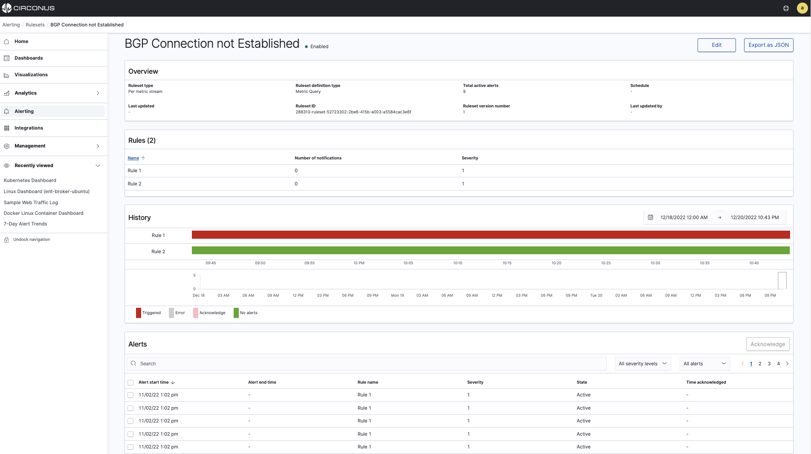

# Alerting

With Circonus Alerting, your team is notified of potential issues that your applications or infrastructure could be facing. This allows your team to proactively address issues before they impact your customers or employees.

For example, a server that is facing disk space issues could result in the server crashing, or an application with increasing response times could result in productivity losses and customer dissatisfaction.

Circonus makes it easy to analyze alert history and trends through comprehensive summaries of the underlying rulesets and rules.

Alert trends and behavior can also be directly visualized on your dashboards with our convenient [Alert Visualizations](/circonus3/visualizations/alerts/), as depicted below.

Circonus provides you with you two types of Alerts:

- **Stream Alerts** notify your team in seconds of potential issues. Every metric data point is evaluated upon arrival to the Circonus platform and a notification is generated in real-time if an alert condition is met.

  By evaluating the data on arrival, Circonus eliminates the minutes, if not tens of minutes, delay experienced with traditional alerting approaches.

- **Analytic Alerts** proactively scan logs and traces looking for potential issues and then notify the team. Analytic alerts run on a scheduled basis, for example every 5 minutes.

## Alert terms

| Term          | Description                                                                                                                                                                                |
| :------------ | :----------------------------------------------------------------------------------------------------------------------------------------------------------------------------------------- |
| Alert         | An event that occurs when conditions for a rule are met. Alerts will always have a severity level. They are communicated through notifications associated with the rule that is triggered. |
| Rule          | Conditions specified by the user which, if met, trigger an alert. One or more notifications can be added to a rule.                                                                        |
| Ruleset       | One or more rules and associated notifications for a given query on a data source. Circonus supports several different types of rulesets.                                                  |
| Notification  | A message sent to a specified contact group when rule conditions are met and an alert is triggered.                                                                                        |
| Contact Group | A collection of one or more email addresses or webhook URLs that can be selected for a notification.                                                                                       |
| Severity      | A level between 1 and 5 which specifies the relative importance and priority of an alert. Level 1 is the most severe, while level 5 is the least severe.                                   |

To get started with Circonus alerts, choose **Alerting** in the main menu.
