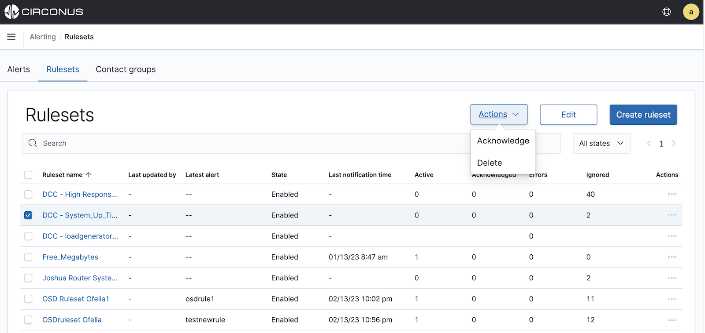
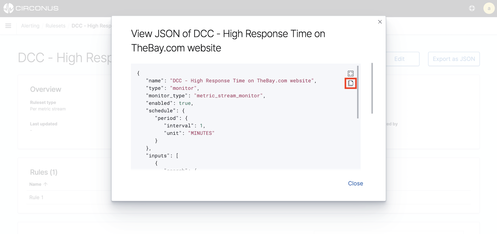
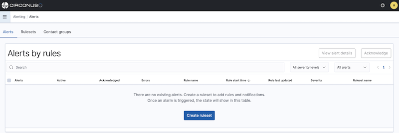
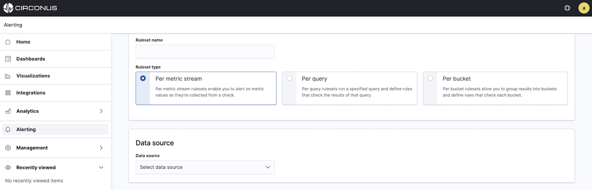
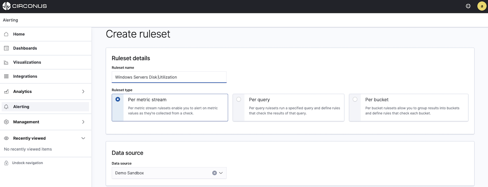
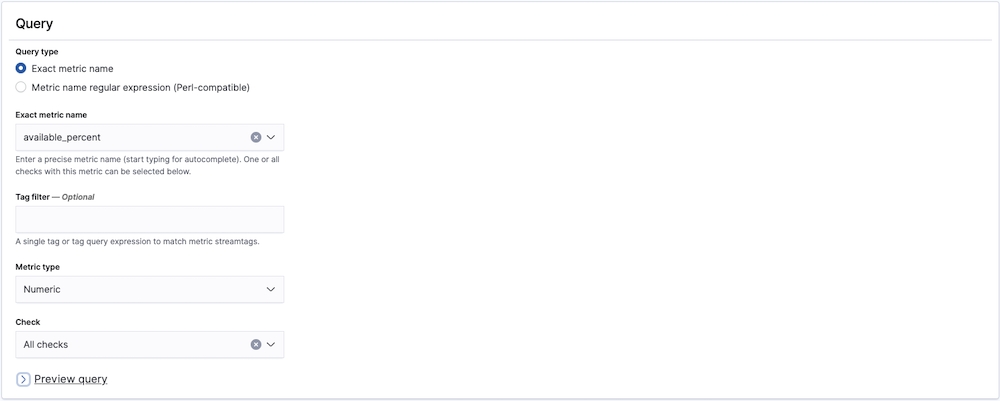
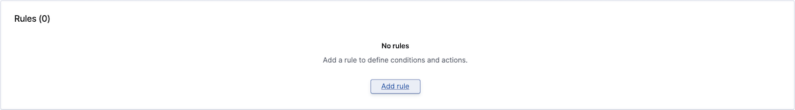
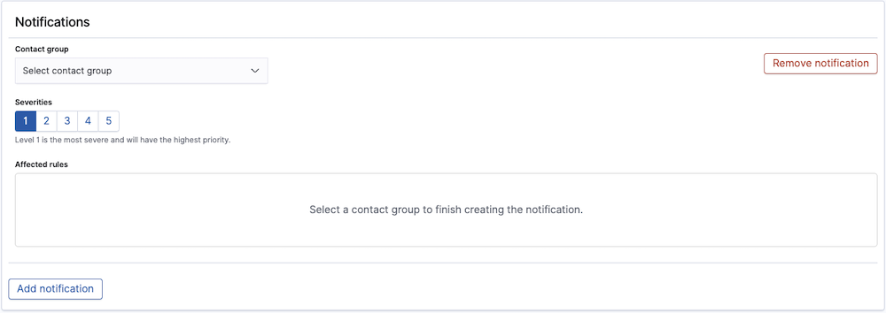
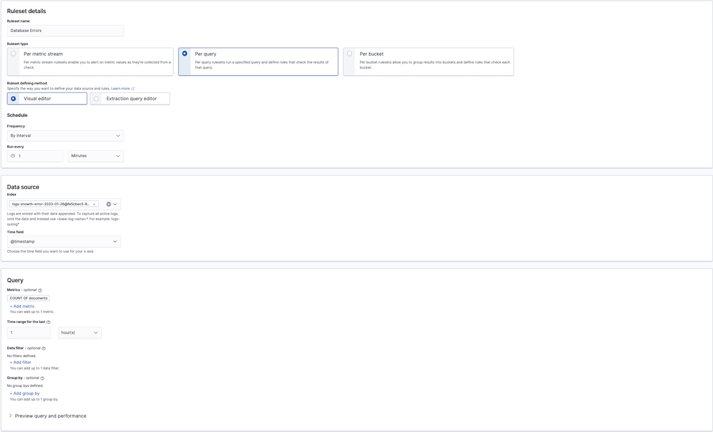
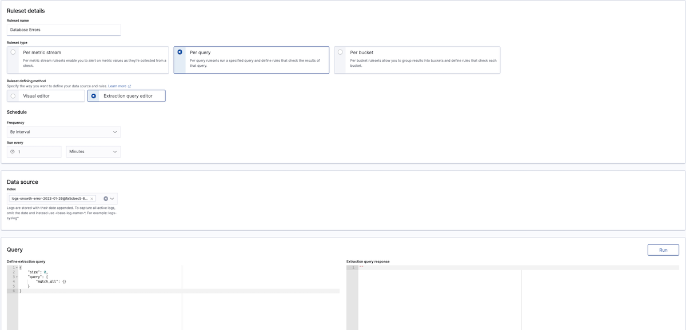

# Rulesets

In essence, rulesets are the logic behind alerts. They include one or more rules which, if met, trigger an alert. Each ruleset is associated with a subset of data arising from a query on a metric, log, or trace data source.

## Viewing all rulesets

To see the rulesets already defined for your account, simply navigate to **Alerting** within the main menu and then click on the **Rulesets** tab.



For each ruleset, you will see its status, state, and error count as well as its number of active, acknowledged, and ignored alerts.

## Viewing an individual ruleset

To view an individual ruleset, simply click on its name within the main rulesets table.


For each ruleset, you will see the following sections:

- **Overview** describes the type of ruleset, how it's defined, whether there are any active alerts, its schedule if its an analytic alert (not applicable to metric alerts), and other information.

- **Rules** lists the rules defined under the ruleset, including their severity and any defined notifications.

- **History** provides a timeline graph of showing when rules have been triggered. The timeline does not display for mobile users.

- **Alerts** provides a list of the alerts triggered by the ruleset, including their associated rules and severities, and when they were acknowledged.

## Acknowledging a ruleset's alerts

You can acknowledge alerts for a ruleset a few different ways.

From the main rulesets page, you can click on the **Actions** menu for a given ruleset and select **Acknowledge** to acknowledge all of the ruleset's active alerts.

From the main rulesets page, you can also select the checkbox to the left of a ruleset's name and then click the **Actions** button above the table to reveal an option to acknowledge the ruleset's alerts.

Additionally, you can acknowledge alerts for a ruleset while viewing the ruleset. Within the **Alerts** section of the page, select the checkboxes to the left of the alerts you would like to acknowledge. Then click the **Acknowledge** button above the table.

## Editing a ruleset

You can choose to edit an existing ruleset in one of two ways.

From the main rulesets page, you can select the checkbox to the left of a ruleset's name and then click the **Edit** button above the table.

Alternatively, if you are already viewing a specific ruleset that you wish edit, you can simply click the **Edit** button at the top of the page.

The page for editing a ruleset is the same page as for creating a new ruleset. See the [Creating a new ruleset](#creating-a-new-ruleset) section below for a walkthrough of this page.

## Enabling or disabling a ruleset

To enable or disable a ruleset, first navigate to the main rulesets page by selecting **Alerting** within the main menu and then clicking the **Rulesets** tab.

For the ruleset you wish to enable or disable, you can click on its **Actions** menu within the table and select **Enable** or **Disable** as needed.

## Deleting a ruleset

To delete a ruleset, first navigate to the main rulesets page by selecting **Alerting** within the main menu and then clicking the **Rulesets** tab. You can delete a ruleset a couple different ways.

For the ruleset you wish to delete, you can click on its **Actions** menu within the table and select **Delete**.

You can also select the checkbox on the lefthand side of a **Ruleset name** and then click on the **Actions** button above the table to reveal an option to delete the ruleset. You can select multiple rulesets to delete using this method.

## Exporting a ruleset as JSON

If you wish to export a ruleset, simply click on the **Export as JSON** button while viewing the ruleset. You can copy the JSON directly from the dialog by clicking on the document icon (highlighted in red below).



Note that the icon above the document icon will simply put the dialog in fullscreen mode.

## Creating a new ruleset

To create a new ruleset, first select **Alerting** from the main menu. If no rulesets have been previously defined, you will be prompted to create a ruleset from the **Alerts** tab.



If there are already defined rulesets, select the **Rulesets** tab within the **Alerting** section and click on the **Create ruleset** button in the top right corner.


Once on the **Create ruleset** page, first enter a ruleset name.

### Selecting a ruleset type

Next, you will need to select a ruleset type. Circonus supports several different types of rulesets, with each type generating either a stream alert or analytics alert.

- **Stream alerts** assess metric samples as they arrive to determine if they meet any defined alert conditions in real-time.

- **Analytic alerts** scan logs and traces for patterns on a defined schedule.



On the **Create Ruleset** page, you will see three ruleset types. Select the desired ruleset type by clicking on its panel.

- **Per metric stream** rulesets generate **stream alerts** based on metric data.
- **Per query** rulesets run a specified analytic query of log or trace data on a scheduled basis and generate **analytic alerts**.
- **Per bucket** rulesets enable you to group results into buckets and run analytics against each bucket using a defined script. With these rulesets, each bucket can generate an **analytics alert**.

For further clarification in choosing the ruleset type, consider the collection method. If the data you wish to alert on was collected with CUA, select the **Per metric stream** ruleset type However, if the data you wish to alert on was collected with **FluentBit** or **Data Prepper**, choose either the **Per query** or **Per bucket** ruleset type.

### Per Metric stream ruleset

If you select the **Per metric stream** ruleset type, you next need to select a data source from the dropdown.



Once you select a data source, you can add your query. Circonus supports **Exact Metric name** and **Metric name regular expression** queries. (If these options are disabled, it means you need to select a data source.)

- **Exact metric name** queries let you enter the precise metric name you wish to alert on. If you select this option, you can select from the dropdown options or begin typing for autocomplete suggestions.
- **Metric name regular expression (perl-compatible)** queries allow you to enter a regular expression to match one or more metrics. The regular expression must follow [Perl](https://www.geeksforgeeks.org/perl-regex-cheat-sheet/) conventions, e.g. `^duration$`



For either query type, you can apply a **Tag filter** to further constrain the metrics to which the ruleset will apply.

By default, the **Metric type** will be numeric, but you can select text metrics if you wish to alert on things like versions or configuration settings.

Next, you must select the check which you'd like to target with your query. For exact metric name queries, you can select either **All checks** from the dropdown or a single check. For metric name regular expressions, you can only select a single check.

#### Adding a new rule

Once a check selection has been made, a preview of your query will be visible. When you're ready, continue to the **Rules** section.



Click the **Add Rule** button to add a rule to your ruleset. If a ruleset has multiple rules, they are processed in order. The first one to be found in violation triggers the alert and rule processing stops. Reorder rules as needed using the grip icon to the left of each rule name.

The following aspects of your new rule are available to be edited:

- **Windowing:** Consider more than one measurement over the specified duration, applying the chosen function, the output of which is evaluated against the rule criterion and value. Windowing is only available for numeric and histogram metric types.
- **Duration:** This option is only available when a Windowing function other than "None" is chosen, and sets the length of the window for evaluation, in seconds. You may choose from some predefined options or enter your own value.
- **Criterion:** The operator for comparing the incoming measurement with the threshold value. The available options differ depending on the type of metric chosen for the rule. Numeric and histogram metrics have higher/lower than, while text metrics have matching options. All metric types also have an option for absence over a chosen duration. If no measurements arrive within the absence period, an alert is triggered.
- **Value:** The threshold value to which you want to compare the incoming measurement.
- **Severity:** The severity level this rule will trigger. Circonus has 5 severity levels, 1 through 5, with 1 being the most severe.
- **Wait:** Circonus will create the alert in the UI immediately when a rule is violated, but it will wait the specified number of minutes before notifying any contact groups about the problem. This allows time for the issue to resolve on its own.


As you configure your rule, you will see a results preview showing whether the historical values would have breached the threshold set in the rule _(red threshold line)_. This allows you to fine tune and adjust the rule values to avoid alert storms.



For each rule, you can add one or more **Notifications**. To get started, click **Add notification** within a given rule. A notification will then be added to your ruleset with a severity matching that of the rule. To finish adding the notification, select the preferred contact group. Once a contact group has been selected, you'll see the applicable rule listed under the **Affected rules** of the notification.

You can also add notifications directly from the **Notifications** section. However, with this approach, the severity will not be pre-populated and will need to be manually selected.

By adding multiple notifications for different rules with increasing severity, you can essentially build an escalation path for your ruleset.

To delete **Rules** or **Notifications**, simply click on the red **Remove Rule** or **Remove Notification** buttons in the top right hand corner of each panel.

### Per query or Per bucket ruleset

For **Analytic alerts** (**Per query** or **Per bucket**), you will first need to choose the method for defining your ruleset. You can choose **Visual editor**, **Extraction query editor**, or **Anomaly Detection**.

Once you have selected the **Ruleset defining method**, specify the **Schedule** on which you'd like the query to run. You can run it either by time intervals (minutes, hours, or days) or on a custom schedule. Note that you will also need to provide the desired time zone.

Next, select the appropriate indices under **Data source**. Each index will appear as a label. If you previously selected **Visual editor**, you will also need to choose the time field you'd like to use for your x-axis.

#### Using the Visual editor

The visual editor works well for rulesets that you can define as "some value is above or below some threshold for some amount of time." Visual definition works well for most rulesets.



To define a query with the **Visual editor**, select a metric, which includes an aggregation (e.g., `count()` or `average()`) and field, a data filter (to have the ruleset only apply to a subset of the original index or indices), and a **Group by**(if you want to include an aggregation field in your query). Note that at least one group-by field is required if you're defining a bucket-level ruleset.

For the rules following a query specified with the **Visual editor**, first add a threshold for the aggregation and timeframe you chose earlier, such as "is below 1,000" or "is exactly 10."

The line moves up and down as you increase and decrease the threshold. Once this line is crossed, the trigger evaluates to true.

Bucket-level rulesets also require you to specify a threshold and value for your aggregation and timeframe, but you can use a maximum of five conditions to better refine your trigger. Optionally, you can also use a keyword filter to sift for a specific field in your index.

Document-level rulesets provide the added option to use tags that represent multiple queries connected by the logical OR operator.

To create a multiple query combination rule, do the following steps:

1. Create a per document ruleset with more than one query.
2. Create the first query with a field, an operator, and a value. For example, set the query to search for the `region` field with either operator: "is" or "is not", and set the value "us-west-2".
3. Select **Add Tag** and give the tag a name.
4. Create the second query and add the same tag to it.
5. Now you can create the rule condition and specify the tag name. This creates a combination rule that checks two queries that both contain the same tag. The ruleset checks both queries with a logical OR operation and if either query's conditions are met, then it will generate the alert notification.

#### Using the Extraction query editor



The extraction query editor gives you greater flexibility in your query (using [the Dashboard query DSL](/circonus3/additional-resources/query-languages/dql/)) and how you evaluate the results of that query (using Painless scripting).

For instance, this [DSL query](/circonus3/additional-resources/query-languages/dql/) averages the `cpu_usage` field:

```shell
{
  "size": 0,
  "query": {
    "match_all": {}
  },
  "aggs": {
    "avg_cpu": {
      "avg": {
        "field": "cpu_usage"
      }
    }
  }
}
```

You can even filter query results using `{{period_start}}` and `{{period_end}}`.

```shell
{
  "size": 0,
  "query": {
    "bool": {
      "filter": [{
        "range": {
          "timestamp": {
            "from": "{{period_end}}||-1h",
            "to": "{{period_end}}",
            "include_lower": true,
            "include_upper": true,
            "format": "epoch_millis",
            "boost": 1
          }
        }
      }],
      "adjust_pure_negative": true,
      "boost": 1
    }
  },
  "aggregations": {}
}
```

After you've added your [DSL query](/circonus3/additional-resources/query-languages/dql/), you can test it using the **Run** button. The **Query Performance** will illustrate the performance implications of the query you have entered.

Next, within the **Rules** section, specify a Painless script that returns true or false. Painless is the default Circonus scripting language and has a syntax similar to Groovy.

Trigger condition scripts revolve around the `ctx.results[0]` variable, which corresponds to the extraction query response. For example, your script might reference `ctx.results[0].hits.total.value` or `ctx.results[0].hits.hits[i]._source.error_code`.

A return value of true means the trigger condition has been met, and the trigger should execute its actions. Test your script using the **Run** button.

The **Info** link next to **Trigger condition** contains a useful summary of the variables and results available to your query.
{: .tip }

Bucket-level rulesets require you to specify more information in your trigger condition. At a minimum, you must have the following fields:

- `buckets_path`, which maps variable names to metrics to use in your script.
- `parent_bucket_path`, which is a path to a multi-bucket aggregation. The path can include single-bucket aggregations, but the last aggregation must be multi-bucket. For example, if you have a pipeline such as `agg1>agg2>agg3`, `agg1` and `agg2` are single-bucket aggregations, but `agg3` must be a multi-bucket aggregation.
- `script`, which is the script that Circonus runs to evaluate whether to trigger any alerts.

For example, you might have a script that looks like the following:

```shell
{
  "buckets_path": {
    "count_var": "_count"
  },
  "parent_bucket_path": "composite_agg",
  "script": {
    "source": "params.count_var > 5"
  }
}
```

After mapping the `count_var` variable to the `_count` metric, you can use `count_var` in your script and reference `_count` data. Finally, `composite_agg` is a path to a multi-bucket aggregation.
