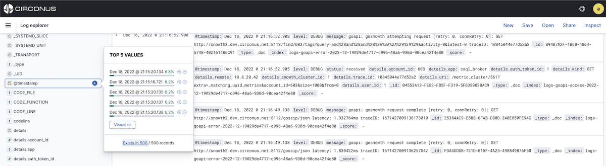
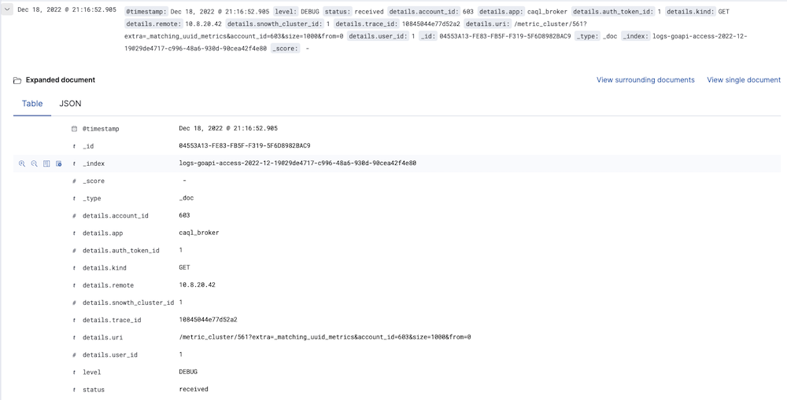
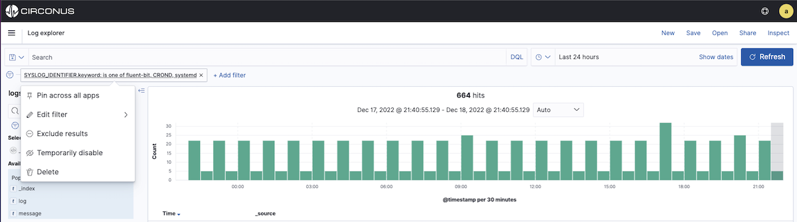

# Filtering by Fields

You can filter the search results to display only those documents that contain a particular value in a field. You can also create negative filters that exclude documents that contain the specified field value.

You add field filters from the Fields list, the Documents table, or by manually adding a filter. In addition to creating positive and negative filters, the Documents table enables you to filter on whether or not a field is present. The applied filters are shown below the Query bar. Negative filters are shown in red.

## Creating new filters

To add a filter from the Fields list:

1. Click the name of the field you want to filter on. This displays the top five values for that field.

2. To add a positive filter, click the **Positive Filter** button. This includes only those events that contain that value in the field.

3. To add a negative filter, click the **Negative Filter** button. This excludes events that contain that value in the field.



To add a filter from the Documents table:

1. Expand an **Event** entry (Document) in the table by clicking the **Expand** button to the left of the event's table entry.

2. To add a positive filter, click the **Positive Filter** button to the right of the field name. This includes only those documents that contain that value in the field.

3. To add a negative filter, click the **Negative Filter** button to the right of the field name. This excludes documents that contain that value in the field.

4. To filter on whether or not documents contain the field, click the **Exists** button to the right of the field name. This includes only those documents that contain the field.



To manually add a filter:

1. Click **+ Add filter**. A popup will be displayed for you to create the filter.

2. Choose a field to filter by. This list of fields will include fields from the index pattern you are currently querying against.

3. Choose an operation for your filter.

The following operators can be selected:

| **Operator**   | **Description**                                                                  |
| -------------- | -------------------------------------------------------------------------------- |
| is             | Filter where the value for the field matches the given value.                    |
| is not         | Filter where the value for the field does not match the given value.             |
| is one of      | Filter where the value for the field matches one of the specified values.        |
| is not one of  | Filter where the value for the field does not match any of the specified values. |
| is between     | Filter where the value for the field is in the given range.                      |
| is not between | Filter where the value for the field is not in the given range.                  |
| exists         | Filter where any value is present for the field.                                 |
| does not exist | Filter where no value is present for the field.                                  |

4. Choose the value(s) for your filter. Values from your indices may be suggested as selections if you are filtering against an aggregatable field.

5. (Optional) Specify a label for the filter. If you specify a label, it will be displayed below the query bar instead of the filter definition.
6. Click **Save**. The filter will be applied to your search and be displayed below the query bar.
   If you are experiencing long-running queries as a result of the value suggestions, you can turn off the suggestions by setting the advanced setting, filterEditor:suggestValues, to false.


## Managing filters

To modify a filter, hover over it and click one of the action buttons.

- **Pin across all apps** pins the filter across dashboards, visualizations, and Logs Explorer in Circonus. For example, you can pin a filter in Logs Explorer and it remains in place when you switch to Visualizations. Note that a filter is based on a particular index field—​if the indices being searched don’t contain the field in a pinned filter, it has no effect.
- **Edit Filter** definition. Enables you to manually update the filter and specify a label for the filter.
  To apply a filter action to all of the applied filters, click **Actions** and select the action.
- **Exclude results** switch from a positive filter to a negative filter and vice-versa. When selected, the filter is outlined in red.
- **Temporarily disable** to disable the filter without removing it. Click again to reenable the filter. Diagonal stripes indicate that a filter is disabled.
- **Delete Filter** removes the filter.



## Editing a filter

You can edit a filter by changing the field, operator, or value associated with the filter (see the [Creating new filters](/circonus3/analytics/logs-explorer/filtering-by-fields/#creating-new-filters) section above), or by directly modifying the filter query that is performed to filter your search results. This enables you to create more complex filters that are based on multiple fields.

1. To edit the filter query, first click the edit button for the filter, then click **Edit Query DSL**.

2. You can then edit the query for the filter.

For example, you could use a bool query to create a filter for the sample log data that displays the hits that originated from Canada or China that resulted in a 404 error:

```json
{
  "bool": {
    "should": [
      {
        "term": {
          "geoip.country_name.raw": "Canada"
        }
      },
      {
        "term": {
          "geoip.country_name.raw": "China"
        }
      }
    ],
    "must": [
      {
        "term": {
          "response": "404"
        }
      }
    ]
  }
}
```
