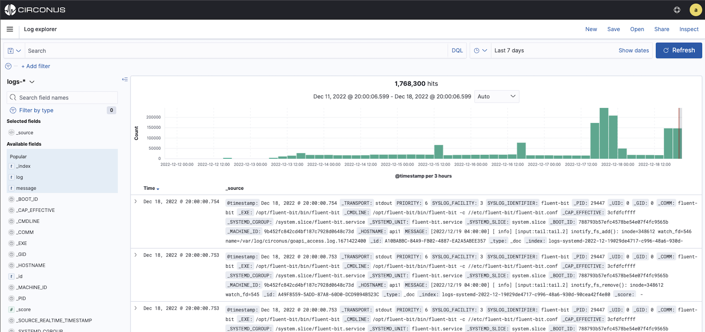
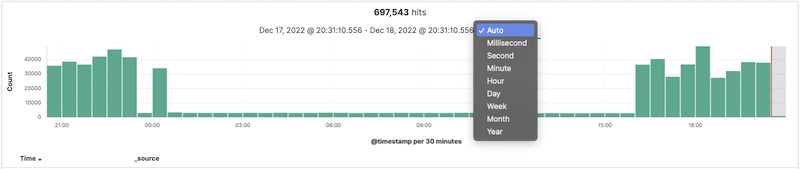

# Logs Explorer

Logs Explorer helps you extract analytics and insights from your operational logs and distributed traces within Circonus. Regardless of whether the data is from the cloud, infrastructure, or applications, Circonus allows you to quickly ingest, query, and display your organization's data in visualizations and dashboards as well as deliver the insights needed to manage your organization's technology investments.

With Logs Explorer, you have access to all your data stored by Circonus. Log and trace data are stored as documents within the Circonus platform and you have access to all of your documents.

You can submit search queries, filter the search results, and view document data. You can also see the number of documents that match the search query and get field value statistics. If a time field is configured for the selected index pattern, the distribution of documents over time is displayed in a histogram at the top of the page.

Let's review some of the features within Logs Explorer.

## Filtering the Time

You can set a time filter if your data contains time-based fields or events.

The time filters in Logs Explorer function identically to those on the [dashboards](/circonus3/dashboards/introduction/#date-and-time-filters). You can use the time picker to choose from **Quick select**, **Recently used**, **Absolute time**, **Relative time**, or **Now** (current date and time). The time filter restricts the search results to a specific time period.

You can also manipulate the time frame and interval using the histogram at the top of the Logs Explorer screen.

Here, you can make a selection by either clicking a histogram bar for the desired time interval or by clicking and dragging over the desired time frame. Note that when making a selection by clicking and dragging, you must start the selection with the cursor over the background of the chart. The cursor changes to a plus sign when you hover over a valid start point.

**More options:**

- Use the browser Back button to undo your changes.
- To move forward or backward in time, click the arrows to the left or right of the time rage.
- To use a different interval, click the dropdown on the histogram and select an interval.

## Searching Your Data

You can search your data indices (that match the current index pattern) by entering your search criteria in the query bar. By default, you can use [Dashboards Query Language](/circonus3/additional-resources/query-languages/dql/) which features autocomplete and a simple, easy-to-use syntax. Logs Explorer also supports querying using [Lucene query syntax](/circonus3/additional-resources/query-languages/lucene-support/) (recommended for advanced users only) by clicking on the **DQL** button and setting the Slider from **On** to **Off** for the Dashsboards Query Lanugage.

When you submit a search request, the histogram, Documents table, and Fields list are updated to reflect the search results. The total number of hits (matching documents) is shown in the toolbar. The Documents table shows the first five hundred hits. By default, the hits are listed in reverse chronological order, with the newest documents shown first. You can reverse the sort order by clicking the Time column header. You can also sort the table by the values in any indexed field. For more information, see [Sorting the Document List](/circonus3/analytics/logs-explorer/viewing-doc-data/#sorting-the-document-list).

To search your data, enter your search criteria in the query bar and press **Enter** or click the **Search** button to submit the request to Circonus.

## Saving a Search

Saving searches enables you to reload them into both the Logs Explorer and dashboards, and use them as the basis for visualizations. Saving a search saves both the search query string and the currently selected index pattern.

To save the current search:

1. Click **Save** in the query bar.
2. Enter a name for the search and click **Save**.

### Opening a Saved Search

To load a saved search into Logs Explorer:

1. Click the disk icon in the query bar.
2. Select the search you want to open.

If the saved search is associated with a different index pattern than is currently selected, opening the saved search changes the selected index pattern. The query language used for the saved search will also be automatically selected.

## Changing Which Indices You’re Searching

When you submit a search request, the indices that match the currently-selected index pattern are searched. The current index pattern is shown below the toolbar. To change which indices you are searching, click the index pattern and select a different index pattern.

## Refreshing the Search Results

As more documents are added to the indices you’re searching, the search results shown in Logs Explorer and used to display visualizations get stale. You can configure a refresh interval to periodically resubmit your searches to retrieve the latest results.

To enable auto refresh:

1. Click the time picker in the query bar.
2. Click **Auto refresh**.
3. Choose a refresh interval from the list (described above).

When auto refresh is enabled, the refresh interval is displayed next to the time picker along with a **Pause** button. To temporarily disable auto refresh, click **Pause**.

_If auto refresh is not enabled, you can manually refresh visualizations by clicking_ **Refresh**.
