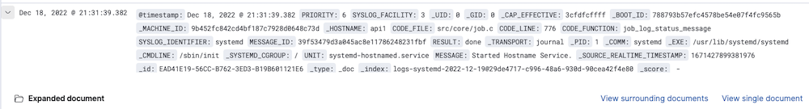

# Viewing Document Data

When you submit a search query, the 500 most recent events known as documents that match the query are listed. You can configure the number of documents shown in the table by setting the `discover:sampleSize` property in Advanced Settings. By default, the table shows the localized version of the time field configured for the selected index pattern and the document `_source`. You can add fields to the Documents table from the Fields list. You can sort the listed documents by any indexed field that’s included in the table.

To view a document’s field data, click the **Expand button** to the left of the document’s table entry.

To view the original JSON document (pretty-printed), click the JSON tab.

To view the document data as a separate page, click the **View single document** link. You can bookmark and share this link to provide direct access to a particular document.

To display or hide a field’s column in the Documents table, click the **Toggle column in table** button.

To collapse the document details, click the **Collapse** button.

## Sorting the Document List

You can sort the documents in the Documents table by the values in any indexed field. If a time field is configured for the current index pattern, the documents are sorted in reverse chronological order by default.

To change the sort order, hover over the name of the field you want to sort by and click the **Sort** button. Click again to reverse the sort order.

## Adding Field Columns to the Documents Table

By default, the Documents table shows the localized version of the time field that’s configured for the selected index pattern and the document `_source`. You can add fields to the table from the Fields list or from a document’s field data.

To add a field column from the Fields list, hover over the field and click its **Add** button.

To add a field column from a document’s field data, expand the document and click the field’s **Toggle column in table** button.

Added field columns replace the `_source` column in the Documents table. The added fields are also added to the **Selected Fields** list.

To rearrange the field columns, hover over the header of the column you want to move and click the **Move left** or **Move right** buttons.

## Removing Field Columns

To remove a field column from the Documents table, hover over the header of the column you want to remove and click the **Remove field** button.

## Viewing Document Context

For certain applications it can be useful to inspect a window of documents surrounding a specific event. The context view enables you to do just that for index patterns that are configured to contain time-based events.

To show the context surrounding an anchor document, click the **Expand** button to the left of the document’s table entry and then click the **View surrounding documents** link.

The context view displays a number of documents before and after the anchor document. The anchor document itself is highlighted in blue. The view is sorted by the time field specified in the index pattern configuration and uses the same set of columns as the Logs Explorer view the context was opened from. If there are multiple documents with the same time field value, the internal document order is used as a secondary sorting criterion by default.

> The field used for tiebreaking in case of equal time field values can be configured using the advanced setting `context:tieBreakerFields` in **Management > Advanced Settings**, which defaults to the \_doc field. The value of this setting can be a comma-separated list of field names, which will be checked in sequence for suitability when a context is about to be displayed. The first suitable field is then used as the tiebreaking field. A field is suitable if the field exists and is sortable in the index pattern the context is based on.
>
> While not required, it is recommended to only use fields which have _document values_ enabled to achieve good performance and avoid unnecessary field data usage. Common examples for suitable fields include log line numbers, monotonically increasing counters and high-precision timestamps.
>
> The number of documents displayed by default can be configured via the `context:defaultSize` setting in Management > Advanced Settings.

### Changing the Context Size

You can change the number documents displayed before and after the anchor document independently.

To increase the number of displayed documents that are newer than the anchor document, click the **Load 5 more** button above the document list or enter the desired number into the input box right of the button.

To increase the number of displayed documents that are older than the anchor document, click the **Load 5 more** button below the document list or enter the desired number into the input box right of the button.

> The default number of documents loaded with each button click can be configured via the `context:step` setting in Management > Advanced Settings.

### Filtering the Context

Depending on how the documents are partitioned into index patterns, the context view might contain a large number of documents not related to the event under investigation. In order to adapt the focus of the context view to the task at hand, you can use filters to restrict the documents considered for display in the context view.

When switching from the discover view to the context view, the previously applied filters are carried over. Pinned filters remain active, while normal filters are copied in a disabled state. You can selectively re-enable them to refine your context view.

New filters can be added via the **Add filter** link in the filter bar, by clicking the filter icons appearing when hovering a field, or by expanding documents and clicking the filter icons in the table.

## Viewing Field Data Statistics

From the Fields list, you can see how many of the documents in the Documents table contain a particular field, what the top 5 values are, and what percentage of documents contain each value.

Data can be visualized in various ways. The quick visualize can only be applied to aggregatable fields. The keyword fields can be visualized and they are available in the side bar if **Hide missing fields** is unchecked.

To view field data statistics, click the name of a field in the Fields list.
