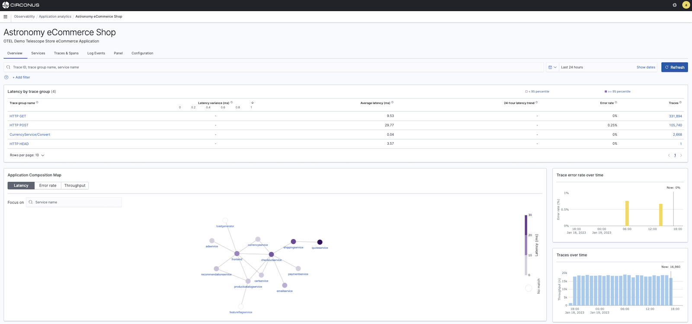
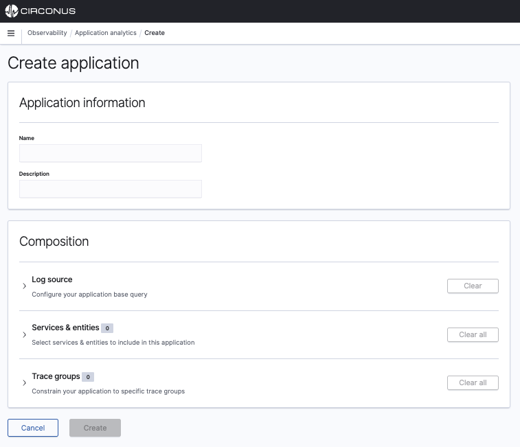

# Application Analytics



You can use application analytics to create custom observability applications to view the availability status of your systems where you can combine log events with trace and metric data into a single view of overall system health. This lets you quickly pivot between logs, traces, and metrics to dig into the source of any issues.

## Get started with Application Analytics

To get started, select **Observability** from the main menu and then choose **Application analytics**.

### Create an Application



1. Choose **Create application**.
2. Enter a name for your application and optionally add a description.
3. Do at least one of the following:

   - Use PPL to specify the base query. You can't change the base query after the application is created.
   - Select services & entities from the dropdown or the service map.
   - Select trace groups from the dropdown or the table.

4. Choose **Create**.

### Create a Visualization

1. Choose the **Log Events** tab.
1. Use PPL to build upon your base query.
1. Choose the **Visualizations** tab to see your visualizations.
1. Expand the **Save** dropdown menu, enter a name for your visualization, then choose **Save**.

To see your visualizations, choose the **Panel** tab.

### Configure Availability

Availability is the status of your application determined by availability levels set on a [time series metric](/circonus3/analytics/observability/app-analytics/#time-series-metric).

To create an availability level, you must configure the following:

- **color**: The color of the availability badge on the home page.
- **name**: The text in the availability badge on the home page.
- **expression**: Comparison operator to determine the availability.
- **value**: Value to use when calculating availability.

By default, application analytics shows results from the last 24 hours of your data. To see data from a different time frame, use the date and time selector.

#### Time series metric

A time series metric is any visualization that has a query that spans over a timestamp and is a line chart. You can then use PPL to define arbitrary conditions on your logs to create a visualization over time.

##### Example

```bash
source = <index_name> | ... | ... | stats ... by span(<timestamp_field>, 1h)
```

Choose **Line** in visualization configurations to create a time series metric.
