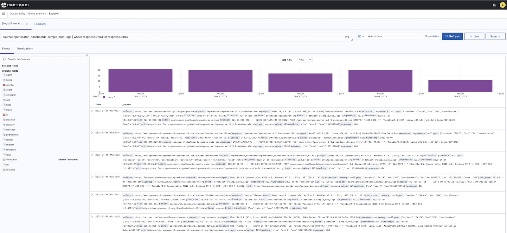

# Event Analytics

The Event analytics section within Observability is where you can use Piped Processing Language (PPL) queries to build and view different visualizations of your data.



## Get Started with Event Analytics

To get started, select **Observability** in the main menu and then choose **Event analytics**. If you want to start exploring without adding any of your own data, choose **Add sample Events Data**, and some sample visualizations you can interact with will be added.

## Build a Query

To generate custom visualizations, you must first specify a PPL query. Circonus then automatically creates a visualization based on the results of your query.

For example, the following PPL query returns a count of how many host addresses are currently in your data.

```
source = opensearch_dashboards_sample_data_logs | fields host | stats count()
```

By default, Circonus shows results from the last 15 minutes of your data. To see data from a different timeframe, use the date and time selector.

## Save a Visualization

After Circonus generates a visualization, you must save it if you want to return to it at a later time or if you want to add it to an [operational panel](/circonus3/analytics/observability/operational-panels).

To save a visualization, expand the save dropdown menu next to **Refresh**, enter a name for your visualization, and then choose **Save**. You can reopen any saved visualizations on the Event Analytics page.

## View Logs

The following are methods you can use to view logs.

### Trace Log Correlation

If you regularly track events across applications, you can correlate logs and traces. To view the correlation, you have to index the traces according to Open Telemetry standards (similar to trace analytics). Once you add a `TraceId` field to your logs, you can view the correlated trace information in the event explorer log details. This method lets you correlate logs and traces that correspond to the same execution context.

### View Surrounding Events

If you want to know more about a log event you're looking at, you can select **View surrounding events** to get a bigger picture of what was happening around the time of interest.

### Live Tail

If you prefer watching events happen live, you can configure an interval so event analytics automatically refreshes the content. Live tail lets you stream logs live to Circonus observability event analytics based on the provided PPL query, as well as provide rich functionality such as filters. Doing so improves your debugging experience and lets you monitor your logs in real-time without having to manually refresh.

You can also choose intervals and switch between them to dictate how often live tail should stream live logs. This feature is similar to the CLI's `tail -f` command in that it only retrieves the most recent live logs by possibly eliminating a large portion of live logs. Live tail also provides you with the total count of live logs received by Circonus during the live stream, which you can use to better understand the incoming traffic.

## Related links

- [Circonus Dashboards](/circonus3/dashboards/introduction/)
- [Getting Started with Circonus](/circonus3/getting-started/)
