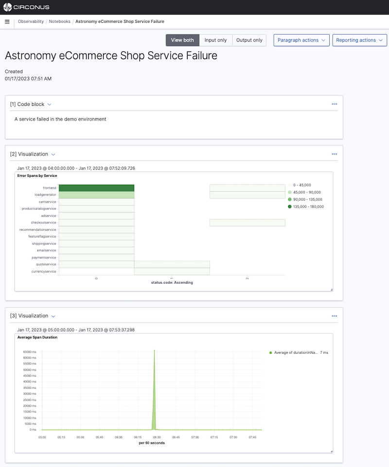

# Notebooks

A Circonus notebook is an interface that lets you easily combine code snippets, live visualizations, and narrative text. Notebooks let you interactively explore data by running different visualizations that you can share with team members to collaborate on a project.

Notebook documents are composed of two elements: code blocks (Markdown/SQL/PPL) and visualizations. You can choose multiple timelines to compare and contrast visualizations.

You can also generate [reports](/circonus3/analytics/reporting/) directly from your notebooks.

Common use cases include creating postmortem reports, designing runbooks, building live infrastructure reports, and writing documentation.



## Get started with Notebooks

To get started, choose **Notebooks** within the main menu.

### Step 1: Create a Notebook

1. Choose **Create notebook** and enter a descriptive name.
1. Choose **Create**.

Choose **Actions** to rename, duplicate, or delete a notebook.

### Step 2: Add a paragraph

Paragraphs combine code blocks and visualizations for describing data.

#### Add a code block

Code blocks support markdown, SQL, and PPL languages.

Specify the input language on the first line using `%[language type]` syntax.
For example, type `%md` for markdown, `%sql` for SQL, and `%ppl` for PPL.

##### Sample markdown block

```
%md
Add in text formatted in markdown.
```

##### Sample SQL block

```sql
%sql
Select * from opensearch_dashboards_sample_data_flights limit 20;
```

##### Sample PPL block

```
%ppl
source=opensearch_dashboards_sample_data_logs | head 20
```

#### Add a visualization

1. To add a visualization, choose **Add paragraph** and select **Visualization**.
1. In **Title**, select your visualization and choose a date range. You can choose multiple timelines to compare and contrast visualizations.
1. To run and save a paragraph, choose **Run**.

## Paragraph actions

You can perform the following actions on paragraphs:

- Add a new paragraph to the top of a report.
- Add a new paragraph to the bottom of a report.
- Run all the paragraphs at the same time.
- Clear the outputs of all paragraphs.
- Delete all the paragraphs.

## Sample notebooks

We prepared the following sample notebooks that showcase a variety of use cases:

- Using PPL to query the Circonus sample web logs data.
- Using PPL and visualizations to perform sample root cause event analysis on the Circonus sample web logs data.

To add a sample notebook, choose **Actions** and select **Add sample notebooks**.

## Create a report

You can use notebooks to create PNG and PDF reports:

1. From the top menu bar, choose **Reporting actions**.
1. You can choose to **Download PDF** or **Download PNG**.

   Reports generate asynchronously in the background and might take a few minutes, depending on the size of the report. A notification appears when your report is ready to download.

1. To create a schedule-based report, choose **Create report definition**. For steps to create a report definition, see [Create reports using a definition](/circonus3/analytics/reporting/managing-reports/#create-reports-using-a-definition).
1. To see all your reports, choose **View all reports**.

## Related links

- [Circonus Dashboards](/circonus3/dashboards/introduction/)
- [Getting Started with Circonus](/circonus3/getting-started/)
