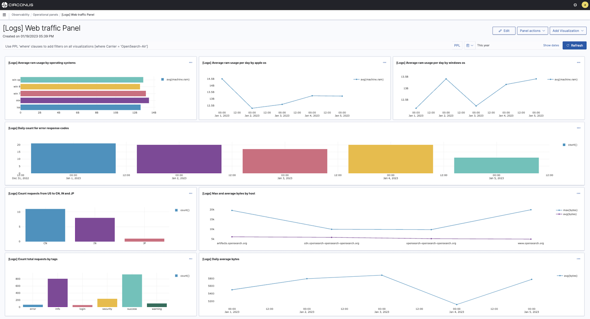

# Operational Panels

Operational panels in Circonus are collections of visualizations generated using Piped Processing Language (PPL) queries.

## Get Started with Operational Panels

If you want to start using operational panels without adding any data, expand the **Action** menu and choose **Add samples**. A set of operational panels with saved visualizations for you to explore will then be added.

## Create an Operational Panel

To create an operational panel and add visualizations:

1. From the **Add Visualization** dropdown menu, choose **Select Existing Visualization** or **Create New Visualization**, which takes you to the [event analytics](/circonus3/analytics/observability/event-analytics) explorer where you can use PPL to create visualizations.
1. If you're adding already existing visualizations, choose a visualization from the dropdown menu.
1. Choose **Add**.

To search for a particular visualization in your operational panels, use PPL queries to search for data you've already added to your panel.

## Related links

- [Circonus Dashboards](/circonus3/dashboards/introduction/)
- [Getting Started with Circonus](/circonus3/getting-started/)
