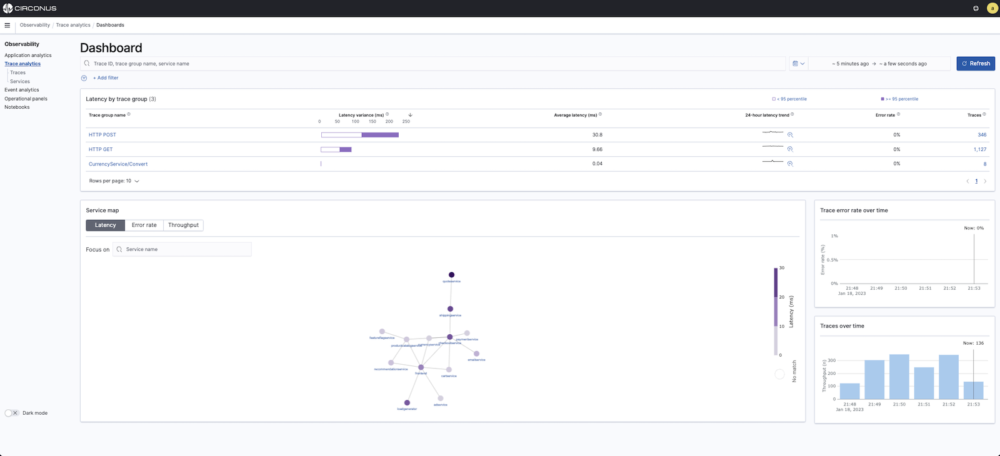
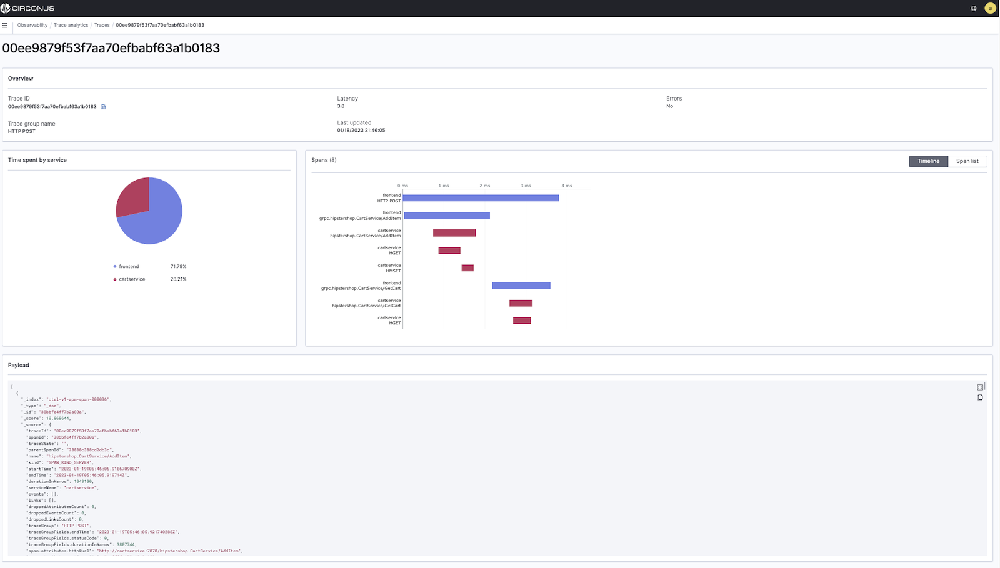

# Trace Analytics

Trace analytics is a key part of Circonus Observability which helps you visualize and analyze your [OpenTelemetry](https://opentelemetry.io/) distributed tracing data within the platform.

Traces can help you find and fix performance problems in distributed applications.

A single operation, such as a user clicking a button, can trigger an extended series of events. The front end might call a back end service, which calls another service, which queries a database, processes the data, and sends it to the original service, which sends a confirmation to the front end.

Trace analytics can help you visualize this flow of events and identify performance problems.

## Dashboard view

The Trace analytics **Dashboard** groups traces together by HTTP method and path so that you can see the average latency, error rate, and trends associated with a particular operation. For a more focused view, try filtering by trace group name.

## Trace view

To drill down on the traces that make up a trace group, choose the number of traces in the right hand column. Then choose an individual trace for a detailed summary.

## Services view

The **Services** view lists all services in the application, plus an interactive map that shows how the various services connect to each other. In contrast to the dashboard, which helps identify problems by operation, the service map helps identify problems by service. Try sorting by error rate or latency to get a sense of potential problem areas within your application.

## Related links

- [Circonus Dashboards](/circonus3/dashboards/introduction/)
- [Getting Started with Circonus](/circonus3/getting-started/)
