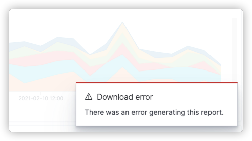

# Managing Reports

You can use Circonus to create PNG, PDF, and CSV reports. To create reports, you must have the correct permissions. For a summary of the predefined roles and the permissions they grant, see [Users and Roles](/circonus3/management/access-control/users-roles/).

CSV reports have a non-configurable 10,000 row limit. They have no explicit size limit (e.g. in MB), but extremely large documents could cause report generation to fail with an out-of-memory error from the V8 JavaScript engine.

## Create reports from Logs Explorer, Visualizations, Dashboards, or Notebooks

Quickly generate an on-demand report from the current view.

1. From the top menu bar, choose **Reporting**.
1. For dashboards, visualizations, or notebooks, choose **Download PDF** or **Download PNG**. If you're creating a report from the Logs Explorer page, choose **Generate CSV**.

   Reports generate asynchronously in the background and might take a few minutes, depending on the size of the report. A notification appears when your report is ready to download.

1. To create a schedule-based report, choose **Create report definition**. Then proceed to [Create reports using a definition](#create-reports-using-a-definition). This option pre-fills many of the fields for you based on the visualization, dashboard, or data you were viewing.

## Create reports using a definition

Definitions let you generate reports on a periodic schedule.

1. From the navigation panel, choose **Reporting**.
1. Choose **Create**.
1. Under **Report settings**, enter a name and optional description for your report.
1. Choose the **Report source** (i.e. the page from which the report is generated). You can generate reports from dashboards, visualizations, Logs Explorer (saved search), or notebook pages.
1. Select your dashboard, visualization, saved search, or notebook. Then choose a time range for the report.
1. Choose an appropriate file format for the report.
1. (Optional) Add a header or footer to the report. Headers and footers are only available for dashboards, visualizations, and notebooks.
1. Under **Report trigger**, choose either **On demand** or **Schedule**.

   For scheduled reports, select either **Recurring** or **Cron based**. You can receive reports daily or at some other time interval. Cron expressions give you even more flexiblity. See [Cron expression reference](/circonus3/analytics/reporting/cron/) for more information.

1. Choose **Create**.

## Troubleshooting

### Chromium fails to launch with Circonus

While creating a report for dashboards or visualizations, you might see a the following error:

This problem can occur for two reasons:

- You don't have the correct version of `headless-chrome` to match the operating system on which Circonus is running. Download the correct version [here](https://github.com/opensearch-project/dashboards-reports/releases/tag/chromium-1.12.0.0).

- You're missing additional dependencies. Install the required dependencies for your operating system.

### Characters not loading in reports

You might encounter an issue where UTF-8 encoded characters look fine in your browser, but they don't load in your generated reports because you're missing the required font dependencies. Install the font dependencies and then generate your reports again.
