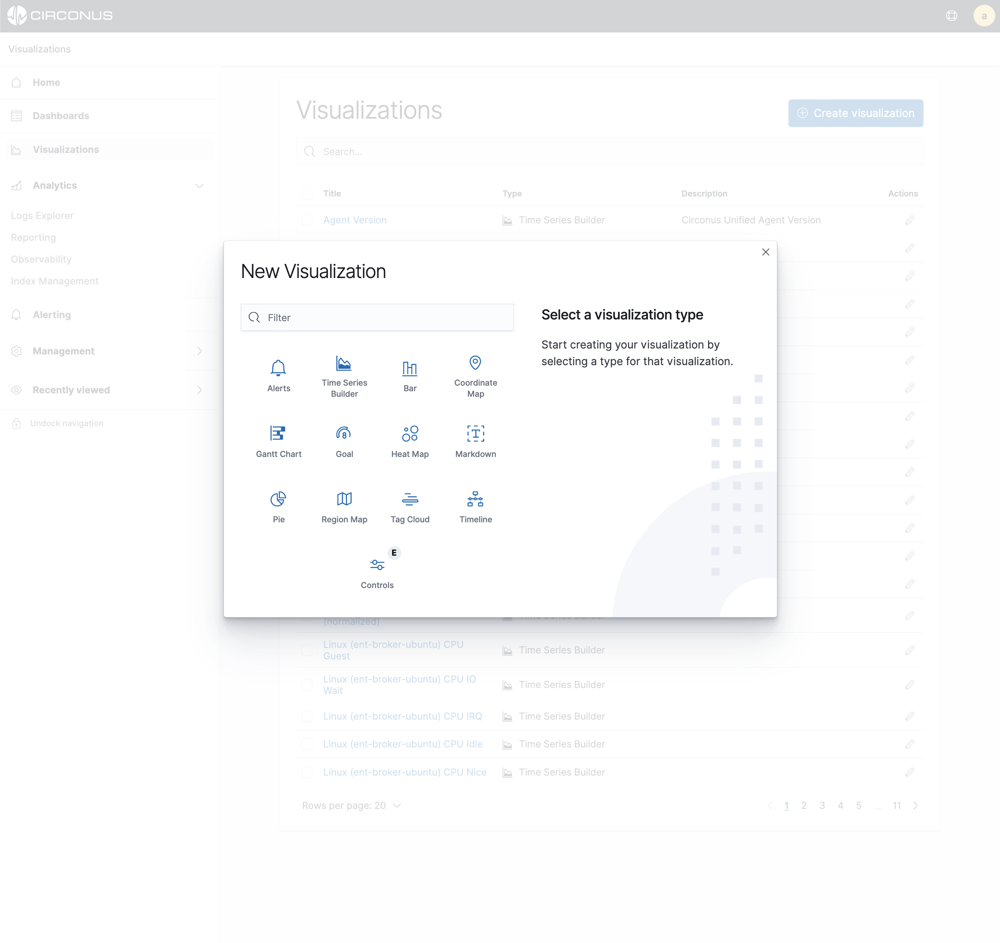
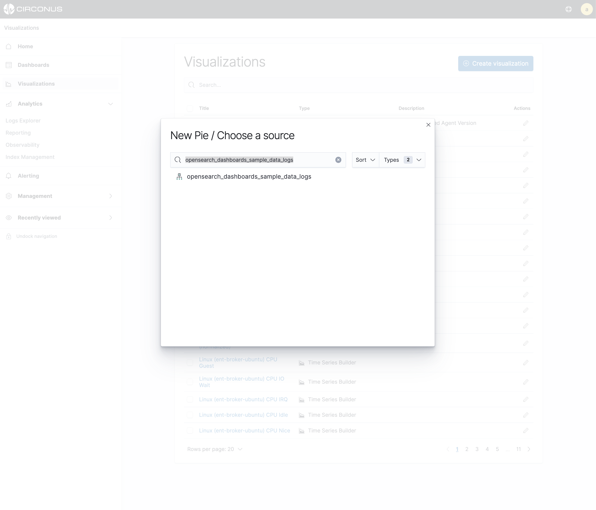
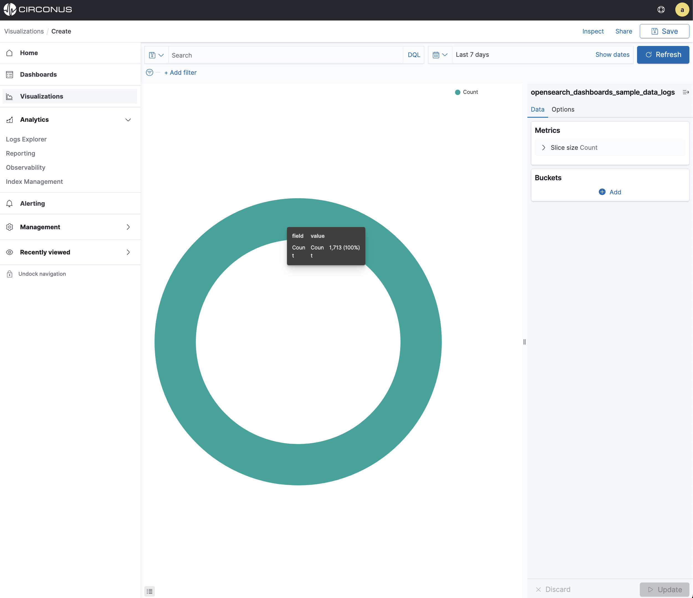
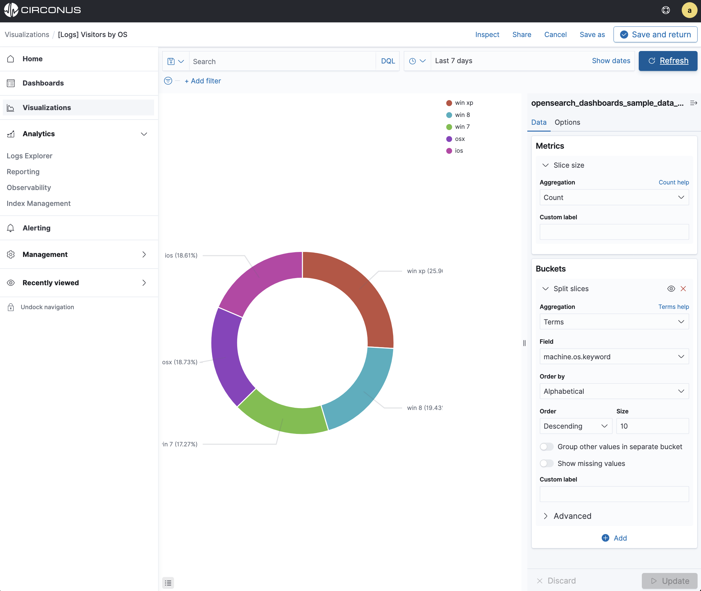
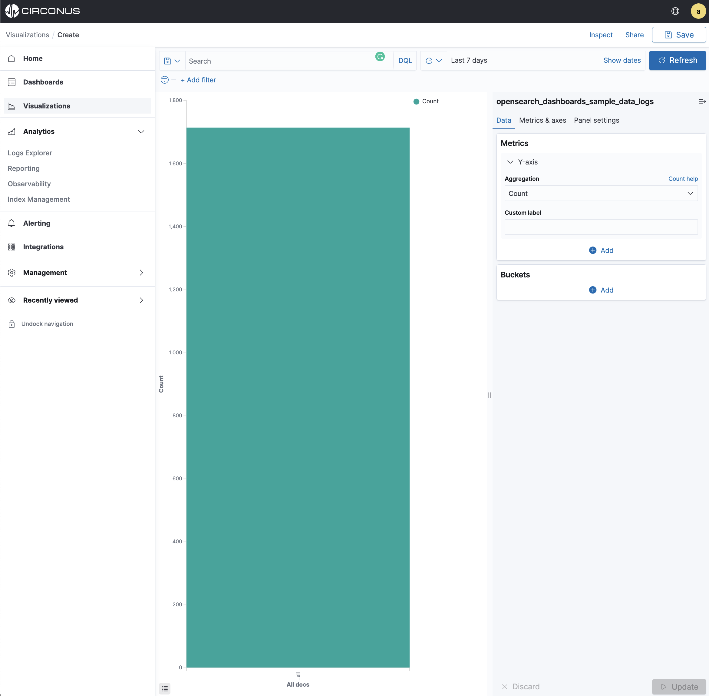
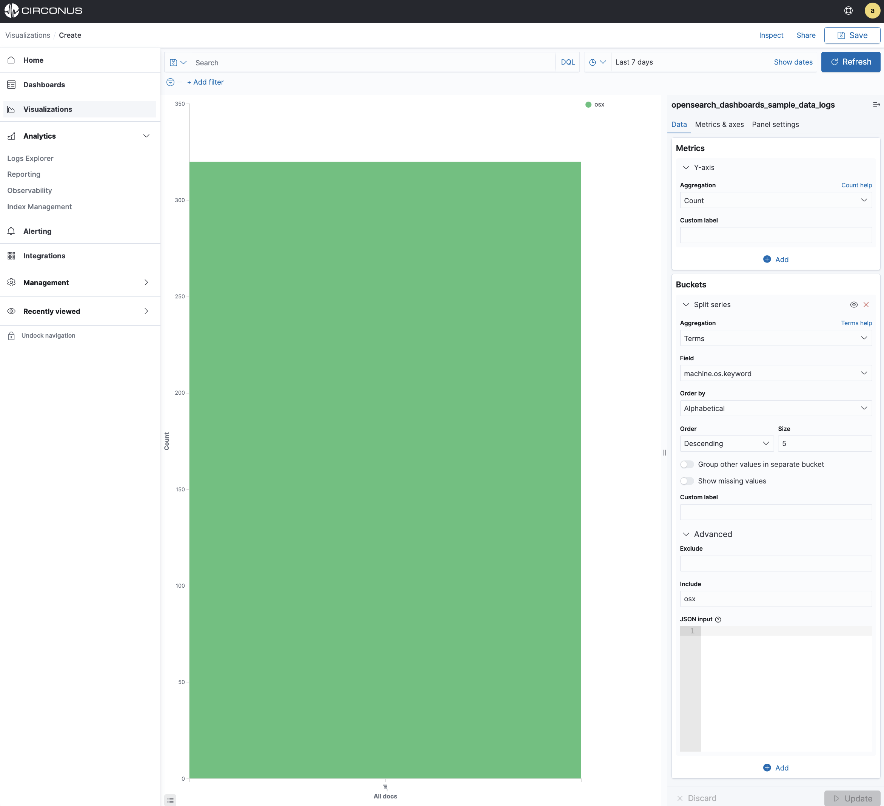
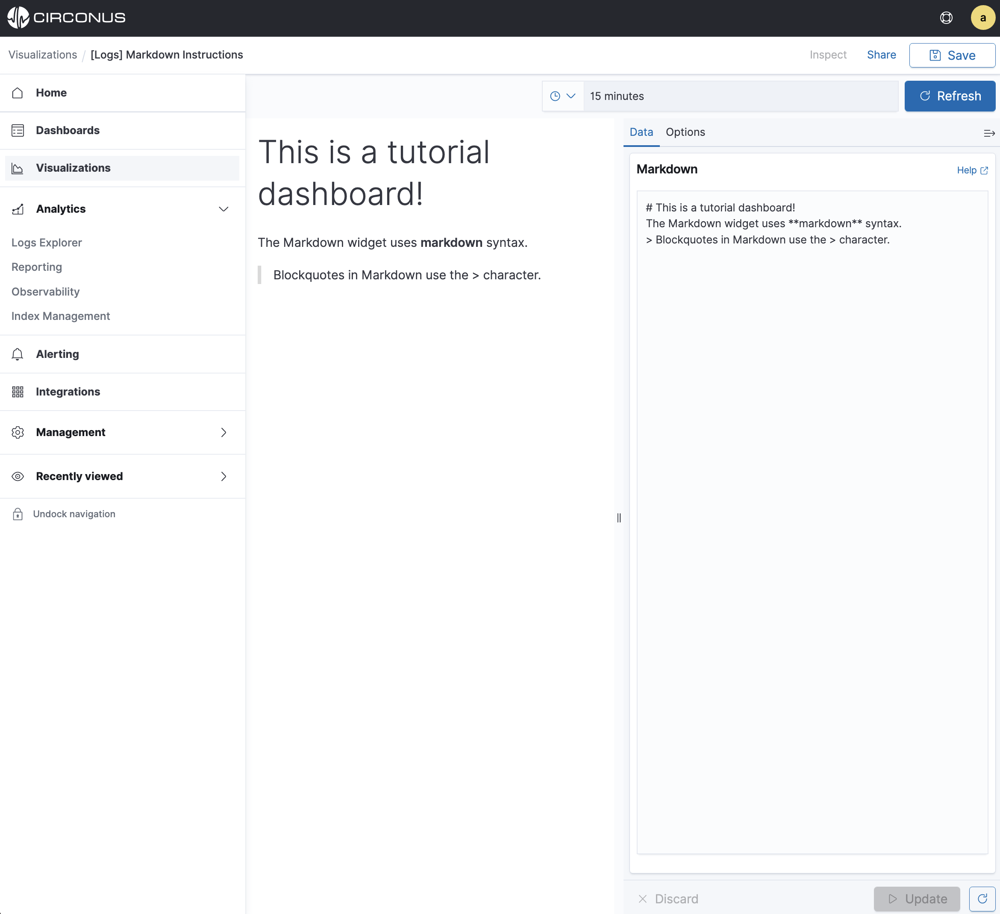
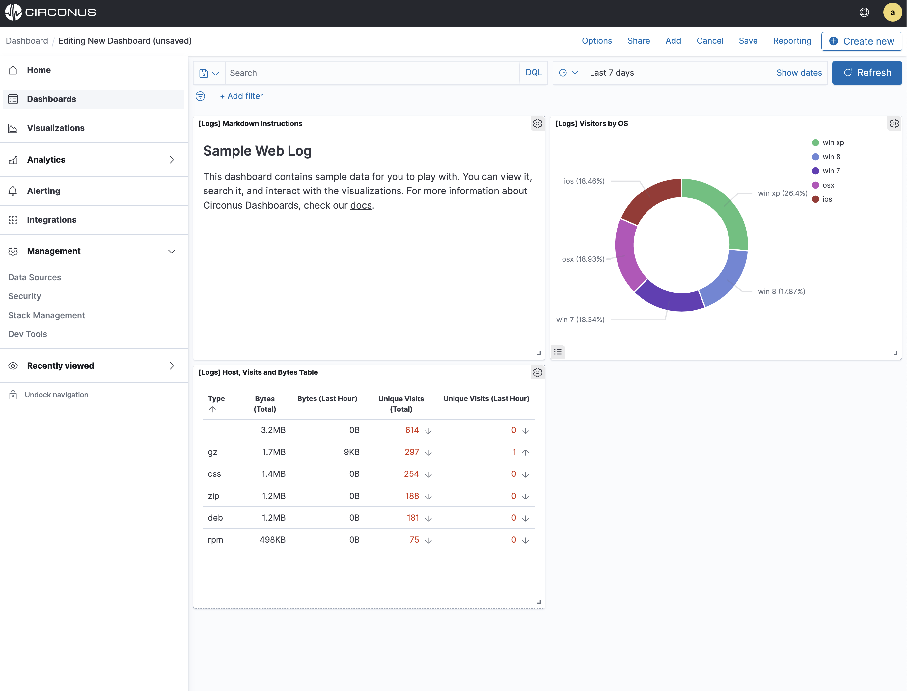

# Build Your First Dashboard

Dashboards provide a unified visualization framework for your cloud services, infrastructure, and applications and make it easy for you to explore your metric, log, or trace data within the platform.

From real-time infrastructure monitoring (IM) to application performance monitoring (APM), distributed tracing, outage response and data exploration, dashboards give you the visualizations needed to graphically represent trends, outliers, and patterns in your data.

## Dashboard Use Cases

In Circonus, a dashboard is a collection of charts, graphs, gauges, and other visualizations. You can track, analyze, and display real-time search, monitoring, and analysis of business and operational data for use cases like infrastructure monitoring or application observability (monitoring, log analytics, distributed tracing).

**Visualize and correlate metric, log, and trace data.**


**Diagnose performance issues and reduce application downtime.**


**Unlock analysis of real-time operational monitoring of infrastructure and applications.**


Get ready to build a custom dashboard using either sample or your data.

- Discover and explore the data
- Visualize the data
- Add visualizations to a dashboard
- Inspect the data behind a visualization

In the Visualizations application, you can depict your data using a variety of charts, tables, maps, and more. For this tutorial, you’ll create four visualizations: a time series, pie chart, bar chart, coordinate map, and Markdown widget.

## Pie chart

Let's start by creating a pie [chart](/circonus3/additional-resources/glossary/#chart).

1. Open **Visualizations.**
2. Click the **Create visualization+** button. You’ll see all the visualization types in Circonus.



3. Click **Pie**.
4. In **New Pie/Choose a source**, select the `opensearch_dashboards_sample_data_logs` index pattern. You’ll use the pie chart to gain insight into the various operating systems users are using.



Initially, the pie contains a single "slice." That’s because the default search matched all documents.



To specify which slices to display in the pie, you use a Circonus [Bucket aggregation](/circonus3/visualizations/aggregations/bucket-agg). This aggregation sorts the documents that match your search criteria into different categories, also known as _buckets_.
Use a bucket aggregation to establish multiple ranges of OSes and out what percentage of OS types are being used.

1. In the **Buckets** pane, click **Split Slices**.
2. In the **Aggregation** dropdown menu, select **Terms**.
3. In the **Field** dropdown menu, select **machine.os.keyword**.
4. In the **Order** dropdown menu, select **Descending** with a **Size** of **10**.
5. Click **Update** to apply the changes to the chart.



To save this chart so you can use it later, click **Save** in the command bar and enter `Pie Example`.

## Bar chart

You’ll use a bar chart to look at the **Web log** data set, and visualize the count of `osx` contained in the `machine.os.keyword` field.

Create a **Vertical Bar** chart and set the search source to `opensearch_dashboards_sample_data_logs`.

Initially, the chart is a single bar that shows the total count of documents that match the default wildcard query.



Show the number of `osx` operating systems used along the Y-axis. This requires you to configure the Y-axis [Metric aggregation](/circonus3/visualizations/aggregations/metric-agg/) **count** This aggregation computes metrics based on values from the search results.

1. In the **Metrics** pane, expand Y-Axis.
2. Set **Aggregation** to **Count**.
3. In the **Buckets** pane, select Set **Field** to **Split series**.
4. Set **Field** to **machine.os.keyword**.
5. Set **Order by** to **Alphabetical**.

Now we will limit the data output to the chart to only include **osx**.

6. In the **Buckets** pane, expand the **Advanced** section.
7. In the **Include** field, type **osx**.
8. Click **Update** to apply the changes.



To save this chart so you can use it later:

Click **Save** in the command bar and enter `Bar Example`.

## Markdown

The final visualization is a Markdown widget that renders formatted text.

1. Create a **Markdown** visualization.
2. In the textbox, enter the following

```sh
# This is a tutorial dashboard!
The Markdown widget uses **markdown** syntax.
> Blockquotes in Markdown use the > character.
```

3. Click **Update** to render the changes.

The Markdown renders in the preview pane:



Click **Save** in the command bar and enter `Markdown Example`.

## Displaying your visualizations in a dashboard

A dashboard is a collection of visualizations that you can arrange and share. You’ll build a dashboard that contains the visualizations you saved during this tutorial.

1. Open **Dashboards**.
2. Click **Create dashboard**.
3. Click **Add**.
4. Add the following visualizations to the dashboard **[Logs] Markdown Instructions, [Logs] Visitors by OS, and [Logs] Hosts, Visits and Bytes Table**.

Your sample dashboard looks like this:



You can rearrange the visualizations by clicking the header of a single visualization and dragging. The gear icon in the top right of a visualization displays controls for editing and deleting the visualization. A resize control is on the lower right.

To get a link to share or HTML code to embed the dashboard in a web page, save the dashboard and click **Share**.

**Save** your dashboard.

## Inspecting the data

Seeing visualizations of your data is great, but sometimes you need to look at the actual data to understand what’s really going on. You can inspect the data behind any visualization and view the Circonus query used to retrieve it.

1. In the dashboard, hover the pointer over the pie chart.
2. Click the icon in the upper right.
3. From the **Options** menu, select **Inspect**.


You can also look at the query used to fetch the data for the visualization.

1. Open the **View: Data** menu and select **Requests**.
2. Click the tabs to look at the request statistics, the Elasticsearch request, and the response in JSON.
3. To close the Inspector, click X in the upper right.


