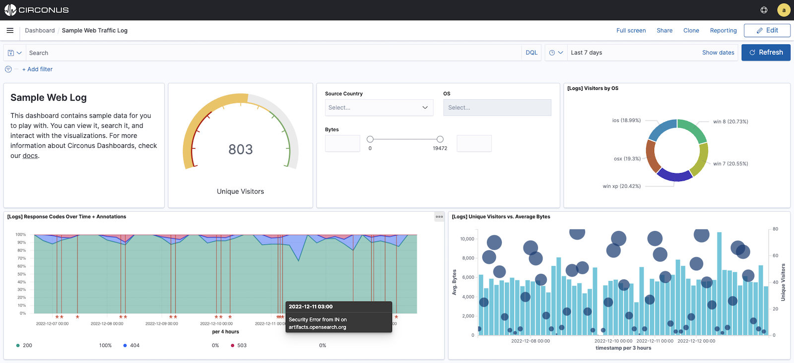
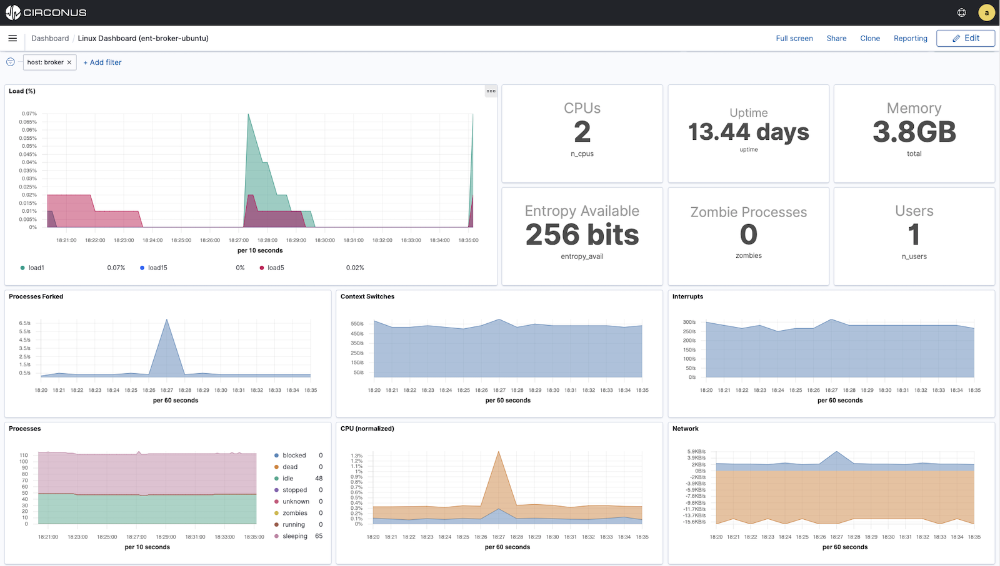

# Circonus Dashboards

Circonus dashboards provide a unified visualization framework for your cloud services, infrastructure, and applications and make it easy for you to explore your metric, log, or trace data within the platform.

From real-time infrastructure monitoring (IM) to application performance monitoring (APM), distributed tracing, outage response and data exploration, Circonus dashboards give you the visualizations needed to graphically represent trends, outliers, and patterns in your data.

Circonus dashboards also provide exceptional versatility. The image below depicts a dashboard in fullscreen mode with web traffic logs filtered to show US customers using either OSX or iOS devices.

## Dashboard Use Cases

In Circonus, a dashboard is a collection of charts, graphs, gauges, and other visualizations. You can track, analyze, and display real-time search, monitoring, and operational data for use cases like infrastructure monitoring or application observability (monitoring, log analytics, distributed tracing).

**Visualize and correlate metric, log, and trace data.**

**Diagnose performance issues and reduce application downtime.**

**Unlock analysis of real-time operational monitoring of infrastructure and applications.**

