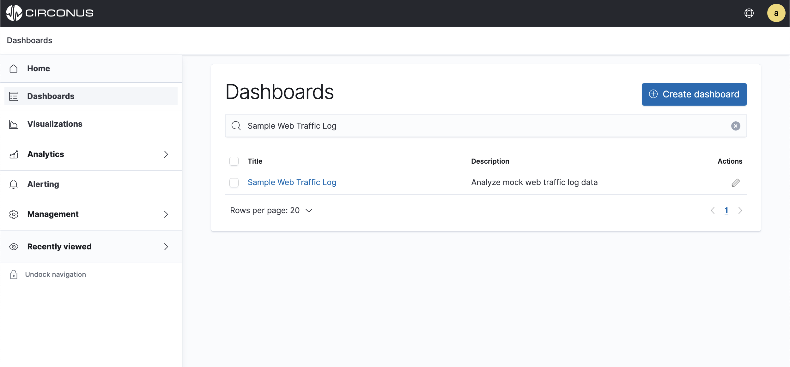
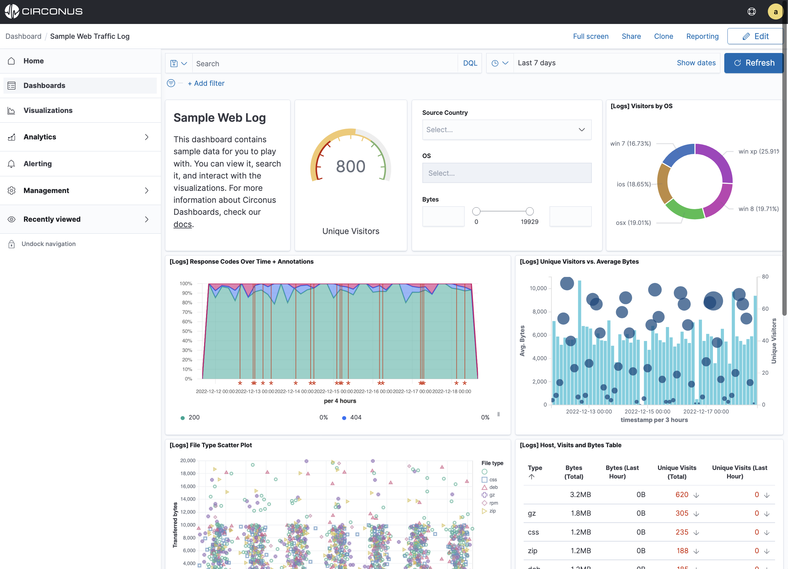
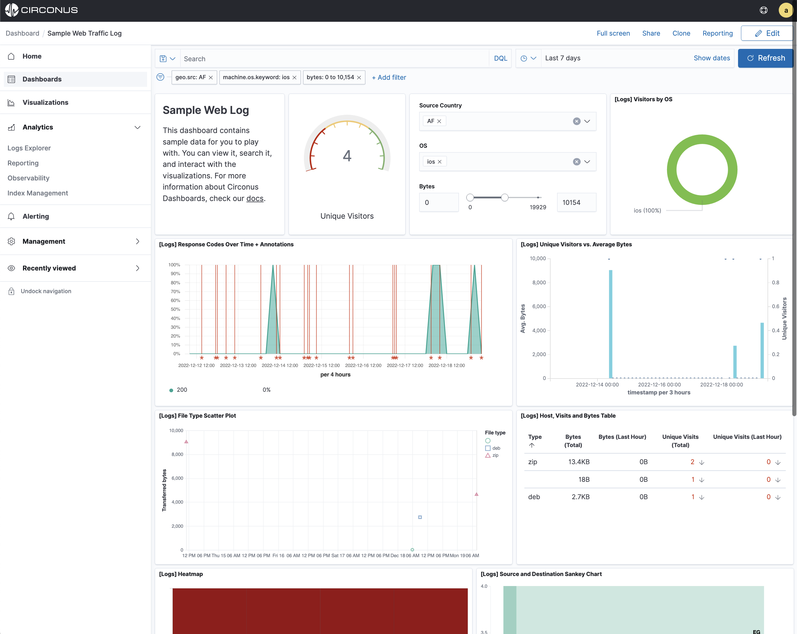
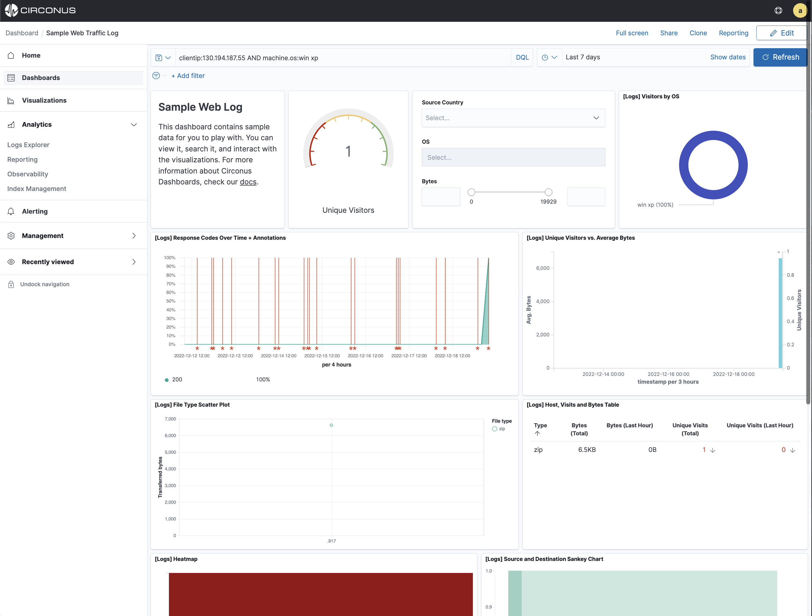
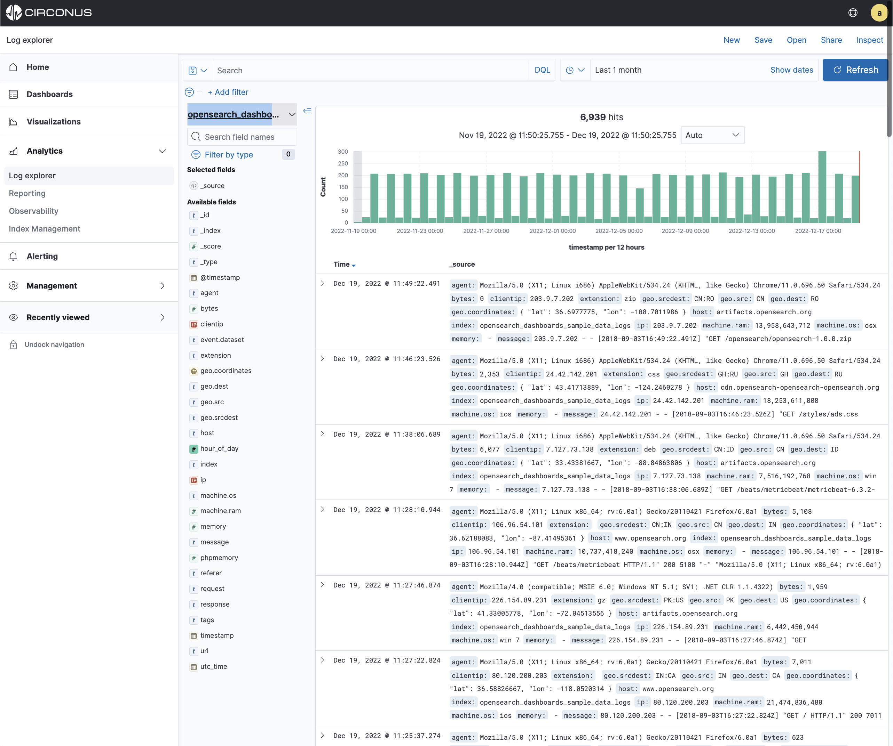
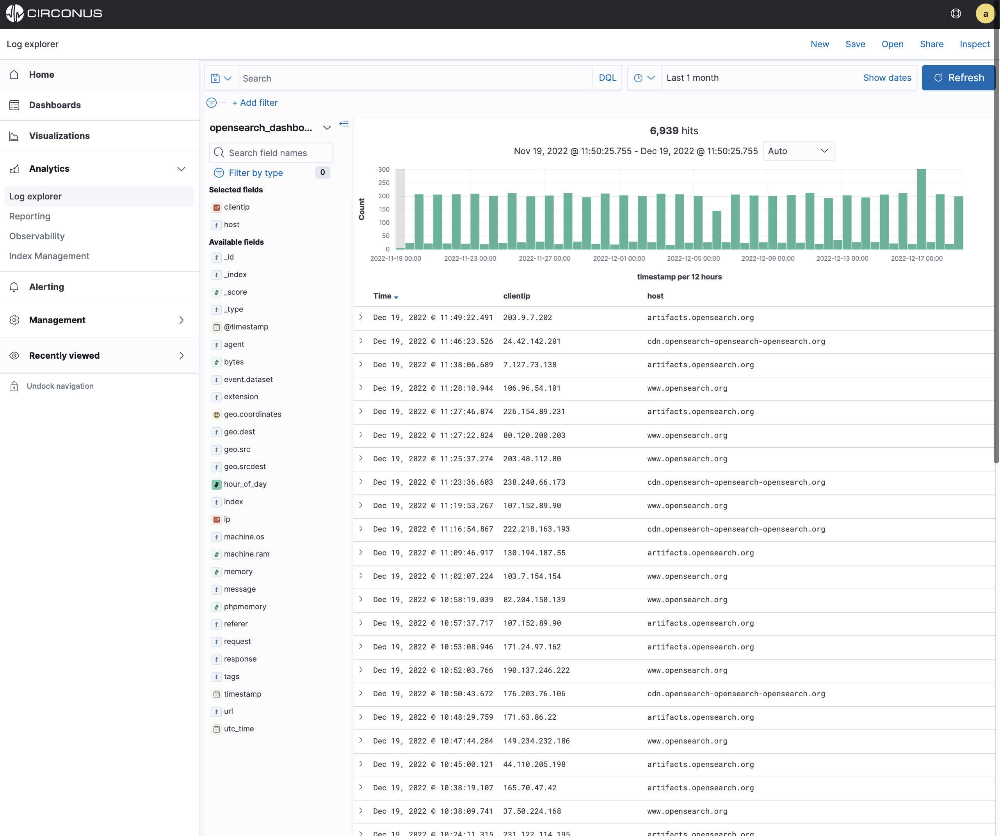
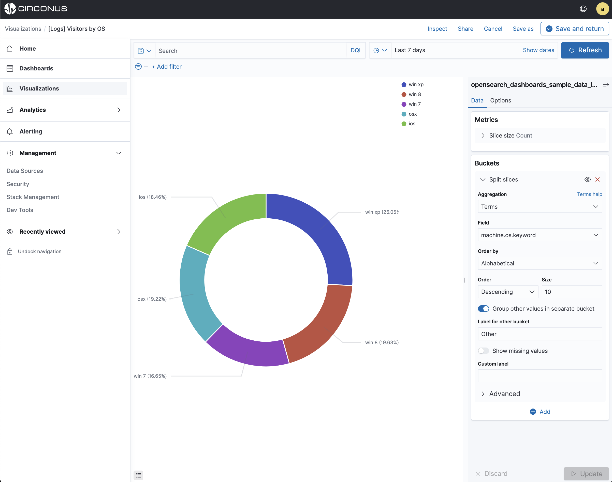
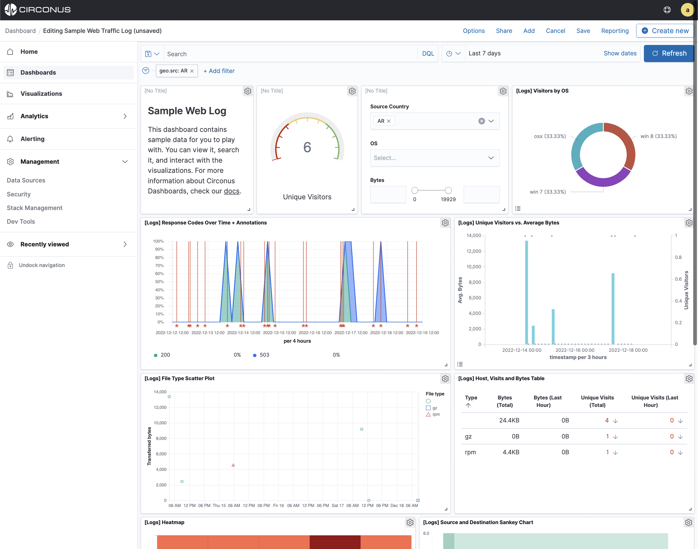
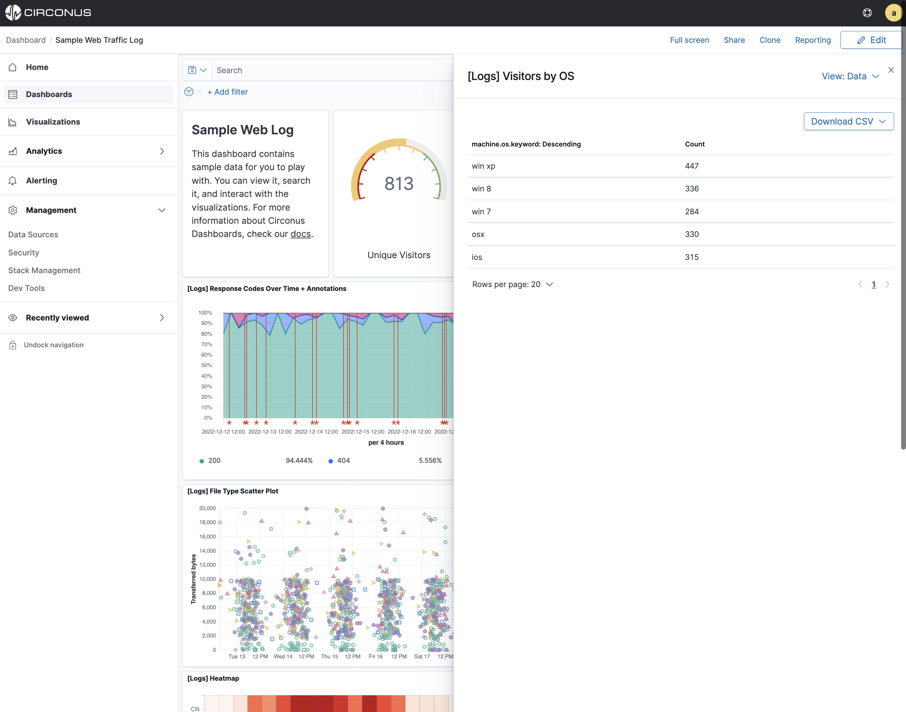
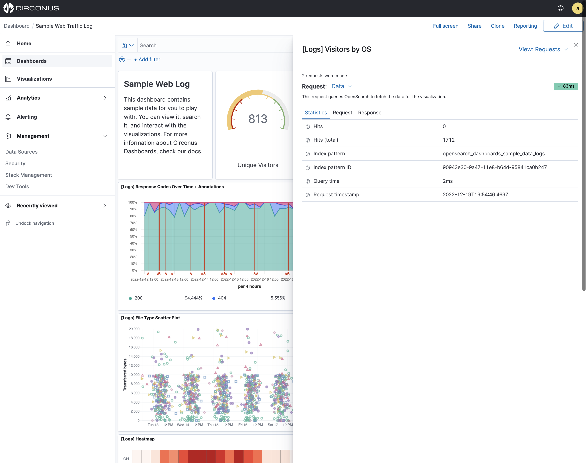

# Explore with Sample Data

Circonus offers a sample data set that you can use to explore the platform before connecting your data. This sample data includes pre-loaded [web-logs](/circonus3/additional-resources/glossary/#log) as well as a prepackaged dashboard and visualizations depicting these logs.

If the sample data is not already loaded into your account, select **Home** within the main menu, then **Add sample data** and **Add data**.

In this tutorial, you’ll learn to

- **Filter** the data
- **Query** the data
- **Discover** the data
- **Edit** a visualization
- **Inspect** the data behind the scenes

**Note:** The timestamps in the sample data sets are relative to when they are installed, which is when your account was created.

## View the dashboard

The web logs data set simulates a fictional web application. To view the dashboard for this data, select **Dashboards** within the main menu. Then click **Sample Web Traffic Log**.



The **Sample Web Traffic Log** dashboard is a collection of charts, graphs, maps, and other visualizations derived from the `opensearch_dashboards_sample_data_logs` index data source.



## Filter the dashboard

Many visualizations in the **Sample Web Traffic Log** dashboard are interactive. You can apply filters to modify the view of the data across all visualizations.

In the Controls visualization, you can set a Source Country, OS, and the Bytes slider. The changes will be applied automatically. The Source Country, OS, and Bytes fields are filtered to match the data you specified. For example, this dashboard shows the data for Source Country **AF** related to **ios** containing Bytes between **0 and 10154**.



To remove the filters for a dashboard, click the **x** which is located to the right of each filter and the data in the dashboard will update automatically.

You can also add filters manually. In the filter bar, click Add a Filter and specify the data you want to view.

## Query the data

You can enter a DQL query to narrow the view of data.

To find all data related to client IP 130.194.187.55, submit the following DQL query:

```toml
clientip:130.194.187.55
```

For a more complex query with AND and OR, try this:

```toml
clientip:130.194.187.55 AND (machine.os:win xp OR machine.os:osx)
```

The dashboard updates to show data relating to client IP 130.194.187.55 and `machine.os wind xp`.



When you are finished exploring the dashboard, remove the query by clearing the contents in the query bar and pressing Enter.

In general, filters are faster than queries.

## Logs Explorer

In the Logs Explorer application, the Sample Web Traffic Log data is presented in a table. You can interactively explore the data, including searching and filtering.

In the side navigation, select **Analytics** > **Logs Explorer**.

The current index pattern appears below the filter bar. An index pattern tells Circonus which log indices you want to explore.

The `opensearch_dashboards_sample_data_logs` index contains a time field. A histogram shows the distribution of documents over time.



By default, all fields are shown for each matching document. To choose which fields to display, hover the pointer over the list of Available Fields and then click add next to each field you want to include as a column in the table.

For example, if you add the `clientip` and `host` fields, the display includes columns for those two fields:



## Edit a visualization

You have edit permissions for the **Sample Web Traffic Log** dashboard so you can change the appearance and behavior of the visualizations. For example, you might want to see visitors by OS ordered a different way such as Alphabetically.

1. Go to the **Sample Web Traffic Log** dashboard.
2. In the command bar, click **Edit**.
3. In the **Visitors by OS** visualization, click the gear icon in the upper right.
4. From the **Options** menu, select **Edit **Visualization.

**Visitors by OS** is a metric visualization. To specify which groups to display in this visualization, you use a Circonus bucket aggregation. This aggregation sorts the documents that match your search criteria into different categories, or buckets.

1. In the **Buckets** pane, select **Split slices**.
2. In the **Order by** dropdown menu, select **Alphabetical**.
3. At the bottom of the **Data** section, select **Update** to see the changes to the visualization.

You now see the various os versions ordered alphabetically.



To practice saving changes within a dashboard:

1. Go to the **Sample Web Traffic Log** dashboard.
2. Resize the panel for the **Visitors by OS** visualization by dragging the handle in the lower right. You can also rearrange the visualizations by clicking the header and dragging.
3. In the command bar, click **Save** and then confirm the save.



## Inspect the data

Seeing visualizations of your data is great, but sometimes you need to look at the actual data to understand what’s really going on. You can inspect the data behind any visualization and view the Elasticsearch query used to retrieve it.

1. Hover the pointer over the **Visitors by OS** visualization.
2. Click the icon in the upper right.
3. From the Options menu, select Inspect.



You can also look at the query used to fetch the data for the visualization.

1. Open the **View: Data** menu and select **Requests**.
2. Click the tabs to look at the request statistics, the Elasticsearch request, and the response in JSON.
3. To close the editor, click X in the upper right.


