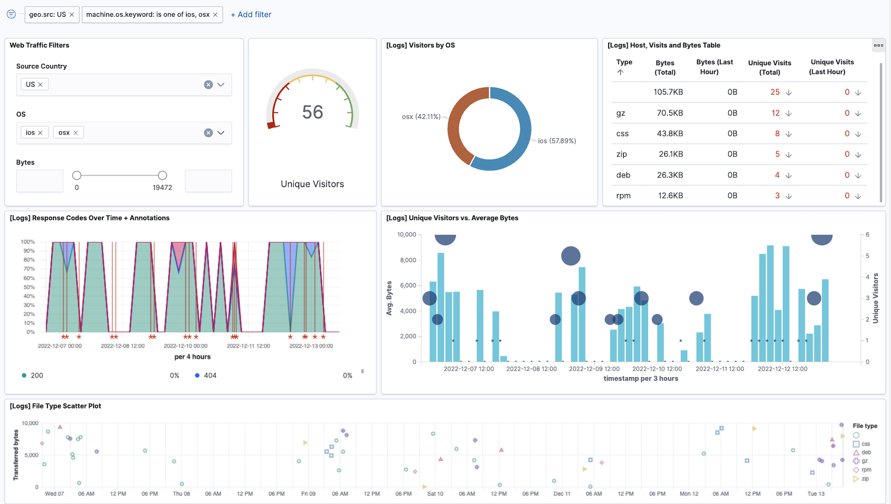

# Getting Started in Circonus

Welcome to Circonus! This guide will help you get started with Circonus and take actionable steps based on your observed system performance.

Circonus is a full-stack observability platform built for the enterprise. With Circonus, you can achieve crystal clear, real-time observability of the behavior, health, trends, and performance of all applications, microservices, and infrastructure in one unified platform.

To help you get started with Circonus, we'll give you an overview of how the Circonus Observability Platform works, before exploring the features and capabilities of Circonus using sample data. Then, we'll walk through the data ingestion process for [metrics](/circonus3/additional-resources/glossary/#metric/), [logs](/circonus3/additional-resources/glossary/#log), and [traces](/circonus3/additional-resources/glossary/#trace). With your data flowing to Circonus, we'll conclude with building your first dashboard and exploring your data within the platform.

As you step through this guide, you'll notice that many terms will be linked to their definitions within the [Glossary](/circonus3/additional-resources/glossary/). You can always visit the [Glossary](/circonus3/additional-resources/glossary/) directly for further clarification on the terms and acronyms used by Circonus.
