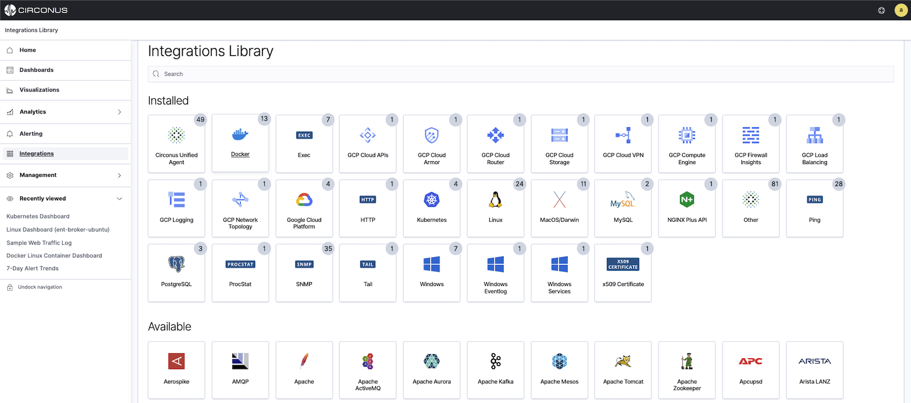

# Metric Ingestion

[Integrations](/circonus3/additional-resources/glossary/#integrations) let you collect [metrics](/circonus3/additional-resources/glossary/#metric) from third-party services. Available Integrations can be seen in your Circonus account if you click on **Integrations** within the main menu and then select Library.



To start collecting metrics from any of these integrations, you first need to install the [Circonus Unified Agent (CUA)](/circonus3/integrations/agents/circonus-unified-agent/introduction/). CUA is a lightweight metrics collection agent that can be installed in a couple of different ways depending on whether you are just testing Circonus or performing a large deployment in your environment. CUA reports metrics from the host, container, cloud, etc. that it is installed on. CUA can be set up with various integrations by simply updating the CUA configuration file to gather additional metrics.

## Installation

CUA can be installed within containers, hosts, or in the cloud. Installing CUA in most cases is done by a single line command and simply resetting CUA.
Follow the link to your specific platform by clicking on it below to see instructions for installing CUA.

- [Windows](/circonus3/integrations/agents/circonus-unified-agent/windows/ "CUA for Windows")
- [Linux](/circonus3/integrations/agents/circonus-unified-agent/linux/ "CUA for Linux")
- [macOS](/circonus3/integrations/agents/circonus-unified-agent/macos/ "CUA for macOS")
- [Docker](/circonus3/integrations/agents/circonus-unified-agent/docker/ "CUA for Docker")
- [FreeBSD](/circonus3/integrations/agents/circonus-unified-agent/freebsd/ "CUA for FreeBSD")

A [check](/circonus3/additional-resources/glossary/#check) will be created once you have installed CUA on your particular platform which contains specific metrics. If you need additional metrics from other applications, such as Kubernetes, then you will need to configure an integration.

## API Key

To have metrics flow into a specific Circonus account, CUA will be configured with your account-specific API key if you install CUA from a package or the one-time installer that pulls from GitHub seen in your account Integrations section. If you download CUA from another source and manually install it, you will need to get the API key from your account, add it to the CUA configuration file and then restart CUA.

The API Key is added to the CUA configuration file.

**Linux/macOS**

```bash
/opt/circonus/unified-agent/etc/circonus-unified-agent.conf
```

**Windows**

```bash
C:\Program Files\Circonus\Circonus-Unified-Agent\etc\circonus-unified-agent.conf
```

Learn more about using [API tokens](/circonus3/integrations/api/api-tokens/).

## Ports

CUA communicates with public Circonus brokers via TLS over port 43191 and with the Circonus API over Port 443.

## Troubleshooting

Find in-depth CUA troubleshooting steps in the [Troubleshooting](/circonus3/integrations/agents/circonus-unified-agent/introduction/#troubleshooting) section of our CUA documentation.

Join the [Circonus Labs Slack channel](https://slack.s.circonus.com/) to ask questions to the Circonus team now!

## Terminal Commands

Find CUA-specific terminal commands in the [Terminal Commands](/circonus3/integrations/agents/circonus-unified-agent/introduction/#terminal-commands) section of our CUA documentation.

## Example Integration Setup with CUA

The following example will demonstrate how to add the ping integration to CUA that is running on a macOS host.

### Step 1 - Install

Open the `circonus-unified-agent.conf` configuration file found in the directory `/opt/circonus/unified-agent/etc/` and search for "inputs.ping". There you will find specific parameters that will need to be both uncommented and modified. Below is an example of the `inputs.ping` integration that is set up to ping https://www.google.com. Keep in mind that this is a `TOML` file so the syntax is important. After you make changes to the file you will need to save and close it.

```bash
[[inputs.ping]]  # Google Homepage Test
instance_id = "Google_Homepage" ## REQUIRED

  ## Hosts to send ping packets to.
urls = ["https://www.google.com/"]

  ## Method used for sending pings, can be either "exec" or "native".  When set
  ## to "exec" the systems ping command will be executed.  When set to "native"
  ## the plugin will send pings directly.
  ##
method = "exec"

  ## Number of ping packets to send per interval.  Corresponds to the "-c"
  ## option of the ping command.
count = 2
```

### Step 2 - Restart

Restart macOS CUA by entering the following command in the terminal:

```bash
sudo launchctl kickstart -k system/com.circonus.circonus-unified-agent
```

### Step 3 - Validation

If the CUA configuration file was successfully modified and the `inputs.ping` integration plugin was correctly configured, you will see the [metrics](/circonus3/additional-resources/glossary/#metric) in your Circonus account under that particular integration.

Join the [Circonus Labs Slack channel](https://slack.s.circonus.com/) to ask questions to the Circonus team now!
