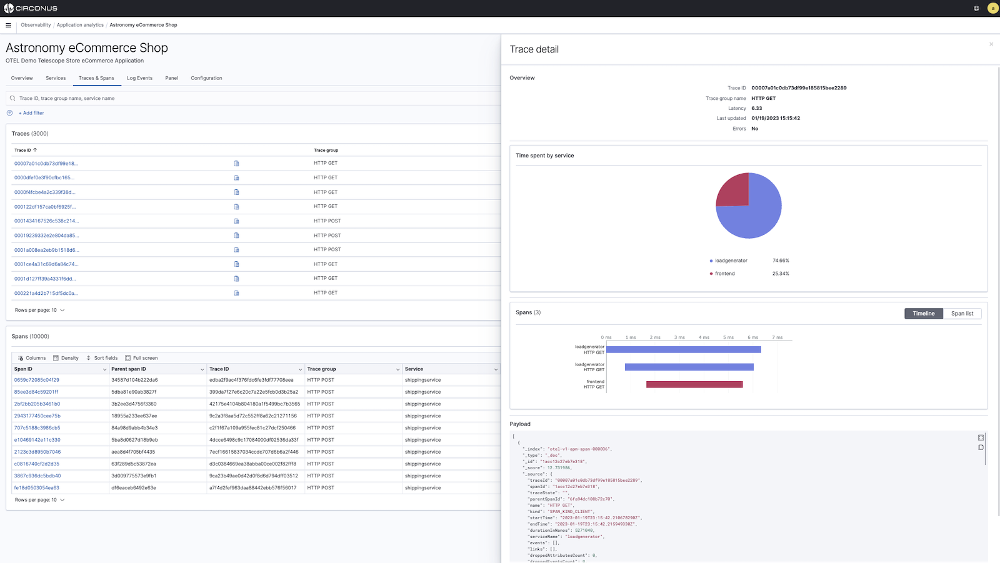
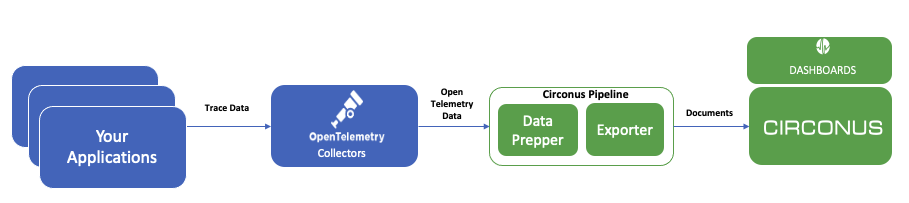

# Trace Ingestion

Circonus Observability provides the ability to visualize and analyze [distributed traces](/circonus3/additional-resources/glossary/#trace) and spans emitted by your applications.

For distributed tracing, you need to instrument your applications to generate trace data. This is typically done by adding tracing libraries such as [OpenTelemetry](https://opentelemetry.io/docs/) to your applications. Circonus also supports older tracing libraries like Jaeger and Zipkin.

**Basic Trace Data Flow into Circonus**

1. Instrument your applications with [OpenTelemetry](https://opentelemetry.io/docs/) or older tracing libraries like Jaeger or Zipkin. [OpenTelemetry](https://opentelemetry.io/docs/) provides example applications for many programming languages that can help you get started, including Java, Python, Go, and JavaScript as part of its documentation.

2. Once an application is instrumented, it will start emiting trace data. The [OpenTelemetry Collector](https://opentelemetry.io/docs/collector/getting-started/) receives data from the application and formats it into OpenTelemetry data.

3. The Circonus Pipeline which integrates [Data Prepper](https://docs.circonus.com/circonus3/integrations/agents/data-prepper/introduction/) as an Opensource transformation engine that processes the OpenTelemetry data, transforms it, and passes it to the Circonus Pipeline Exporter to encrypt, compress, transport and storage within the Circonus platform.

4. Circonus Observability [Trace Analytics](https://docs.circonus.com/circonus3/analytics/observability/trace-analytics/displays), will analyze the trace data in near real-time, and allow you to visualize the data in dashboard views, trace and service views that allow you to visualize the service architecture, latency, error rate, and throughput.
