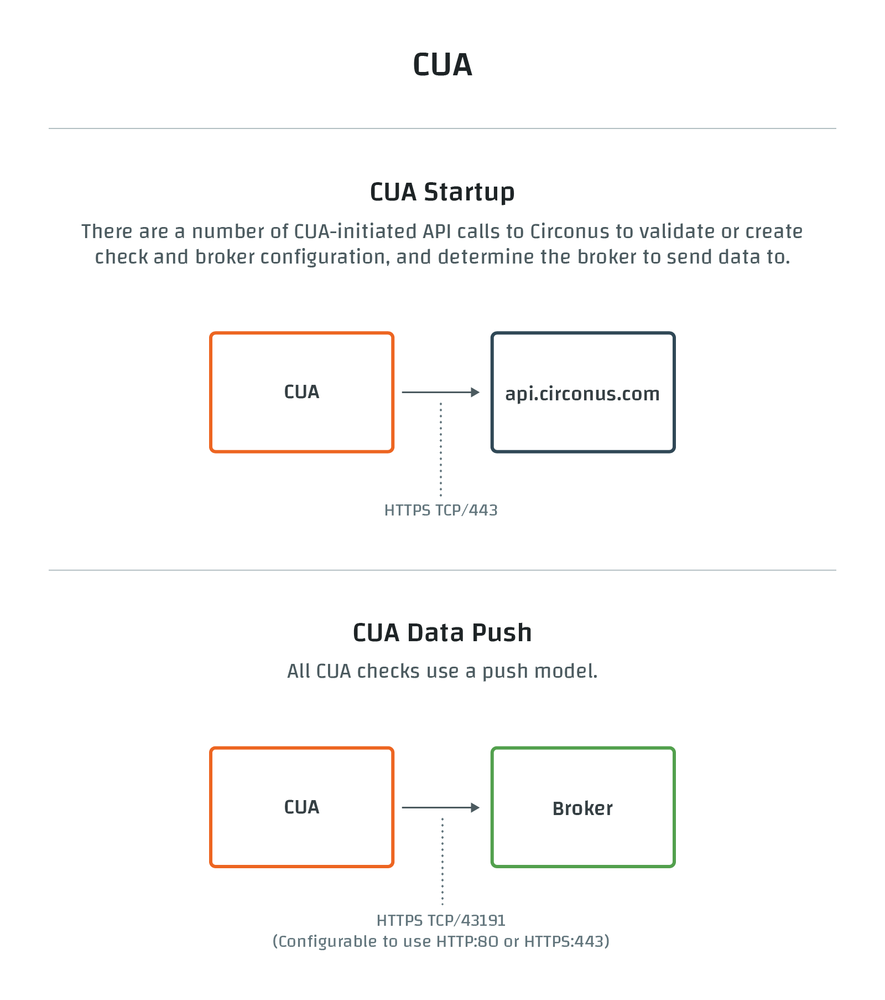

# Circonus Unified Agent

## Overview

The Circonus Unified Agent, affectionately referred to as CUA [see-you-ey], is an agent for collecting metrics and writing them to the Circonus service.

CUA collects metrics through various input plugins, allowing Circonus customers to monitor systems, services, and 3rd party APIs.

These input plugins are designed to be easy to develop and contribute. Pull requests are very welcome, as we seek to expand support for and incorporate support for many technologies.

CUA is open-source, and its source code is available on GitHub at [circonus-labs/circonus-unified-agent](https://github.com/circonus-labs/circonus-unified-agent).

## How It Works

When the Unified Agent (CUA) first starts up, it takes stock of the input plugins which have been enabled and looks for corresponding checks in Circonus (it matches via tags and metadata). If it finds matching checks for all the plugins, it begins data submission. If one or more plugins do not have corresponding checks, it creates new checks for those plugins. When new checks are created, CUA has to select a broker to receive its data submissions; if any compatible enterprise brokers are available, one will be selected, but otherwise a compatible public broker will be selected. Once the checks are set up or selected, data submission can begin. CUA will collect data from each plugin and at the configured interval, will submit that data to Circonus via the pre-selected broker(s).



## Installation

CUA can easily be installed using the one-step installer. A number of target platforms are supported.

To get started using CUA, please select your platform:

- [Windows](/circonus3/integrations/agents/circonus-unified-agent/windows/ "CUA for Windows")
- [Linux](/circonus3/integrations/agents/circonus-unified-agent/linux/ "CUA for Linux")
- [macOS](/circonus3/integrations/agents/circonus-unified-agent/macos/ "CUA for macOS")
- [Docker](/circonus3/integrations/agents/circonus-unified-agent/docker/ "CUA for Docker")
- [FreeBSD](/circonus3/integrations/agents/circonus-unified-agent/freebsd/ "CUA for FreeBSD")

[Packages](https://www.github.com/circonus-labs/circonus-unified-agent/releases/latest) are also available for 64-bit x86 and Arm v8 architectures. For other architectures, use a source install.

## Basic Usage

### Agent Architecture

The Circonus Unified Agent, or CUA, is based on InfluxData's Telegraf. CUA's primary function is to collect metrics through various input plugins, allowing Circonus customers to monitor systems, services, and 3rd party APIs.

CUA is plugin-driven and has 4 distinct types:

- Input Plugins collect metrics from the system, services, or 3rd party APIs
- Processor Plugins transform, decorate, and/or filter metrics
- Aggregator Plugins create aggregate metrics (e.g. mean, min, max, quantiles, etc.)
- Output Plugins write metrics to various destinations (e.g. Circonus, log files, etc.)

These plugins are designed to be easy to develop and contribute. Pull requests are very welcome, as we seek to expand support for and incorporate support for many technologies.

### Supported Platforms

| Platform            | Supported versions                                        |
| ------------------- | --------------------------------------------------------- |
| [Docker][1]         | Version 1.12+                                             |
| [FreeBSD][2]        | FreeBSD 12                                                |
| [Linux][3]          | All x86 and arm64 v8                                      |
| [MacOS][4]          | MacOS 10.12+                                              |
| [Windows Server][5] | Windows Server 2008 R2+ and Server Core (not Nano Server) |
| [Windows][6]        | Windows 7+                                                |

**Notes**

- 64-bit x86 packages are available for all platforms on the list. Arm v8 packages are available for all platforms except Windows and MacOS.
- CUA supports the latest updates to Windows Server 2008 R2 with the most recent Windows updates installed, however [ there is a known issue with clock drift and Go][6] that affects this environment.

[1]: /circonus3/integrations/agents/circonus-unified-agent/docker
[2]: /circonus3/integrations/agents/circonus-unified-agent/freebsd
[3]: /circonus3/integrations/agents/circonus-unified-agent/linux
[4]: /circonus3/integrations/agents/circonus-unified-agent/macos
[5]: /circonus3/integrations/agents/circonus-unified-agent/windows
[6]: /circonus3/integrations/agents/circonus-unified-agent/windows

## Troubleshooting

A variety of factors need to be considered while troubleshooting the Circonus Unified Agent (CUA). The following guide will walk you through best practices for getting CUA back up and running.

If you just installed CUA, you will need to wait at least 5 minutes before proceeding to the following troubleshooting steps to ensure enough time has passed for the check to be created and metrics to start flowing to Circonus.

**Keep in mind that after you modify the CUA configuration file, you will need to restart CUA in order for the changes to take effect.** Below you will find platform-specific CUA reset examples.

Restart CUA on **MacOS** by entering the following command in the terminal:

```bash
sudo launchctl kickstart -k system/com.circonus.circonus-unified-agent
```

Restart CUA on **Linux** by entering the following command in the terminal:

```bash
sudo systemctl restart circonus-unified-agent
```

Restart CUA on **Windows** by entering the following command in the terminal:

```bash
Restart-Service -Name circonus-unified-agent
```

### Step 1: Ensure your device is operational and is connected to the public internet

Test your internet connectivity either using a web browser or a command terminal.

Below is an example of a successful ping from macOS or a Linux terminal to the public internet:

```bash
~ > ping -c 4 www.api.circonus.com                                      3s 01:36:45 PM
ping www.api.circonus.com (23.202.231.169): 56 data bytes
64 bytes from 23.202.231.169: icmp_seq=0 ttl=49 time=23.973 ms
64 bytes from 23.202.231.169: icmp_seq=1 ttl=49 time=25.687 ms
64 bytes from 23.202.231.169: icmp_seq=2 ttl=49 time=42.443 ms
64 bytes from 23.202.231.169: icmp_seq=3 ttl=49 time=24.370 ms

--- www.api.circonus.com ping statistics ---
4 packets transmitted, 4 packets received, 0.0% packet loss
round-trip min/avg/max/stddev = 23.973/29.118/42.443/7.719 ms
```

For Windows OS, use the command: `ping www.api.circonus.com`

### Step 2: Manually run CUA in debug mode to see if any errors are occurring

As you execute CUA in debug mode, you can see the application start up and process the configuration file information. If you come across any errors, which are seen as indicated by “E!” in the command line right after the date/time stamp, a description will soon follow the error. Read each line and look for outliers that indicate something is not working correctly.

#### macOS and Linux Example

The following is an example of CUA successfully running without any errors.

```bash
~ > cd /opt/circonus/unified-agent/sbin
~ /opt/circonus/unified-agent/sbin > ./circonus-unified-agentd --debug
2022-06-23T15:14:46Z I! Starting Circonus Unified Agent 0.0.43-SNAPSHOT-e4c599a
2022-06-23T15:14:46Z I! Using config file: /opt/circonus/unified-agent/etc/circonus-unified-agent.conf
2022-06-23T15:14:46Z I! Loaded inputs: disk internal kernel mem net processes snmp swap system
2022-06-23T15:14:46Z I! Loaded aggregators:
2022-06-23T15:14:46Z I! Loaded processors:
2022-06-23T15:14:46Z I! Loaded outputs: circonus
2022-06-23T15:14:46Z I! Tags enabled:
2022-06-23T15:14:46Z I! [agent] Config: Interval:10s, Quiet:false, Hostname:"Joshuas-MBP-2.attlocal.net", Flush Interval:10s
2022-06-23T15:14:46Z D! [agent] Initializing plugins
2022-06-23T15:14:46Z D! [outputs.circonus] starting 2 metric processors
2022-06-23T15:14:46Z D! [agent] Connecting outputs
2022-06-23T15:14:46Z D! [agent] Attempting connection to [outputs.circonus]
2022-06-23T15:14:46Z D! [outputs.circonus] find/create check using API
2022-06-23T15:14:46Z D! [outputs.circonus] find/create check using API
2022-06-23T15:14:47Z D! [agent] Successfully connected to outputs.circonus
2022-06-23T15:14:47Z D! [agent] Starting service inputs
2022-06-23T15:14:57Z D! [outputs.circonus] processor 0, received 53 batches
2022-06-23T15:14:57Z D! [outputs.circonus] Wrote 53 batches in 8µs
2022-06-23T15:14:57Z D! [outputs.circonus] Buffer fullness: 0 / 10000 batches
2022-06-23T15:14:57Z D! [outputs.circonus] processor 0, queued 337 metrics for submission in 1.976ms
2022-06-23T15:14:57Z D! [outputs.circonus] agent:host::: flush -- C:44b6d4a1-c3e9-4dbc-97fb-76d78c19c2e6, S:n/a, E:none, Stats:55, Filtered:0, Bytes:930, Encode:2.705708ms, Submit:56.271458ms, LastReq:55.460209ms, Flush:58.985208ms
2022-06-23T15:14:57Z D! [outputs.circonus] host:host::: flush -- C:187b092b-092f-40b5-be91-dffbe16c0be3, S:n/a, E:none, Stats:285, Filtered:0, Bytes:3027, Encode:6.8115ms, Submit:66.1295ms, LastReq:64.392375ms, Flush:72.945208ms
2022-06-23T15:14:57Z D! [outputs.circonus] processor 0, submit sent metrics in 73.045125ms
2022-06-23T15:14:57Z D! [outputs.circonus] processor 0, processed 337 metrics in 75.187375ms
```

The following output indicates that host metrics were successfully submitted to Circonus without any errors: “E:none” indicates no errors with the submission.

```bash
2022-06-23T15:14:57Z D! [outputs.circonus] host:host::: flush -- C:187b092b-092f-40b5-be91-dffbe16c0be3, S:n/a, E:none, Stats:285, Filtered:0, Bytes:3027, Encode:6.8115ms, Submit:66.1295ms, LastReq:64.392375ms, Flush:72.945208ms
```

Example of CUA running into an snmp.inputs plugin error.

```bash
C2022-06-23T15:15:01Z E! [inputs.snmp::Asus_Router_Test] Error in plugin: gather (input snmp): initializing table ifTable: initializing field ifIndex: translating: : signal: interrupt
```

Example of CUA encountering a configuration file invalid TOML syntax error.

Configuration syntax errors are easy to create, but they can be avoided by editing the CUA configuration file in a text editor, like VSCode, with a TOML syntax extension that shows errors in the syntax.

```bash
2022-06-23T22:19:46Z E! [circonus-unified-agent] Error running agent: loadconfig (): Error loading config file /opt/circonus/unified-agent/etc/circonus-unified-agent.conf: error parsing data: line 405: invalid TOML syntax
```

#### Windows Example

The following is an example of CUA successfully running without any errors.

```bash
PS C:\Program Files\Circonus\Circonus-Unified-Agent\sbin> .\circonus-unified-agentd.exe --debug
2022-06-24T00:42:42Z I! Starting Circonus Unified Agent 0.0.41
2022-06-24T00:42:42Z I! Using config file: C:\Program Files\Circonus\Circonus-Unified-Agent\etc\circonus-unified-agent.conf
2022-06-24T00:42:42Z I! Loaded inputs: internal win_perf_counters win_services
2022-06-24T00:42:42Z I! Loaded aggregators:
2022-06-24T00:42:42Z I! Loaded processors:
2022-06-24T00:42:42Z I! Loaded outputs: circonus
2022-06-24T00:42:42Z I! Tags enabled:
2022-06-24T00:42:42Z I! [agent] Config: Interval:10s, Quiet:false, Hostname:"JoshuaXPS15", Flush Interval:10s
2022-06-24T00:42:42Z D! [agent] Initializing plugins
2022-06-24T00:42:42Z D! [outputs.circonus] starting 2 metric processors
2022-06-24T00:42:42Z D! [agent] Connecting outputs
2022-06-24T00:42:42Z D! [agent] Attempting connection to [outputs.circonus]
2022-06-24T00:42:42Z D! [outputs.circonus] find/create check using API
2022-06-24T00:42:42Z D! [outputs.circonus] find/create check using API
2022-06-24T00:42:42Z D! [agent] Successfully connected to outputs.circonus
2022-06-24T00:42:42Z D! [agent] Starting service inputs
2022-06-24T00:42:52Z D! [outputs.circonus] Wrote 321 batches in 0s
2022-06-24T00:42:53Z D! [outputs.circonus] processor 0, received 321 batches
2022-06-24T00:42:53Z D! [outputs.circonus] Buffer fullness: 0 / 10000 batches
2022-06-24T00:42:53Z D! [outputs.circonus] find/create check using API
2022-06-24T00:42:53Z D! [outputs.circonus] processor 0, queued 765 metrics for submission in 423.3133ms
2022-06-24T00:42:53Z D! [outputs.circonus] agent:host::: flush -- C:414354f0-e444-4f7b-831f-1aa43f9d1e15, S:n/a, E:none, Stats:37, Filtered:0, Bytes:771, Encode:533.1µs, Submit:50.8269ms, LastReq:50.3116ms, Flush:51.36ms
2022-06-24T00:42:53Z D! [outputs.circonus] host:host::: flush -- C:925586d6-0818-4912-a6f7-fbba957e18a9, S:n/a, E:none, Stats:145, Filtered:0, Bytes:2231, Encode:1.0484ms, Submit:55.9393ms, LastReq:55.4242ms, Flush:56.9877ms
2022-06-24T00:42:53Z D! [outputs.circonus] win_services:Windows::: flush -- C:047154e8-f1b1-4026-8ca3-5a97a84ec9fa, S:n/a, E:none, Stats:586, Filtered:0, Bytes:12774, Encode:3.2668ms, Submit:69.9919ms, LastReq:67.6545ms, Flush:73.2587ms
2022-06-24T00:42:53Z D! [outputs.circonus] processor 0, submit sent metrics in 84.0632ms
2022-06-24T00:42:53Z D! [outputs.circonus] processor 0, processed 765 metrics in 512.6821ms
```

The following output indicates that metrics were successfully submitted to Circonus without any Errors: “E:none” indicates no errors with the submission.

```bash
2022-06-24T00:42:53Z D! [outputs.circonus] host:host::: flush -- C:925586d6-0818-4912-a6f7-fbba957e18a9, S:n/a, E:none, Stats:145, Filtered:0, Bytes:2231, Encode:1.0484ms, Submit:55.9393ms, LastReq:55.4242ms, Flush:56.9877ms
```

Example of CUA running into an inputs.ping parameter error.

```bash
PS C:\Program Files\Circonus\Circonus-Unified-Agent\sbin> .\circonus-unified-agentd.exe --debug
2022-06-23T20:54:56Z I! Starting Circonus Unified Agent 0.0.41
2022-06-23T20:54:56Z I! Using config file: C:\Program Files\Circonus\Circonus-Unified-Agent\etc\circonus-unified-agent.conf
2022-06-23T20:54:56Z E! [circonus-unified-agent] Error running agent: loadconfig (): Error loading config file C:\Program Files\Circonus\Circonus-Unified-Agent\etc\circonus-unified-agent.conf: plugin inputs.ping: line 425: configuration specified the fields ["ur"], but they weren't used
```

Example of CUA encountering a configuration file syntax error.

Configuration syntax errors are easy to create and can be avoided by editing the CUA configuration file in a text editor, like VSCode, with a TOML syntax extension that shows errors in the syntax.

```bash
PS C:\Program Files\Circonus\Circonus-Unified-Agent\sbin> .\circonus-unified-agentd.exe --debug
2022-06-23T22:19:46Z I! Starting Circonus Unified Agent 0.0.41
2022-06-23T22:19:46Z I! Using config file: C:\Program Files\Circonus\Circonus-Unified-Agent\etc\circonus-unified-agent.conf
2022-06-23T22:19:46Z E! [circonus-unified-agent] Error running agent: loadconfig (): Error loading config file C:\Program Files\Circonus\Circonus-Unified-Agent\etc\circonus-unified-agent.conf: error parsing data: line 405: invalid TOML syntax
```

### Step 3: Contact Circonus help desk for further assistance

Join the circonus-labs to get live chat troubleshooting assistance at [https://slack.s.circonus.com/](https://slack.s.circonus.com/)

## Terminal Commands

This section will introduce you to various CUA terminal commands and show you how to use them. These CUA terminal commands will allow you to further troubleshoot both CUA and integrations that you may have configured within the CUA configuration file.

### Command Format

MacOS and Linux directory:

```bash
/opt/circonus/unified-agent/sbin > ./circonus-unified-agentd [commands|flags]
```

Windows directory:

```bash
C:\Program Files\Circonus\Circonus-Unified-Agent\sbin > .\circonus-unified-agents [commands|flags]
```

Example: A successful `--test` command to see what metrics CUA is pushing to Circonus from MacOS:

```bash
~ > /opt/circonus/unified-agent/sbin/./circonus-unified-agentd --test                                                                               19s 03:13:19 PM
2022-06-24T19:19:57Z I! Starting Circonus Unified Agent 0.0.43-SNAPSHOT-e4c599a
2022-06-24T19:19:57Z I! Using config file: /opt/circonus/unified-agent/etc/circonus-unified-agent.conf
{"sys_bytes|ST[__rollup:false,input_metric_group:internal_memstats,input_plugin:internal]": {"_value": 25297928, "_type": "L", "_ts": 1656098398000}}
{"mallocs|ST[__rollup:false,input_metric_group:internal_memstats,input_plugin:internal]": {"_value": 53855, "_type": "L", "_ts": 1656098398000}}
{"heap_sys_bytes|ST[__rollup:false,input_metric_group:internal_memstats,input_plugin:internal]": {"_value": 16187392, "_type": "L", "_ts": 1656098398000}}
{"heap_idle_bytes|ST[__rollup:false,input_metric_group:internal_memstats,input_plugin:internal]": {"_value": 7127040, "_type": "L", "_ts": 1656098398000}}
{"heap_released_bytes|ST[__rollup:false,input_metric_group:internal_memstats,input_plugin:internal]": {"_value": 2236416, "_type": "L", "_ts": 1656098398000}}
{"heap_objects|ST[__rollup:false,input_metric_group:internal_memstats,input_plugin:internal]": {"_value": 15017, "_type": "L", "_ts": 1656098398000}}
{"num_gc|ST[__rollup:false,input_metric_group:internal_memstats,input_plugin:internal]": {"_value": 4, "_type": "L", "_ts": 1656098398000}}
```

### Available Commands

```bash
Usage:

  circonus-unified-agent [commands|flags]

The commands & flags are:

  config              print out full sample configuration to stdout
  version             print the version to stdout

  --aggregator-filter <filter>   filter the aggregators to enable, separator is :
  --config <file>                configuration file to load
  --config-directory <directory> directory containing additional *.conf files
  --plugin-directory             directory containing *.so files, this directory will be
                                 searched recursively. Any Plugin found will be loaded
                                 and namespaced.
  --debug                        turn on debug logging
  --input-filter <filter>        filter the inputs to enable, separator is :
  --input-list                   print available input plugins.
  --output-filter <filter>       filter the outputs to enable, separator is :
  --output-list                  print available output plugins.
  --pidfile <file>               file to write our pid to
  --pprof-addr <address>         pprof address to listen on, don't activate pprof if empty
  --processor-filter <filter>    filter the processors to enable, separator is :
  --quiet                        run in quiet mode
  --section-filter               filter config sections to output, separator is :
                                 Valid values are 'agent', 'global_tags', 'outputs',
                                 'processors', 'aggregators' and 'inputs'
  --sample-config                print out full sample configuration
  --once                         enable once mode: gather metrics once, write them, and exit
  --test                         enable test mode: gather metrics once and print them
  --test-wait                    wait up to this many seconds for service
                                 inputs to complete in test or once mode
  --usage <plugin>               print usage for a plugin, ie, 'circonus-unified-agent --usage mysql'
  --version                      display the version and exit

Examples:

  # generate a config file:
  circonus-unified-agent config > circonus-unified-agent.conf

  # generate config with only cpu input & circonus output plugins defined
  circonus-unified-agent --input-filter cpu --output-filter circonus config

  # run a single collection, outputting metrics to stdout
  circonus-unified-agent --config circonus-unified-agent.conf --test

  # run with all plugins defined in config file
  circonus-unified-agent --config circonus-unified-agent.conf

  # run, enabling the cpu & memory input, and circonus output plugins
  circonus-unified-agent --config circonus-unified-agent.conf --input-filter cpu:mem --output-filter circonus

  # run with pprof
  circonus-unified-agent --config circonus-unified-agent.conf --pprof-addr localhost:6060
```

<!--
[Guides](/circonus/agents/circonus-unified-agent/guides/): Step-by-step tutorials for using CUA.

[Security](/circonus/agents/circonus-unified-agent/security/): Information on the main security capabilities and features available to customers to ensure their environment is secure.
-->
