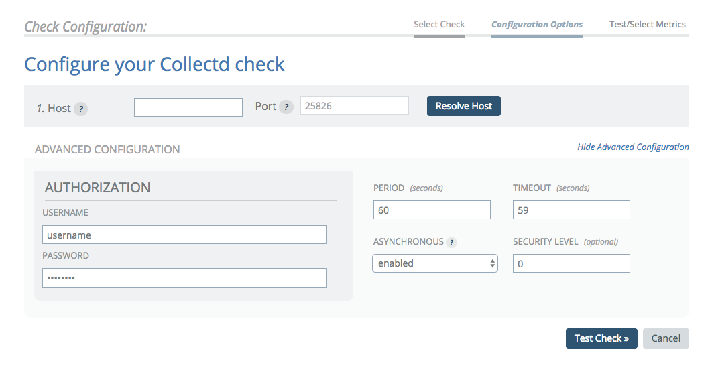

# collectd

## Overview

This check type allows you to run [collectd](http://collectd.org/) on your hosts and send that data directly to Circonus. Collectd is a lightweight C-based tool that has a variety of plugins available for data collection.

## Configuration

There are two main ways to use collectd with Circonus, either to push the information from your device over UDP (similar to statsd and HTTP Traps) or via the `write_http` plugin.

By default, collectd sends data over UDP to a broker on port 25826. Make sure your `collectd.conf` is properly configured to send to this port, or change the default port to the correct port.

Because of the way collectd sends data, **you cannot send data to any of the Circonus Public Brokers**. Circonus Enterprise Brokers should be used for collectd checks.

You may configure the check to specify Authorization information and set a Security Level. Security Level is an integer describing the security of allowed packets; 0 allows all packets, 1 allows signed and encrypted packets, 2 only allows encrypted packets.



### UDP submission

The target field for UDP can be either and IP address or a domain name that resolves to an IP address. When the packet is received by the broker, the source address is matched against the resolved IP address. If no check is found with that resolved IP, the information will be discarded. In this case, we strongly recommend that the IP address be used to identify the target host, rather than the domain name, to prevent potential DNS issues from causing data loss.

### `write_http` submission

When collectd submits data via HTTP, one of the attributes in the data payload is "host", which is the hostname of your machine. The broker will dissect the payload and attempt to find a collectd check in Circonus that has a target host exactly matching the host name specified. Do not use an IP address to identify the target host unless your collectd instance is reporting its "host" as that IP address.

The following should be added to your collectd configuration:

```
<Plugin write_http>
   <URL "https://<broker host>:43191/module/collectd/">
     User "username"
     Password "s3cr3t"
     VerifyPeer false
     VerifyHost false
     CACert "/etc/circonus-ca.crt"
     Format "JSON"
     StoreRates false
   </URL>
</Plugin>
```

> You can get a copy of the Circonus CA certificate here: https://login.circonus.com/pki/ca.crt

> Target host is name matched (not IP matched) for the `write_http` check.

The User and Password must match the Username and Password in the "Advanced Configuration" check. For `write_http`, Username and Password are not optional. Both must be specified and not blank.

## Metrics

Provided metrics depend on what is submitted by the underlying collectd daemon, and how it’s configured.
