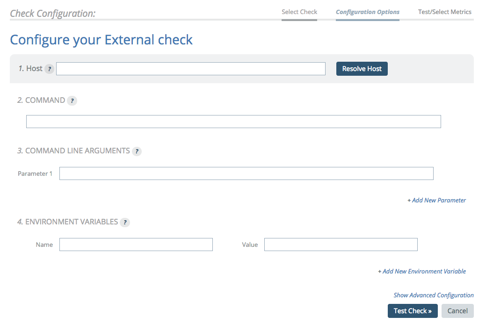
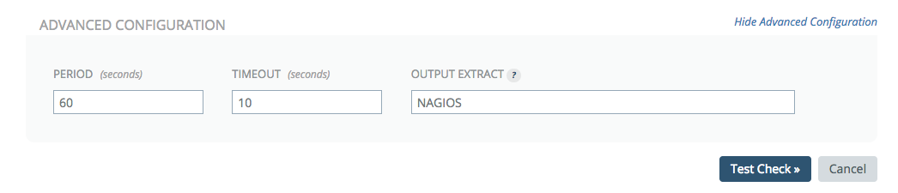

# External

## Overview

The External Check allows you to run an executable on the same box as your Enterprise Broker and turn the output into metrics.

An executable is defined as anything that runs for a short time (starts and ends) and creates output. Most often, it is a script in any language that your environment understands and can execute. A good rule of thumb is that if you can execute it on the command line, then it would work in this check type.
Metrics

## Configuration

By default, executables must be located on your Enterprise Broker under `/opt/noit/prod/libexec/external-plugins/`. These executables can be under either "`/site`" (for site-wide executables) or "`/local`" (for local executables) and we'll execute them and parse the results.

In the creation of the output, either a regular expression or Nagios is defined in the Output Extract field in the advanced options. If Nagios is defined, then Circonus takes the output of the executable and parses it to create the metrics. This is the default and is the preferred method.

**Note:**

> This check type only appears as an option if you have an Enterprise Broker defined.
> The Broker that is selected must be the Enterprise Broker where the executable has been placed.

### Defining the Host and the Executable



1.  Enter the **Host**. You must enter either a hostname or an IPv4 address (ex. `1.2.3.4`). If the program you are running does not require an external host, enter "`127.0.0.1`".
1.  Enter the **Command** to run on your broker, including the full path. They can be in "`/opt/noit/prod/libexec/external-plugins`" under either "`/site`" (for site-wide) or "`/local`" (for local). Do not include command line arguments here.
1.  If required, enter the **Command Line Arguments** to pass to the external program. Make sure you enter these in the correct order, one parameter per box. You may use the check target host as a value here by entering "`%[target]`". If you need more than one parameter, click the Add New Parameter link and a new entry area is displayed. They are numbered (Parameter 1, Parameter 2, Parameter 3, etc.).
1.  If required, enter any **Environment Variables** that need to be set when running the external program, where "Name" is the environment variable to be set and "Value" is the value to which the environment variable is set. If you need more than one environment variable, click the "Add New Environment Variable" link and a new entry area will be displayed.

### Using the Output Extract



The Output Extract field determines how the output data from the executable is parsed. You can use either a regular expression, JSON, or Nagios as possible values in this field. Unless you are very familiar with creating regular expressions, in most cases you should use Nagios as the Output Extract.

Options for Output Extract values include:

- Nagios
- JSON
- All other values are treated as a regular expression.

If a regular expression is used, then it is globally applied to the standard output of the command. Each match is turned into a metric. It is a requirement to use named capturing in the regular expression, where "key" is the named match of the metric name and "value" is the named match for the metric value. For example, extracting performance data in the form of "x=5", "y=6", etc. would look like this:

```
(?<key>\S+)=(?<value>[^;\s]+)(?=[;\s])
```

If Nagios is defined, then Circonus takes the output of the executable and parses it to create the metrics. This is the default and is the preferred method.

## Metrics

Provided metrics depend on the metrics made available by the specified executable.
