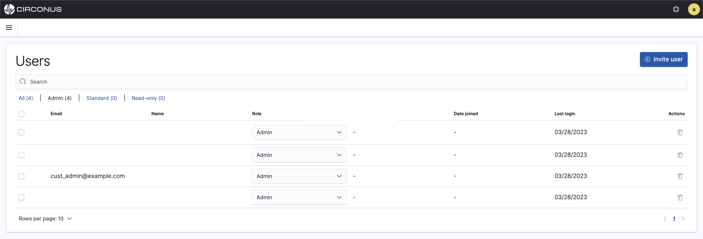
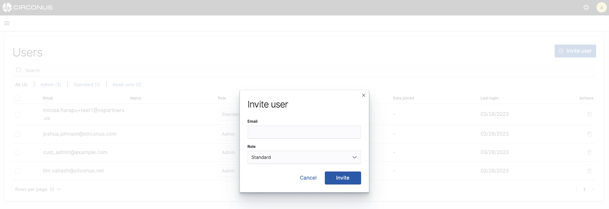
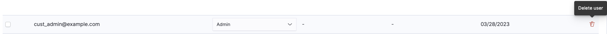

# User and Role Management

Managing users and roles in Circonus is easy. Simply create a user and assign them one of three predefined roles. The roles available to customers are:

- **Admin** who has full administrative access to their account, users, analytics, and data as well as assets such as dashboards and alert rules.
- **Standard** who has the ability to create, modify, and delete dashboards, visualizations, rulesets, and search queries.
- **Read-only** who can view dashboards or use analytic tools like Logs Explorer but cannot modify or save changes to those assets or analytics.

Roles in Circonus cannot be modified by customers.

All users and roles can been viewed or accessed from the **Management** menu by selecting **User Management**. This menu is only visible to administrators.

The **Users** page shows all users and can be filtered by role, the date they joined the customer's account on Circonus, and their last login.

## Adding new users

To add new users, an administrator must first navigate to **User Management**. There, they can simply click on the _+ Invite user_ button in the top right corner. They will prompted to enter the new user's email address and select their role. By default, **Standard** is selected but can be changed by selecting one of the other two roles from the dropdown.

The new user will receive an email invitation to Circonus. When they click on the **Accept Invitation** button within the email, they will be navigated to a setup page which allows them to enter their preferred name and password.

## Changing user roles

From the users page, an administrator can modify user roles at any time by selecting a different role for them from the dropdown within the **Role** column.

## Deleting Users

To delete a user, an administrator can click the _Trash can_ icon under the **Actions** column on the **Users** page. A modal will appear requiring confirmation of the action. Once deleted, a user account cannot be recovered.
