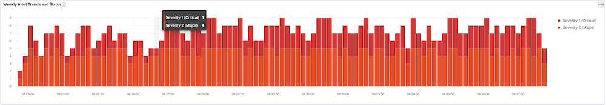
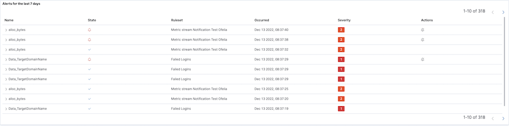
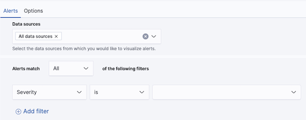
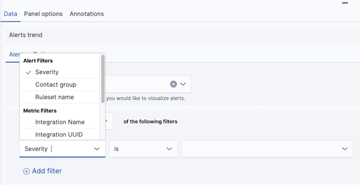
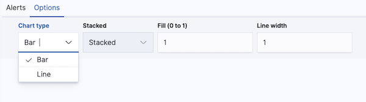
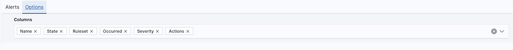

# Alert Visualizations

The **Alerts** visualization supports two visualization types: trend and table.

**Trend** allows you to create line or bar charts showing alert trends. This type supports stacking and can display all alerts or a filtered set.

The **table** allows you to display a filtered set of alerts and showcases the alert name, status, time it occurred, severity, and available actions.

To create a new alert visualization, simply select **Alerts** from the **New Visualization** modal.

## Alert Data Configuration

The **Data Sources** configuration is common to both alert trend and table visualizations.

By default, **All data sources** are selected, which means alerts will be shown from all available data sources. However, you can instead choose specific metrics, log, and trace data sources within the provided dropdown.

Below the **Data Sources** field, you can filter alerts from the chosen data sources. A filter is a single field, condition, and value.

To create a filter, simply select a field name, list operation _(is, is not, contains, starts with, ends with)_ and value. The list of operations available will be dependent on the type of field selected.

You can add more filters by clicking the **Add Filter** link below the filters, and you can remove filters by clicking the minus icon to the right of a filter.

If multiple filters are defined, alerts must match all of them. For example, if you add three filters, they will be joined together, i.e., Overall Filter = _Filter1 and Filter2 and Filter3_. In other words, alerts must match all of the filters in be displayed in the visualization.

## Alert Trend Options

For alert trend visualizations, you can specify a bar, line, or area chart.

To create an area chart, select the line chart option and set Fill to 1.

## Alert Table Options

For alert table visualizations, you can specify the fields you wish to see as columns. Simply select the fields from the **Columns** drop-down list. The fields will show as tags which you can reorder to customize column order. Circonus provides a recommended column order by default.

## Related links

- [Circonus Dashboards](/circonus3/dashboards/introduction/)
- [Getting Started with Circonus](/circonus3/getting-started/)
