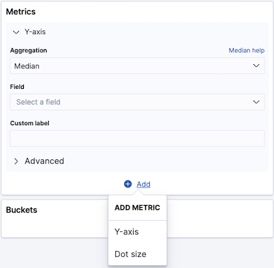
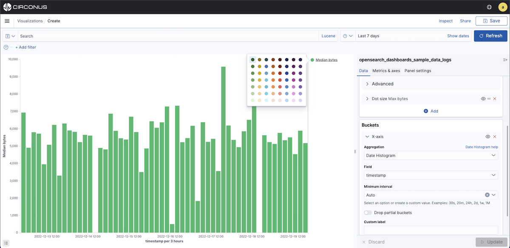

# Bar, Line, and Area Chart Visualizations


The **Bar** visualization within Circonus supports bar, line, and area chart visualizations for log and trace data. Bar charts are often used for comparison, whereas line and area charts are used to show trends over time.

If you are looking to display metric time series data (collected with CUA), use the [Time Series Builder](/circonus3/visualizations/time-series-builder/) instead.

## Working with bar, line and area charts

To create a bar, line, or area chart with this visualization type, you will you first need to select the metrics which define your X and Y axis and values.

### Y-axis metrics



You can define multiple values for the Y-axis by clicking on the **+ Add** link at the bottom of the **Metrics** > **Y-axis** panel. The **+ Add** link allows you to define either a Y-axis value or dot size.

To define your Y-axis values:

1. Select your preferred Y-axis aggregation.

   There are multiple aggregations that can be applied to the Y-axis field, including:

- [Count](/circonus3/visualizations/aggregations/metric-agg/#available-metric-aggregations)
- [Average](/circonus3/visualizations/aggregations/metric-agg/#available-metric-aggregations)
- [Sum](/circonus3/visualizations/aggregations/metric-agg/#available-metric-aggregations)
- [Min](/circonus3/visualizations/aggregations/metric-agg/#available-metric-aggregations)
- [Median](/circonus3/visualizations/aggregations/metric-agg/#available-metric-aggregations)
- [Max](/circonus3/visualizations/aggregations/metric-agg/#available-metric-aggregations)
- [Unique Count](/circonus3/visualizations/aggregations/metric-agg/#available-metric-aggregations)
- [Standard Deviation](/circonus3/visualizations/aggregations/metric-agg/#available-metric-aggregations)
- [Top Hit](/circonus3/visualizations/aggregations/metric-agg/#available-metric-aggregations)
- [Percentiles](/circonus3/visualizations/aggregations/metric-agg/#available-metric-aggregations)
- [Percentile Rank](/circonus3/visualizations/aggregations/metric-agg/#available-metric-aggregations)

2. Select the field that the aggregation is to be applied to.

3. Enter a string in the **Custom Label** field to change the display label.

The **> Advanced** area enables you to create the query using **JSON**. This is recommended for advanced users only.

For an explanation of all available Y-axis aggreggations, see: [Metric Aggregations](http://localhost:1313/circonus3/visualizations/aggregations/metric-agg/).

### X-axis buckets

The X-axis of this chart is the buckets axis. You define buckets for the X-axis, for a split area on the chart, or for split charts.


Bucket aggregations determine what information is being retrieved from your data set.

Before you choose a bucket aggregation, decide if you are splitting slices within a single chart or splitting into multiple charts. A multiple chart split must run before any other aggregations.

When you split a chart, you can change if the splits are displayed in a row or a column by clicking the **Rows | Columns** selector.

This chart uses a bucket aggregation type known as [Sibling Pipeline aggregation](/circonus3/visualizations/aggregations/pipeline-agg/#sibling-pipeline-aggregations).

Types of aggregations available for the X-axis of bar, line, and area charts are:

- [Date Histogram](/circonus3/visualizations/aggregations/bucket-agg/#histogram-and-date_histogram)
- [Date Range](/circonus3/visualizations/aggregations/bucket-agg/#range-date_range-and-ip_range)
- [Filters](/circonus3/visualizations/aggregations/bucket-agg/#filter-and-filters)
- [Histogram](/circonus3/visualizations/aggregations/bucket-agg/#histogram-and-date_histogram)
- [IPv4 Range](/circonus3/visualizations/aggregations/bucket-agg/#range-date_range-and-ip_range)
- [Range](/circonus3/visualizations/aggregations/bucket-agg/#range-date_range-and-ip_range)
- [Significant Terms](/circonus3/visualizations/aggregations/bucket-agg/#significant_terms-and-significant_text)
- [Terms](/circonus3/visualizations/aggregations/bucket-agg/#terms)

### Filters

If you selected **Filters** as your aggregation for the Y-axis, you can specify a set of filters for the data using [DQL query string format](/circonus3/additional-resources/query-languages/dql/), [Lucene syntax](/circonus3/additional-resources/query-languages/lucene-support/) or JSON — just as in the Logs Explorer search bar. Both the use of Lucene and JSON are recommended only for advanced users.

Click **+ Add Filter** to add another filter. Click the **Label** button to open the _label_ field, where you can type in a name to display on the visualization. You'll find the **Label** button above the DQL button.

### Sub-aggregations

Once you’ve specified an X-axis aggregation, you can define sub-aggregations to refine the visualization. Click **+ Add** to define a sub-aggregation, choose **Split Area** or **Split Chart**, then select a sub-aggregation from the list of types.

When multiple aggregations are defined on a chart’s axis, you can use the up or down arrows to the right of the aggregation’s type to change the aggregation’s priority.

Enter a string in the **Custom Label** field to change the display label.



You can customize the colors of your visualization by clicking the color dot next to each label to display the color picker.

Clicking the **Advanced** link will display more customization options for your metrics or bucket aggregation:

- **JSON Input** is a text field where you can add specific JSON-formatted properties to merge with the aggregation definition, as in the following example:

```json
{ "script": "doc['grade'].value * 1.2" }
```

_Use of the JSON Input is recommended for advanced users only._

The availability of these options varies depending on the aggregation you choose.

## Metrics & axes

Select the **Metrics & axes** tab to change the way each individual metric is shown on the chart. The data series are styled in the Metrics section, while the axes are styled in the X and Y axis sections.

**Metrics**

Modify how each metric from the Data panel is visualized on the chart.

- **Chart type** allows you to choose between Area, Line, and Bar types.

- **Mode** allows you to choose whether to stack the different metrics or plot them next to each other.

- **Value Axis** allows you to choose the axis to which you want to plot this data (the properties of each are configured under Y-axes).

- **Line mode** allows you to choose whether the outline of lines or area charts appear smooth, straight, or stepped.

**Y-axis**

Style all the Y-axes of the chart.

- The **Position** of the Y-axis (left or right for vertical charts, and top or bottom for horizontal charts).

- **Mode** defaults to normal, but you can select silhouette, wiggle or percentage.

- **Scale type** scaling of the values (linear, log, or square root).

- **Title** allows you to set the title of axis. If defaults to the metric name.

- **Show Labels** allows you to hide axis labels.

- If **Filter Labels** is enabled, some labels will be hidden in case there is not enough space to display them.

- **Align** allow you to enter the number in degrees for how much you want to rotate labels.

- **Truncate** allows you to enter the size in pixels to which the label is truncated.

**Custom extents**

- **Scale to data bounds** You can check this box if you want to change both upper and lower bounds defaults for the Y-axis (which are zero and maximum) to match the values returned in the data.

- **Set axis extents** allow you to define custom minimum and maximum for each axis.

**X-axis**

- The **Position** of the X-Axis (left or right for horizontal charts, and top or bottom for vertical charts).

- **Show axis lines and labels** allows you to hide axis labels.

- **Show labels** allows you to hide labels.

- If **Filter Labels** is enabled, some labels will be hidden in case there is not enough space to display them.

- **Align** allows you to enter the number in degrees for how much you want to rotate labels.

- **Truncate** allows you to enter the size in pixels by which the label is truncated.

## Panel Settings

These settings apply to the entire chart and not just the individual data series.

**Settings**

- **Show Tooltip** allows you to enable or disable the display of tooltip on hovering over chart objects.
- **Current Time Marker** shows a line that indicates the current time.
- **Show values on chart** allows you to display the values on charts.

**Grid options**

You can enable grid on the chart. By default, grid is displayed on the category axis only.

- **X-axis** allows you to disable the display of grid lines on the category axis.

- **Y-axis** allows you to choose on which (if any) of the value axes you want to display grid lines.

**Threshold line**

Allows you to enable a **Threshold line**. You can choose the threshold value, the line weight, style _(Full, Dashed, Dot-dashed)_ and the color.

## Related links

- [Circonus Dashboards](/circonus3/dashboards/introduction/)
- [Getting Started with Circonus](/circonus3/getting-started/)
