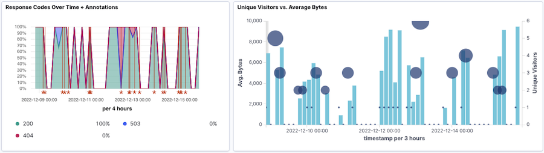
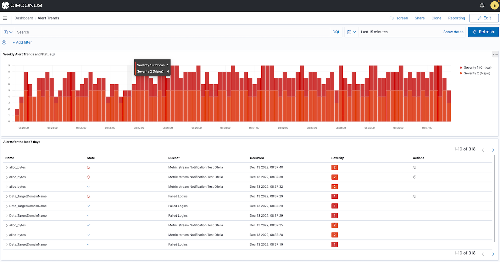
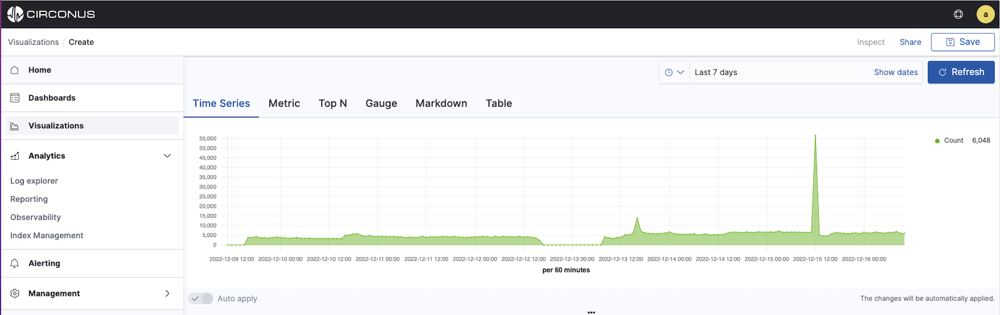
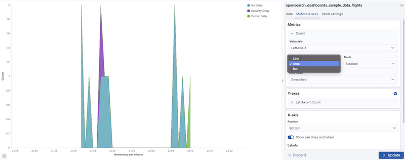
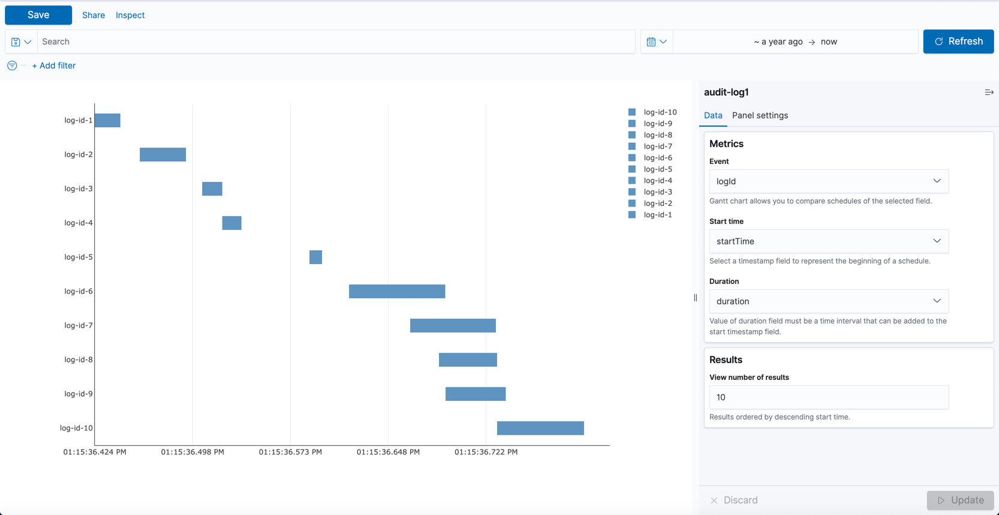
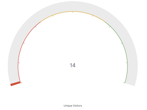
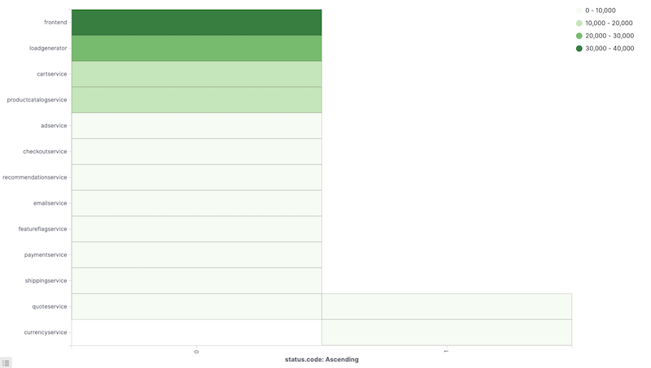
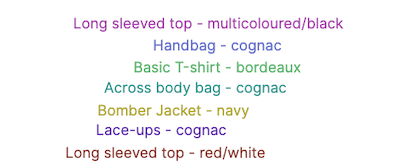
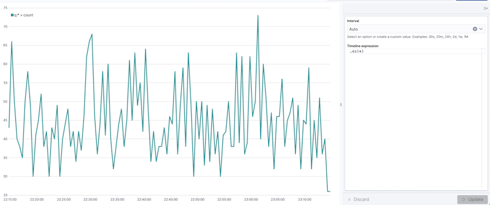
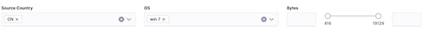

# Visualizations

Circonus [dashboards](/circonus3/dashboards/introduction/) are a collection of visualization panels. Circonus provides many different types of visualizations.

These visualizations enable you to ask the important questions about your data performance, such as:

- **_Who_** is being impacted by app or infrastructure issues? (i.e., which customers or employees)
- **_What_** is the checkout transaction performance?
- **_When_** will my applications exhaust current capacity?
- **_Why_** am I seeing spikes in performance?
- **_How_** can I determine the root cause of an incident and eliminate the issue in the future?

## Choosing a Type of Visualization

Choosing a type of visualization can be challenging. In addition to considering your specific question and the type of data you're working with, you'll want to think about who the information is being communicated to. Will this audience need a quick, at-a-glance understanding or will they need to perform deep discovery and analysis?

For example:

- An **IT Operations center** team member could be interested in current [status](#alert-visualizations) and [trends](#the-time-series-builder) as well as potential [hot spots](#heat-map) that could represent an emerging issue.

- An **Architect** could be interested in application or infrastructure [constraints and trends](#the-time-series-builder), [top consumers](<(#pie-and-donut-visualizations)>), and [hot spots](#heat-map) as well as [patterns](#tag-cloud) that need to be investigated. They may also need to respond to an [existing incident](#alert-visualizations).

- A **Site Reliablity Engineer (SRE)** could be interested in [current performance](#the-time-series-builder), application or infrastructure [hot spots](#heat-map), [request flows and response times](/visualizations/visualizations-overview/#gantt-chart), and [patterns](#tag-cloud) as well as underlying [trends](#the-time-series-builder).

- A **Director of Cloud Infrastructure** cloud be interested in [service level trends](#goal-or-gauge-visualization), [general trends](#the-time-series-builder), and [current statuses](#alert-visualizations).

## Visualization Types

Below, we'll introduce each type of visualization within Circonus and what they're typically used to represent so that you can more easily choose among them.

### Alert Visualizations

The **Alerts** visualization allows you to depict alert trends or a table of active alerts across your metrics, logs, and traces.

The Alerts visualization supports two visualization types:

**Trend** allows you to create **line** or **bar** charts showing alerts trends, supports stacking, and can display all alerts or a filtered set.

**Table** allows you display a filtered set of alerts, showing alert name, status, time it occured, severity and available actions.

See [Alert Visualizations](/circonus3/visualizations/alerts/) for further information on specific configuration options availble.

### Time Series Builder Visualizations

The Time Series Builder, as its name implies, allows you to build multiple different charts and visualizations based on the time series data derived from your metrics, log patterns, and distributed traces. It supports multiple series and data sources within the same visualization as well as the creation of complex aggregations.

The Time Series Builder supports line, area, and bar charts, single metric panels, top N (vertical bar charts), gauges, markdown, and data table panels.

#### Time Series (Line, Area, and Bar Charts)

The Time Series Builder supports the creation of area, line, and bar charts via the **Time Series** type. Bar charts are often used for comparison, whereas line and area charts are used to show trends over time. For all Time Series charts, you can specify whether each series is stacked or not as well as customize the colors, point size, line thickness, fill opacity, etc.

With the Time Series type, multiple series can on displayed that use different chart types. Also, you can compare two time periods by shifting time windows and annotate the graph with log entries.

#### Metric

The **Metric** visualization displays the latest number in a time series, with size automatically resized according to panel size.

#### Top N

The **Top N** visualization is a horizontal bar chart, with each time series represented as a bar, the length of the bar represents the latest time series value.

#### Gauge

The **Gauge** visualization is a single value gauge visualization based on the latest value in a series.

#### Markdown

The **Markdown** visualization allows you create a Rich Text panel. It supports the embedding of fields and values using the Mustache variable syntax.

#### Table

The **Table** visualization displays data from multiple time series as rows, with values displayed in columns.

See [Time Series Builder Visualizations](/circonus3/visualizations/time-series-builder/) for further information on specific configuration options for each of the chart types.

### Bar, Line, and Area Chart Visualizations

The **Bar** visualization type supports bar, line, and area charts optimized for logs and traces.

Bar charts are often used for comparison, whereas line and area charts are used to show trends over time.

See [Bar, Line, and Area Chart Visualizations](/circonus3/visualizations/bar/) for further information on specific configuration options for each of the chart types.

### Map Visualizations

Map visualizations are designed to provide coordinate or regional views. These visualization types are optimized for log and trace data.

Circonus supports two types of map visualizations: coordinate and region maps.

#### Coordinate maps

A **Coordinate Map** displays a geographic area overlaid with circles keyed to the data determined by the buckets you specify.

#### Region maps

A **Region Map** is a thematic map in which boundary vector shapes are colored using a gradient. Higher intensity colors indicate larger values, and lower intensity colors indicate smaller values. These are also known as choropleth maps.

See [Map Visualizations](/circonus3/visualizations/maps/) for further information on specific configuration options.

### Gantt Chart Visualizations

**Gantt Charts** provide a timeline of activites, often referred to as a waterfall view. This visualization type, which is optimized for log and trace data, is particularly useful for viewing call, transaction, or request flows.

See [Gantt Chart Visualizations](/circonus3/visualizations/gantt/) for further information on specific configuration options.

### Goal and Gauge Visualizations

A **goal** visualization displays how your metric performs against a set goal. A **gauge** visualization displays in which predefined range your metric falls. Goal and gauge visualizations are optimized for log and trace data.

See [Goal and Gauge Visualizations](/circonus3/visualizations/goal/) for further information on specific configuration options.

### Heat Map Visualizations

A **heat map** is a graphical representation of data where the individual values contained in a matrix are represented as colors within a specified color gradient or range. The darker the color, the higher the value. Each value in the matrix is determined by a metrics aggregation.

See [Heatmap Visualizations](/circonus3/visualizations/heatmap/) for further information on specific configuration options.

### Markdown Visualizations

The Markdown visualization provides a Rich text panel that accepts GitHub-flavored Markdown text. Circonus renders the text you enter in this field and displays the results on the dashboard. Markdown visualizations let you include labels or guidance on dashboards. Field embedding is also supported, so you can provide a metric value along with its description for example.

See [Markdown Visualizations](/circonus3/visualizations/markdown/) for further information on specific configuration options.

### Pie and Donut Visualizations

The **Pie** and **Donut** visualizations are designed to provide a quick breakdown of overall composition or a comparison of individual elements to a whole. The size of each slide is determined by a metrics aggregation. Pie and donut visualizations are optimized for log and trace data.

Note that if you're looking to compare individual slices, this is better accomplished with a bar chart.

See [Pie and Donut Visualizations](/circonus3/visualizations/pie/) for further information on specific configuration options.

### Tag Cloud Visualizations

The **Tag Cloud** visualization lets you visualize the occurrences (or volume) of different terms such as events, words, or labels contained in your logs and traces. Each term, referred to as a tag, is typically a single word and the importance of each tag is indicated by font size or color.

See [Tag Cloud Visualizations](/circonus3/visualizations/tag-cloud/) for further information on specific configuration options.

### Timeline Visualizations

The Timeline Visualization is a time series data visualizer that enables you to combine totally independent log or trace data sources within a single visualization.

This visualization type is driven by a simple expression language you use to retrieve time series data, perform calculations to tease out the answers to complex questions, and visualize the results.

See [Timeline Visualizations](/circonus3/visualizations/timeline/) for further information on specific configuration options.

### Controls Visualizations

The Controls visualization enables you to add interactive controls (via a dropdown menu or slider) to Circonus dashboards. These controls provide another way to build and create global filters.

<!-- See [Visualizations Controls](/circonus3/visualizations/controls/) for further information on specific configuration options.-->
