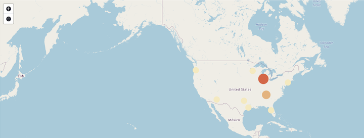
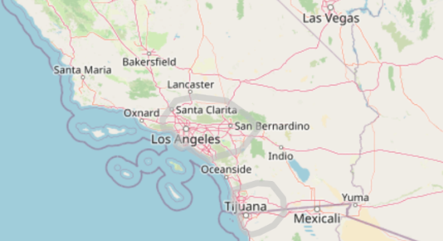

# Map Visualizations

Circonus provides two different map visualizations:

- [Coordinate maps](#coordinate-maps)
- [Region maps](#region-maps)

## Coordinate Maps



A coordinate map displays a geographic area overlaid with circles keyed to the data determined by the buckets you specify.

### Configuration

#### Metrics

The default metrics aggregation for a coordinate map is the Count aggregation. You can select any of the following aggregations as the metrics aggregation:

- The **Count** aggregation returns a raw count of the elements in the selected index pattern.

- The **Average** aggregation returns the average of a numeric field. Select a field from the dropdown.

- The **Sum** aggregation returns the total sum of a numeric field. Select a field from the dropdown.

- The **Min** aggregation returns the minimum value of a numeric field. Select a field from the dropdown.

- The **Max** aggregation returns the maximum value of a numeric field. Select a field from the dropdown.

- **Unique Count** is a cardinality aggregation that returns the number of unique values in a field. Select a field from the dropdown.

Enter a string in the **Custom Label** field to change the display label.

#### Buckets

Coordinate maps use the geohash aggregation. Select a field, typically coordinates, from the dropdown.

- The **Change precision on map zoom** box is checked by default. Uncheck the box to disable this behavior. The Precision slider determines the granularity of the results displayed on the map. See the documentation for the geohash grid aggregation for details on the area specified by each precision level.

- The **Place markers off grid (use geocentroid)** box is checked by default. When this box is checked, the markers are placed in the center of all the documents in that bucket. When unchecked, the markers are placed in the center of the geohash grid cell. Leaving this checked generally results in a more accurate visualization.

Enter a string in the **Custom Label** field to change the display label.

You can click the **Advanced link** to display more customization options for your metrics or bucket aggregation:

- **Exclude Pattern** allows you to specify a pattern in this field to exclude from the results.

- **Include Pattern** allows you to specify a pattern in this field to include in the results.

- **JSON Input** is a text field where you can add specific JSON-formatted properties to merge with the aggregation definition, as in the following example:

```json
{ "script": "doc['grade'].value * 1.2" }
```

The availability of these options varies depending on the aggregation you choose.

#### Options

**Map type** allows you to select one of the following options from the dropdown.

- **Scaled Circle Markers** scales the size of the markers based on the metric aggregation’s value.

- **Shaded Circle Markers** displays the markers with different shades based on the metric aggregation’s value.

- **Shaded Geohash Grid** displays the rectangular cells of the geohash grid instead of circular markers, with different shades based on the metric aggregation’s value.

- A **Heatmap** applies blurring to the circle markers and applies shading based on the amount of overlap.

  Heatmaps have the following options:

  - **Cluster size:** Adjust the size of the heatmap clustering.
  - **Show Tooltip:** Check this box to have a tooltip with the values for a given dot when the cursor is on that dot.

- **Desaturate map tiles** lets you desaturate the map’s color in order to make the markers stand out more clearly.

#### WMS compliant map server

Check this box to enable the use of a third-party mapping service that complies with the Web Map Service (WMS) standard. Specify the following elements:

- **WMS url:** The URL for the WMS map service.

- **WMS layers:** A comma-separated list of the layers to use in this visualization. Each map server provides its own list of layers.

- **WMS version:** The WMS version used by this map service.

- **WMS format:** The image format used by this map service. The two most common formats are image/png and image/jpeg.

- **WMS attribution:** An optional, user-defined string that identifies the map source. Maps display the attribution string in the lower right corner.

- **WMS styles:** A comma-separated list of the styles to use in this visualization. Each map server provides its own styling options.

After changing options, click the **Apply changes** button to update your visualization, or the grey **Discard changes** button to keep your visualization in its current state.

### Navigating the Map

Once your map visualization is ready, you can explore it in several ways:

- Click and hold anywhere on the map and move the cursor to move the map center. Hold Shift and drag a bounding box across the map to zoom in on the selection.

- Click the **Zoom In/Out** buttons to change the zoom level manually.

- Click the **Fit Data Bounds** button to automatically crop the map boundaries to the geohash buckets that have at least one result.

- Click the **Latitude/Longitude Filter** button, then drag a bounding box across the map, to create a filter for the box coordinates.

## Region Maps



Region maps are thematic maps in which boundary vector shapes are colored using a gradient: higher intensity colors indicate larger values and lower intensity colors indicate smaller values. These are also known as choropleth maps.

### Configuration

To create a region map, you configure an inner join that joins the result of an Circonus Log terms aggregation and a reference vector file based on a shared key.

#### Metrics

Select any of the supported Metric or Sibling Pipeline Aggregations.

#### Buckets

Configure a Terms aggregation. The term is the key that is used to join the results to the vector data on the map.

#### Options

##### Layer Settings

- **Vector map:** select from a list of vector maps. This list includes the maps that are hosted by Circonus.

- **Join field:** this is the property from the selected vector map that will be used to join on the terms in your terms-aggregation.

##### Style Settings

- **Color Schema:** the color range used to color the shapes.

##### Basic Settings

- **Legend Position:** the location on the screen where the legend should be rendered.

- **Show Tooltip:** indicates whether a tooltip should be displayed when hovering over a shape..

## Related links

- [Circonus Dashboards](/circonus3/dashboards/introduction/)
- [Getting Started with Circonus](/circonus3/getting-started/)
