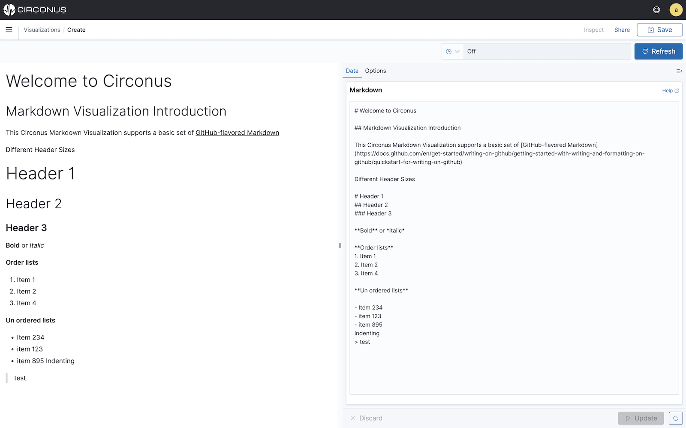

# Markdown Visualization

The markdown visualization enables you to create a rich text visualization that can be used to provide additional context to dashboards.

It accepts [GitHub-flavored Markdown](https://docs.github.com/en/get-started/writing-on-github/getting-started-with-writing-and-formatting-on-github/quickstart-for-writing-on-github) and renders the markdown to a dashboard as indicated by the syntax.

To add text to the markdown visualization, simply enter the markdown text into the **Data** tab on the right hand side of the screen. Basic markdown syntax and elements can be see in the image above.

If you wish to embed metric or other field values, we recommend you use the **Markdown** option within the [Time Series Builder](/circonus3/visualizations/time-series-builder/#markdown).

## Options

Markdown supports two display options:

1. **Base font size in points**: Set base font size (default is 12) using the slider.
2. **Open links in new tab**: Set whether links embedded in the markdown visualization open a browser tab when clicked on (default is off).

## Related links

- [Circonus Dashboards](/circonus3/dashboards/introduction/)
- [Getting Started with Circonus](/circonus3/getting-started/)
