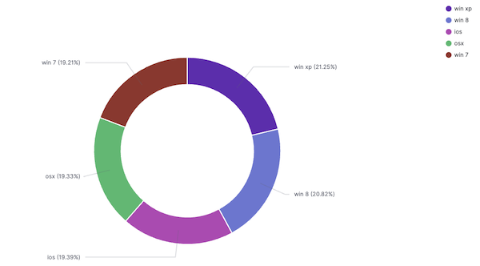
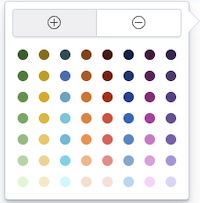

# Working with Pie and Donut Charts

Pie and donut visualizations provide a quick breakdown of overall composition as well as a comparison of slices to an overall pie. If you're specifically looking to compare slices, this is better done with a bar chart. Please note that pie and donut visualizations are optimized for logs and trace data.



## Pie or Donut Chart Aggregations

In Circonus, slice size is determined by metric aggregation. The following metric aggregations are available:

- The **Count** aggregation returns a raw count of the elements in the selected index pattern.

- The **Sum** aggregation returns the total sum of a numeric field. Select a field from the dropdown.

- The **Top Hit** aggregation returns one or more of the top values from a specific field in your documents.

- **Unique Count** is a cardinality aggregation that returns the number of unique values in a field. Select a field from the dropdown.

Enter a string in the **Custom Label** field to change the display label.

The slices are defined by _bucket_ aggregations that determine what information is being retrieved from your data set.

Before you choose a bucket aggregation, specify if you are splitting slices within a single chart or splitting into multiple charts. A multiple chart split must run before any other aggregations. When you split a chart, you can change if the splits are displayed in a row or a column by clicking the **Rows | Columns** selector.

You can specify any of the following bucket aggregations for your pie chart:

- [Date Histogram](/circonus3/visualizations/aggregations/pipeline-agg/#sibling-pipeline-aggregations)
- [Date Range](/circonus3/visualizations/aggregations/pipeline-agg/#sibling-pipeline-aggregations)
- [Filters](/circonus3/visualizations/aggregations/pipeline-agg/#sibling-pipeline-aggregations)
- [Histogram](/circonus3/visualizations/aggregations/pipeline-agg/#sibling-pipeline-aggregations)
- [IPv4 Range](/circonus3/visualizations/aggregations/pipeline-agg/#sibling-pipeline-aggregations)
- [Range](/circonus3/visualizations/aggregations/pipeline-agg/#sibling-pipeline-aggregations)
- [Significant Terms](/circonus3/visualizations/aggregations/pipeline-agg/#sibling-pipeline-aggregations)
- [Terms](/circonus3/visualizations/aggregations/pipeline-agg/#sibling-pipeline-aggregations)

After defining an initial bucket aggregation, you can define sub-buckets to refine the visualization. Click **+ Add sub-buckets** to define a sub-aggregation, then choose **Split Slices** to select a sub-bucket from the list of types.

When multiple aggregations are defined on a chart’s axes, you can use the up or down arrows to the right of the aggregation’s type to change the aggregation’s priority.

You can customize the colors of your visualization by clicking the color dot next to each label to display the _color picker_.



The color picker reveals an array of color dots from which users can select.

You can enter a string in the **Custom Label** field to change the display label.

You can also click the **Advanced** link to display more customization options for your metrics or bucket aggregation:

- **Exclude Pattern** allows you to specify a pattern in this field to exclude from the results.

- **Include Pattern** allows you to specify a pattern in this field to include in the results.

- **JSON Input** provides a text field where you can add specific JSON-formatted properties to merge with the aggregation definition, as in the following example:

  ```json
  { "script": "doc['grade'].value * 1.2" }
  ```

The availability of these options varies depending on the aggregation you choose.

Select the **Options** tab to change the following aspects of the table:

- **Donut** display the chart as a sliced ring instead of a sliced pie.

- Check **Show Tooltip** to enable the display of tooltips.

After changing options, click the **Apply changes** button to update your visualization or the grey **Discard changes** button to keep your visualization in its current state.

## Related links

- [Circonus Dashboards](/circonus3/dashboards/introduction/)
- [Getting Started with Circonus](/circonus3/getting-started/)
