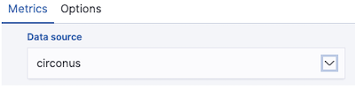
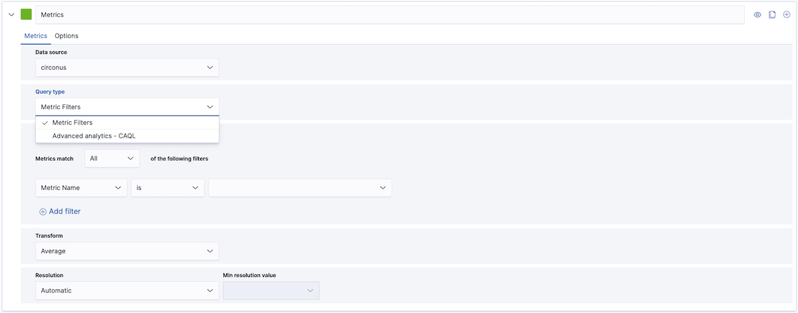
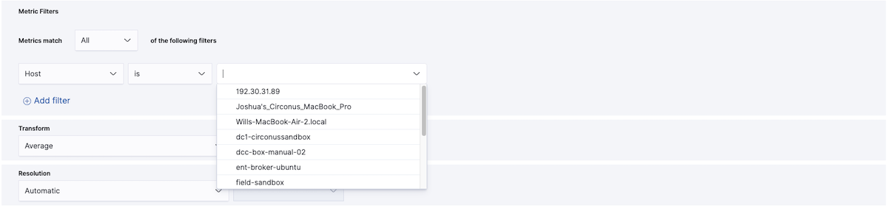
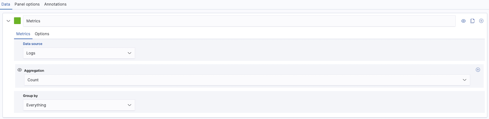
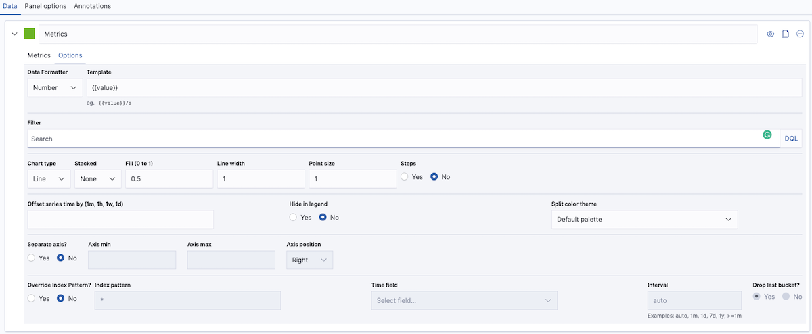
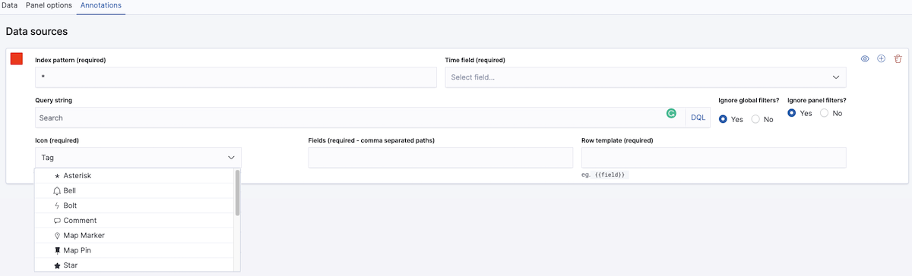
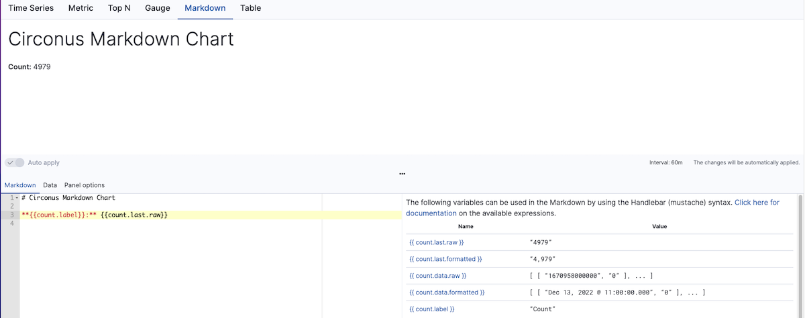
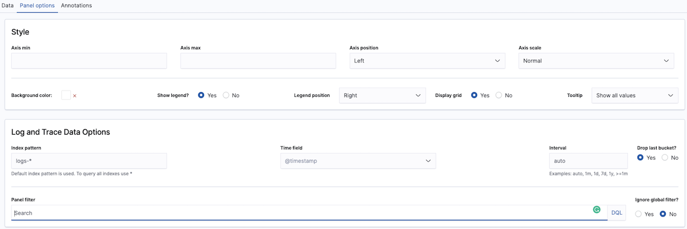

# Time Series Builder Visualizations

The **Time Series Builder** is a powerful tool, empowering you to create different charts and visualizations from your metric, log, and trace time series data. You can leverage the Time Series Builder to produce both straightforward visualizations and extemely complex ones with relative ease.

## Creating a new visualization

The basic process behind the Time Series Builder is straight forward. You choose the data source and series you want to display, then choose how you want to display the data with the available options, which depend on the specific time series visualization selected.

The Time Series Builder supports times series line, area and bar charts, Top N (vertical bar charts), single metric panels, gauges, Markdown and data table panels.

In selecting from the available time series visualizations, consider both the question at hand as well as the use case and needs of your audience. For more guidance, see: [Choosing a Type of Visualization](/circonus3/visualizations/introduction/#choosing-a-type-of-visualization).

## Selecting and configuring time series data

Each type of visualization within the Time Series Builder supports multiple time series.

To add a single series:

1. Select the visualization type.

2. Select the **Data Source**, specifying either logs or metrics. Note that logs data sources include both logs and traces.

   

3. Define the times series data that you're interested in.

If you chose a metrics data source, you can query the data using either **Metric filters** or **Advanced analytics - CAQL**. CAQL, or Circonus Analytics Query Language, provides tremendous flexiblity but is recommended for advanced users only. For more information, see our [CAQL documentation](/caql/).

**Metric Filters** allow you to specify criteria for the desired metrics using filters built with intuitive dropdowns. A filter is a single field, condition, and value. To add more than one filter, click the **+ Add Filter** option at the bottom of the section. You can choose whether the times series must meet **All** filters or **Any** filter by using the dropdown above the filters.

To create a filter, simply select a field name and list operation (e.g., is, is not, contains, starts with, ends with), then set a value. The list of operations available will depend on the type of field selected.

For the field selection, you can select from a list which includes properties such as the **Metric Name** or the originating **Integration Name**, **Tag**, or **Host**, among many others.

The visualization will be automatically populated based on the Metric filters you have added. Note that labels for metric time series will be automatically generated.

To specify the time series data that you're interested in from a logs data source, select **Options** and define a **Filter** using [Dashboards Query Language](/circonus3/additional-resources/query-languages/dql/).

4. Specify the formatting options for a series by clicking on the **Options** tab for that series.

   Data formating options include:

- **Data Formatter** determines how metrics are displayed, i.e., as `Bytes`, `Number`, `Percent`, `Duration` or a `Custom` format.

- **Format string** to format numbers. [See Numeral.js for more details](http://numeraljs.com/#format)

- **Template** supports [mustache template language](http://mustache.github.io/mustache.5.html). For example, in a log series grouped by term, you can use `{{key}}` to add the term.

- **Offset series time by (1m, 1h, 1w, 1d)** allows you to compare the same or different time series using a time offset of a number of _minutes_ (m), _hours_ (h), _days_ (d), and _weeks_ (w).

### Time series annotations

You can annotate **Time Series** visualizations within the Time Series Builder using log entries (called documents). These annotations will appear as lines with icons, situated at the time interval at which the event occurred.

To add annotations to a **Time Series** visualization within the Time Series Builder:

1. Select the **Annotations** tab.

2. Click **Add data source**, then specify the options. You will see that Index pattern, Time field, Icon, Fields and Row template are required to use the annotations feature.

3. Select the Log Index Pattern for the annotations (by default it is set to `*` which means all logs; you can modify the pattern to be more specific).

4. Set the color for the annotation. Select the color patch to the left of the Index pattern. This will display a color picker which allows you to choose the color for the annotation.

5. Select the **Time field** from the drop-down list of valid time fields available in that index.

6. Enter the **Search** [DQL](/circonus3/additional-resources/query-languages/dql/) query string.

7. Choose whether you want to **Ignore** _global or panel filters_. By default, this is set to **Yes**. Set it to **No** if you wish to use the [dashboard filters](/circonus3/dashboards/introduction/#data-filters) or a [Controls Visualization](/circonus3/visualizations/introduction/#controls-visualizations).

8. Select the **icon** you want to use within the annotation. The log entry will display upon hover of the icon.

   > The available icons types are `*` (asterisk), `Bell`, `Bolt` (lightening), `Comment` (bubble), `Map Marker`, `Map Pin`, `Star`, `Tag` _(default)_, `Bomb`, `Bug`, `Exclamation circle`, `Exclamation triangle`, `Fire`, `Flag` and `Heart`.

9. Enter the fields you wish to use in the annotation as a comma separated list.

10. The **Row Template** can be specified using the [mustache template language](http://mustache.github.io/mustache.5.html). For example: `{{field}}`.

You can delete Annotations by clicking on the _red garbage bin_ icon in the top right hand corner of the annotations panel.

### Markdown

To create a Markdown visualization:

1. Select the **Markdown** tab within **Time Series Builder**.

2. Within the **Markdown** tab, enter your Markdown text and then press Enter.

3. Insert [mustache template variables](<(http://mustache.github.io/mustache.5.html)>) into the editor as desired. The mustache syntax uses the Handlebar.js processor, which is an extended version of the [mustache template language](http://mustache.github.io/mustache.5.html).

   For example: `**{{count.label}}:** {{count.last.raw}}` displays as **Count**: 4979

The **Panel options** for Markdown differ from those for other visualizations as you can enter **Custom CSS** to format the Markdown panel.

## Panel options

**Panel options** allow you to control the display of your time series visualization.

Most types of time series visualizations will include two areas within the **Panel options** tab: **Style** and **Log and Trace Data Options**.

To edit **Panel options** for a visualization:

1. Select the **Panel options** tab within **Time Series Builder**.

2. Under **Style**, specify how you want the visualization to look. The style options will differ based on the visualization.

- Style specifies axis scaling, position, color options, and legend and tool tip options.

  - The **Metric**, **Top N**, **Gauge** visualization support specific color rules (conditional formatting) that set the background, text, bar, and gauge color based on the conditions.

  - A **Style** section is not available for the Markdown or Table visualizations. Markdown does support the use of custom CSS.

4. **Log and Trace Data Options** specify the display options for logs and traces.

   - **Index pattern** selects which indices are used. By default, it uses `logs-*`.

   - **Time field** allows you to select from the available time fields within the selected series.

   - **Interval** is set to auto by default. You can choose a time range **(1m, 1h, 7d, 1w, 1y or expressed as condition >=1m)** and compare the same or different time series using a time offset of a number of _minutes_ (m), _hours_ (h), _days_ (d), _weeks_ (w), or _years_ (y).

   - Enter the **Search** [DQL](/circonus3/additional-resources/query-languages/dql/) query string.

   - Choose whether you want to **Ignore** _global or panel filters_. By default, this is set to **Yes**. Set it to **No** if you wish to use the [dashboard filters](/circonus3/dashboards/introduction/#data-filters) or a [Controls Visualization](/circonus3/visualizations/introduction/#controls-visualizations).

## Related links

- [Circonus Dashboards](/circonus3/dashboards/introduction/)
- [Getting Started with Circonus](/circonus3/getting-started/)
