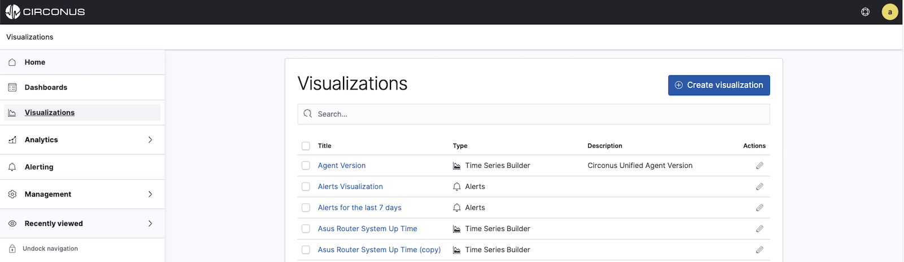
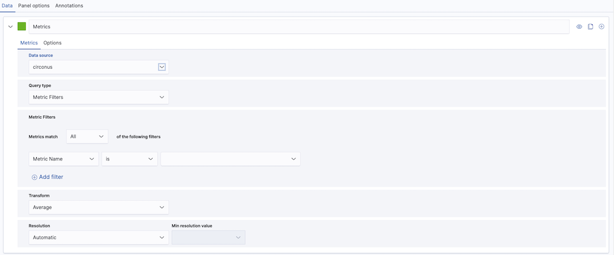
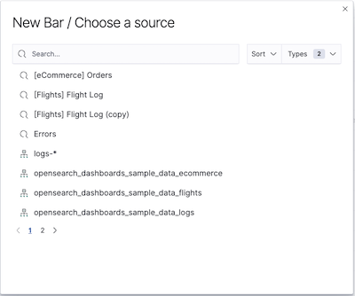
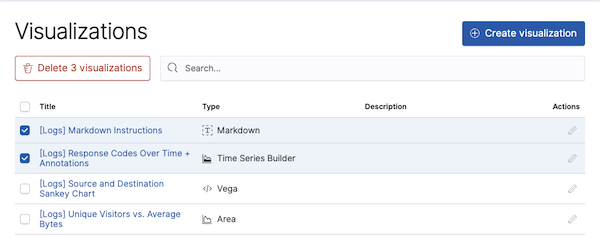

# Working with Visualizations

Circonus dashboards and reports contain one or more visualization panels. Each visualization acts as a communication tool, enabling you to understand some aspect of your data. With visualizations, you can monitor current values, analyze trends, and diagnose issues with ease.

Your choice of visualization should depend on your use case as well as your audience. For more guidance, check out the [Visualizations Overivew](/circonus3/visualizations/visualizations-overview/).

The following sections will explain how to create, edit, and delete visualizations outside the context of a dashboard. To learn how to work with visualizations on a dashboard, see [Managing dashboards](/circonus3/dashboards/dashboards-management).

## Creating a Visualization

To create a visualization, select **Visualizations** in the main menu and then click **+ Create Visualization**.

In the visualizations selection dialog, click on the type of visualization you'd like to create. You can choose from:

- [**Alerts**](/circonus3/visualizations/visualizations-overview/#alert-visualizations)
- [**Time Series Builder**](/circonus3/visualizations/visualizations-overview/#the-time-series-builder)
- [**Bar**](circonus3/visualizations/visualizations-overview/#bar-line-or-area-visualizations)
- [**Coordinate Map**](/circonus3/visualizations/visualizations-overview/#coordinate-maps)
- [**Gantt Chart**](/circonus3/visualizations/visualizations-overview/#gantt-chart)
- [**Goal and Gauge**](/circonus3/visualizations/visualizations-overview/#goal-or-gauge-visualization)
- [**Heat maps**](/circonus3/visualizations/visualizations-overview/#heat-map)
- [**Markdown**](/circonus3/visualizations/visualizations-overview/#markdown)
- [**Pie**](/circonus3/visualizations/visualizations-overview/#pie-and-donut-visualizations)
- [**Region Map**](/circonus3/visualizations/visualizations-overview/#region-maps)
- [**Tag Cloud**](/circonus3/visualizations/visualizations-overview/#tag-cloud)
- [**Timeline**](/circonus3/visualizations/visualizations-overview/#timeline)
- [**Controls**](/circonus3/visualizations/visualizations-overview/#controls)

For the **Alerts** and **Time Series Builder** visualizations, you will be prompted to select a data source. (Normally it will be either Circonus or Logs.)

For visualizations optimized for logs and traces, you will need to specify a search query to retrieve the data for your visualization.

## Editing a Visualization

To edit an existing visualization, first select **Visualizations** from the main menu to view a list of all visualizations. Find the visualization you wish to edit and either click on the visualization name or its pencil (edit) icon within the **Actions** column. Once you make the desired edits, click on the **Save** button in the top right corner.

## Deleting a Visualization

If you wish to delete a visualization, first navigate to the list of visualizations by clicking **Visualizations** within the main menu. Then, select the checkbox in front of the title of the visualization(s) you'd like to delete. Selecting the checkbox next to the table's **Title** column heading will select all visualizations.

Once visualizations have been selected, a **Delete** button will appear above the list, indicating the number of dashboards you have selected. To proceed with deletion, click this button and then confirm in the dialog which appears.

