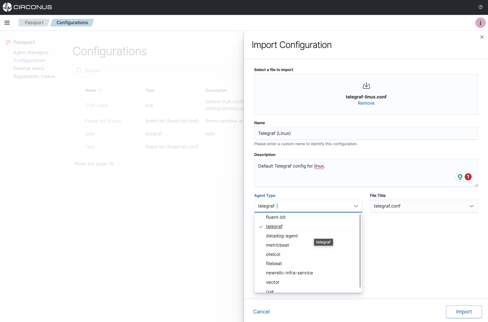

# Build a configuration with flow builder

The Passport Flow Builder is a low-code tool for building configurations for your agents. These configurations can be assigned to the corresponding agents managed by the Agent Manager.

:::info NEW FEATURE!

Passport supports isomorphism for Telegraf and Fluent-bit configuration files!

This means you can import any existing config file and the UI will convert it to a visual builder in the UI to modify any way. This is a great way to get started with Passport and see how the UI works and enable easier management of complex and lengthy configuration files.

:::

### Creating a configuration

To get started with a new configuration in Passport, choose from one of the methods below on the **Passport > Configurations** page:
- Choose **import** to import a file.
- Choose **Create configuration** to copy/paste your config into a code block or start fresh with the low-code builder if using telegraf or fluent-bit.

:::note

At this time, only Telegraf and Fluent-bit are supported in the flow-builder with isomorphism support.

:::

Fill in the relevant information for your config and click "Add" at the bottom of the form.

### Using the flow builder

Once in the flow builder, what you see will be determined in part by which agent you are creating a config for. However, some elements are common to all.

In the left menu, you will see a list of supported plugins broken out by the plugin category supported by the target agent.

You can filter the results by using the search box. To use a plugin, simply drag it from the left menu and drop it over a compatible node on the canvas. The plugins that can connect are agent-specific.

:::note Example

When working with Telegraf, you can drag an output plugin over an input plugin, but not the other way around because the output plugin is the last plugin type in that agent's plugin pipeline model.

:::

Your configurations will appear on the right.

To save, click the **Save** button in the canvas button list:

Once the configuration file is imported, it will be displayed on the **Passport > Configurations** list page.

<iframe width="560" height="315" src="https://www.youtube.com/embed/vVa6A0zgJ_0?si=RDQgrr43v4Zpws8J" title="YouTube video player" frameborder="0" allow="accelerometer; autoplay; clipboard-write; encrypted-media; gyroscope; picture-in-picture; web-share" allowfullscreen></iframe>

## Assigning a configuration

After the Agent Manager has been installed and some collection agents are now being managed, you can start assigning configuration files to the collection agents under management.

:::note

If the Agent Manager is **Disconnected** during this process, once it comes back online it will pull down any assigned configs.

:::

Configuration assignment statuses:

- **New** (Recently assigned to an Agent Manager and the config is waiting for the next check-in from the Agent Manager which is every minute.)
- **Active** (The Agent Manager has updated the configuration file for the selected collection agent)
- **Pending** (The Agent Manager is in the process of applying the configuration)
- **Error** (The Agent Manager encountered an error applying the configuration)
- **Canceled** (The assignment was replaced by another **new** assignment before the Agent Manager had a chance to see it)
- **Inactive** (The assignment was previously **active** but has now been replaced)

Assigning a configuration file can either be done from the specific file's **details** page or the **Agent Manager** page.

### Configuration details page

From a **Passport > Configurations** details page, select the **Assign** button to view all possible agents that can be assigned this configuration.

### Agent Manager page

All supported agent-type configuration files will be listed. Choose one and select **Assign**.

Next, the assignment will be pulled down by the Agent Manager on its next check which is every 60 seconds. When the configuration file has been updated on the collection agent, the status will change to **Active**.

If the Agent Manager is currently **Disconnected**, when it next checks in it will pull down the new config file.

<iframe width="560" height="315" src="https://www.youtube.com/embed/i-wXHos_y4c?si=grQsyIaprkoELMC6" title="YouTube video player" frameborder="0" allow="accelerometer; autoplay; clipboard-write; encrypted-media; gyroscope; picture-in-picture; web-share" allowfullscreen></iframe>

