# Configuration details

Each configuration file has a details page that displays all the information about the configuration file with feature rich capabilities to taylor the configuration file to your needs.

Features such as the following will give you the ability to manage your configuration files in any way you need:

- Details overview
- Auto Versioning
  - Viewing Diffs
  - Rollbacks
- Rules
- Assigning to agents
- Cloning
- History
- Build **_- Low-code builder for Telegraf and Fluent-bit with isomorphism support!_**
- Edit
- Deleting

## Details overview

From the **Passport > Configurations** list page, select the configuration file you want to view the details for.

Information such as the following will be displayed including the current **assignments**:

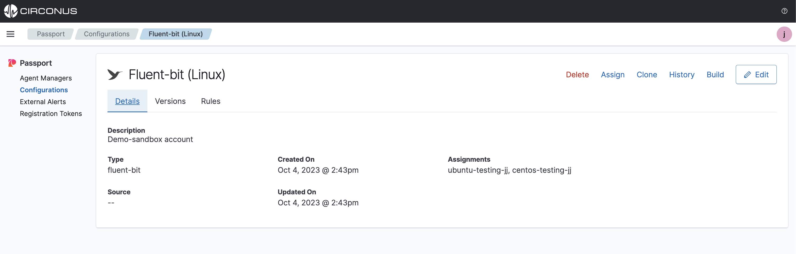

## Versions

From the **Passport > Configurations** list page, select the configuration file you want to view the version history for.

Select the **Versions** tab to view, then under the **Versions** dropdown, select the version you want to view.

When a configuration file is first created, it will be assigned a version of the date in time. Each time the configuration file is updated, the version will increment to the edited date in time. This allows you to view the history of the configuration file and rollback to any previous version.

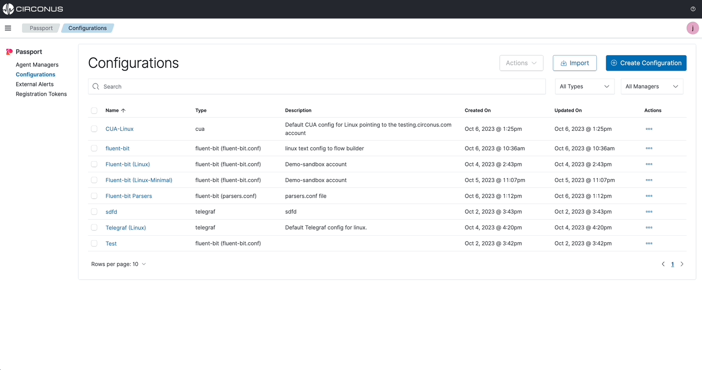

### Diffs

Select the **View Diff** button to view the differences between the current version and the previous version.

Any changes made to the configuration file will be highlighted in green for additions and red for deletions.

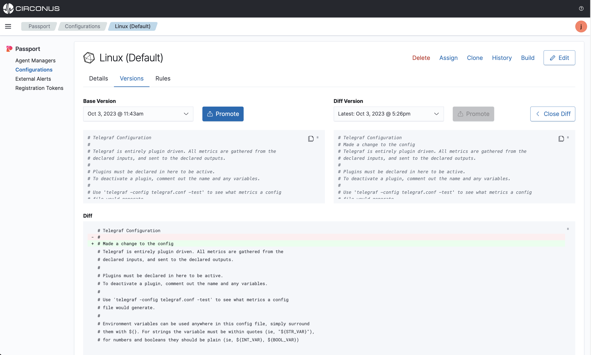

### Rollbacks

From a **Passport > Configurations** details page, select the **Versions** tab to view previous config versions. Then, select the version you want to rollback to and select the **Promote to Latest** button.

:::note NOTE

Rolling back a config version will make the selected version the latest for all agents that have been assigned this configuration and any rules that apply.

:::

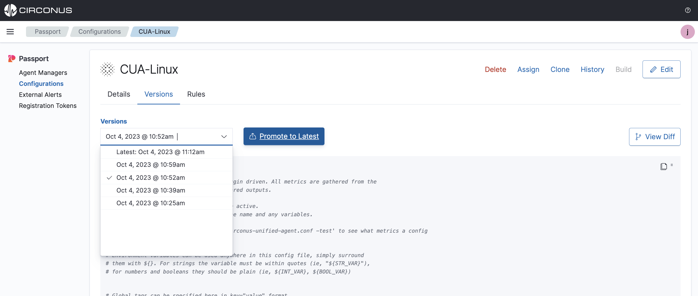

## Rules

From a **Passport > Configurations** details page, select the **Rules** tab to then see all existing rules and create new ones. See the [Rules Engine](/passport/rules-engine) page for more information.

## Assign

After the Agent Manager has been installed and some collection agents are now being managed, you can start assigning configuration files to the collection agents under management.

:::note

If the Agent Manager is **Disconnected** during this process, once it comes back online it will pull down any assigned configs.

:::

Configuration assignment statuses:

- **New** (Recently assigned to an Agent Manager and the config is waiting for the next check-in from the Agent Manager which is every minute.)
- **Active** (The Agent Manager has updated the configuration file for the selected collection agent)
- **Pending** (The Agent Manager is in the process of applying the configuration)
- **Error** (The Agent Manager encountered an error applying the configuration)
- **Canceled** (The assignment was replaced by another **new** assignment before the Agent Manager had a chance to see it)
- **Inactive** (The assignment was previously **active** but has now been replaced)

Assigning a configuration file can either be done from the specific file's **details** page or the **Agent Manager** page.

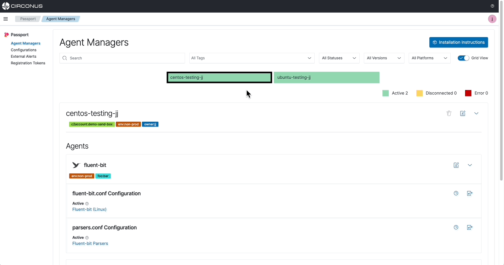

### Configuration details page

From a **Passport > Configurations** details page, select the **Assign** button to view all possible agents that can be assigned this configuration.

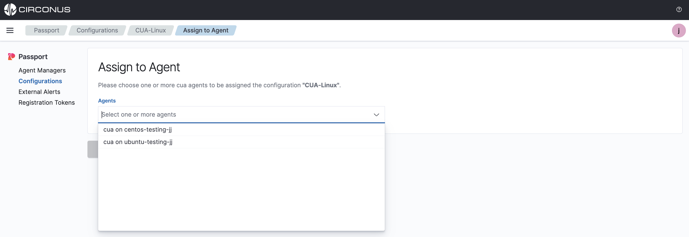

### Agent Manager page

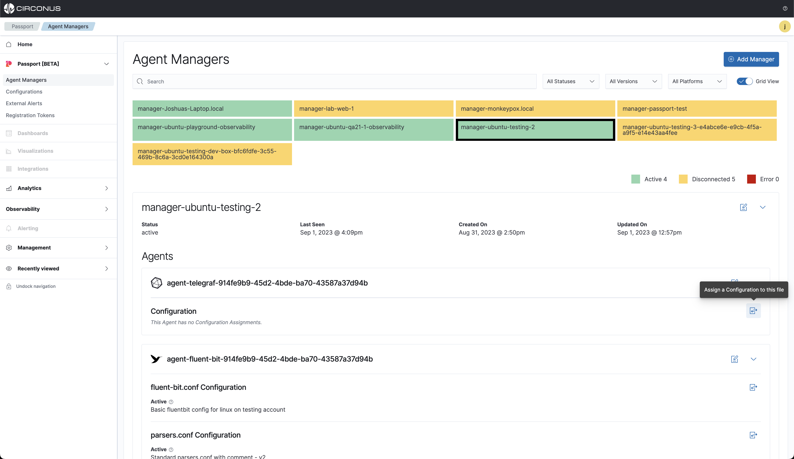

All supported agent-type configuration files will be listed. Choose one and select **Assign**.

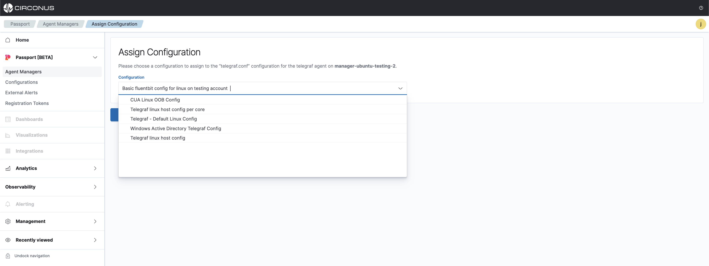

Next, the assignment will be pulled down by the Agent Manager on its next check which is every 60 seconds. When the configuration file has been updated on the collection agent, the status will change to **Active**.

If the Agent Manager is currently **Disconnected**, when it next checks in it will pull down the new config file.

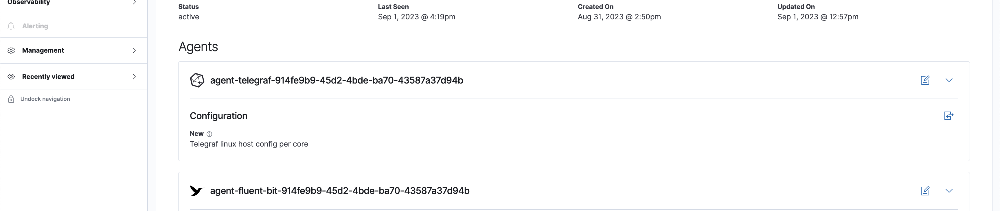

<iframe width="560" height="315" src="https://www.youtube.com/embed/i-wXHos_y4c?si=grQsyIaprkoELMC6" title="YouTube video player" frameborder="0" allow="accelerometer; autoplay; clipboard-write; encrypted-media; gyroscope; picture-in-picture; web-share" allowfullscreen></iframe>

## Clone

From a **Passport > Configurations** details page, select the **Clone** button to then clone the configuration file and make changes.

## History

From a **Passport > Configurations** details page, select the **History** button to then see the assignment history for this configuration file.

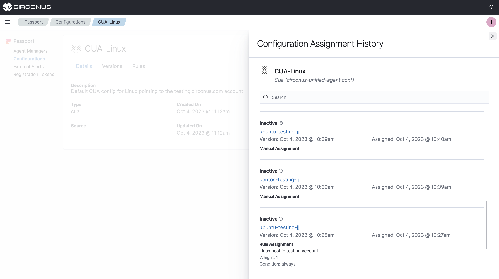

## Build

Both **Telegraf** and **Fluent-bit** are supported in the low-code flow builder with isomorphism, meaning you can import any existing config file and the UI will convert it to a visual builder in the UI to modify any way. This is a great way to get started with Passport and see how the UI works and enable easier management of complex and lengthy configuration files.

From a **Passport > Configurations** details page, select the **Build** button to then see the assignment history for this configuration file.

:::note NOTE

When modifying the configuration file and saving, a new version will be created and pulled down by the Agent Manager on its next check which is every 60 seconds.

:::

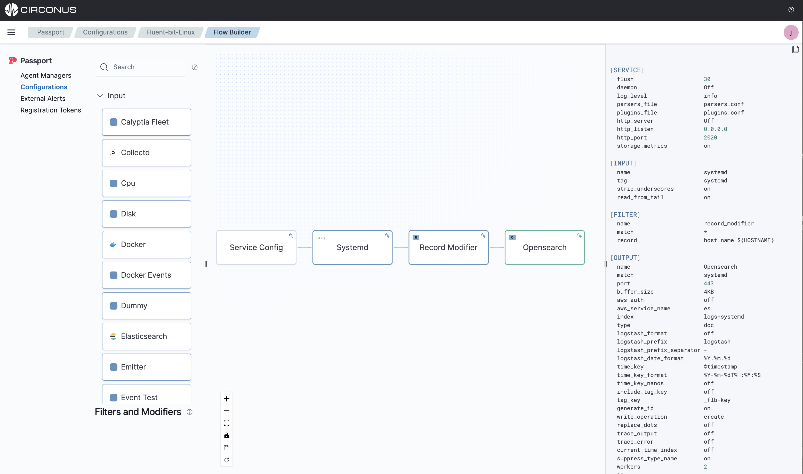

## Edit

From a **Passport > Configurations** details page, select the **Edit** button to then modify the configuration file's **name**, **description** and configuration **text file** contents.

:::note NOTE

When modifying the configuration file and saving, a new version will be created and pulled down by the Agent Manager(s) it is assigned to on its next check which is every 60 seconds.

:::

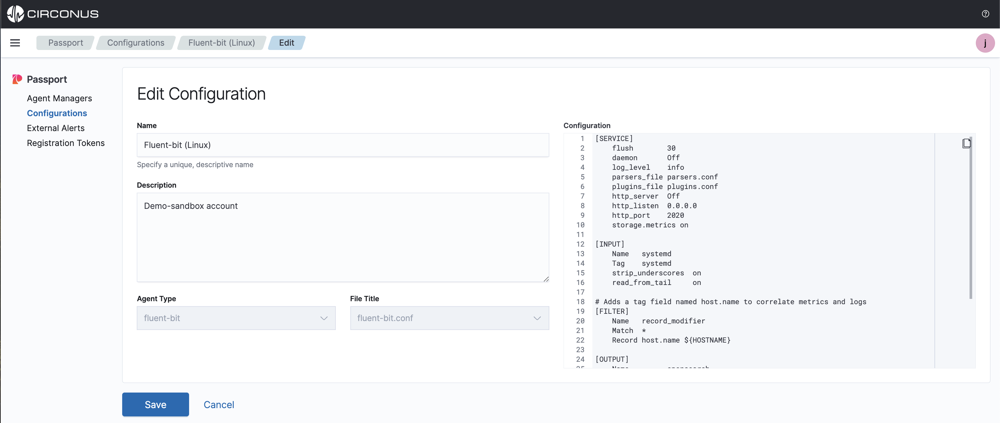

## Deleting

From a **Passport > Configurations** details page, select the **Delete** button to delete a configuration file from Passport.

:::warning WARNING

You will be prompted to confirm the deletion and a list of Managers it is assigned to will be displayed. This configuration file cannot be recovered once deleted.

:::

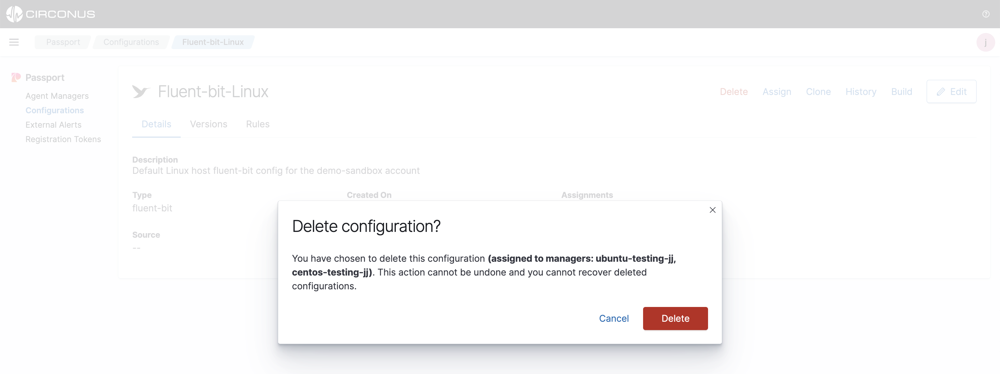
