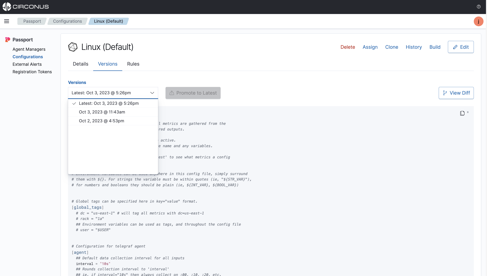

# Managing Configurations

Passport makes it easy to manage your configuration files with built-in versioning whenever the file is first created or uploaded and throughout any edits or cloning.

Features such as version history, rollbacks, cloning, and viewing diffs are all available from the Passport UI.

## Versioning

From the **Passport > Configurations** list page, select the configuration file you want to view the version history for.

Select the **Versions** tab to view, then under the **Versions** dropdown, select the version you want to view.

## Diffs

Select the **View Diff** button to view the differences between the current version and the previous version.

Any changes made to the configuration file will be highlighted in green for additions and red for deletions.

## Rollbacks

## Assign

## Cloning

## History

## Build

## Deleting
