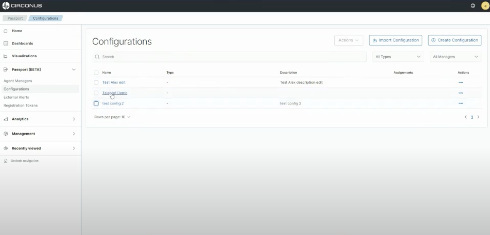
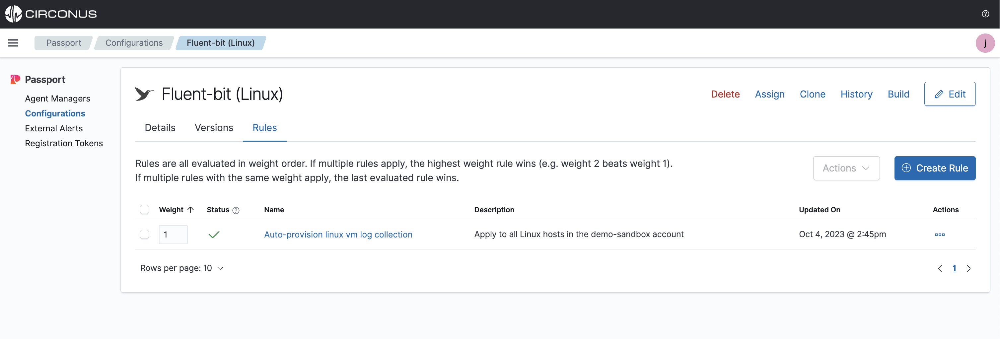
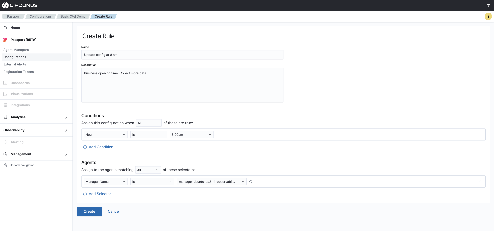

# Rules Engine

Passport rules tell the Circonus Agent which configuration file to load on your specific agent during a given event. One or more can be defined and will take action when the event happens updating specified configuration files to run on your agents to give you the data needed when it is needed.

## Creating Rules

Navigate to the **Passport > Configurations** list view, and select the configuration file to navigate to the details section.

From here, you can view **details**, **preview the config** file and also create **rules**.

Select the **Rules** tab, and then click on the **Create Rule** button located at the top right of the table

From here, you will define a rule to then be applied to this specific configuration file. Fully define the required fields and click **Create**.

:::danger DANGER

If you are creating alert-based rules, ensure the rules align with your expected outcome of the configuration assignment.

:::

All created rules will be listed in the Rules tab and if more than 1 rule has been created, they can be ordered to specify which rule has the most importance. 

:::info Rules ordering

The rules can be ordered by clicking and holding each rule on the far left side of the listed row and dragging it.

:::

## Managing Rules

Many **Actions** are available to take for the rules such as **Edit, **Clone, **Copying** to other** **configurations** or **Deleting** the rule.

<!--Use case examples with tabs here-->

## Use Case Examples

To get you up and running with the Circonus Rules engine, here are some examples of how and when you can use rules to manage your configuration deployments

import Tabs from '@theme/Tabs';
import TabItem from '@theme/TabItem';

<Tabs>
  <TabItem value="event-based" label="Event-driven" default>
    Black Friday holiday shopping season
  </TabItem>
  <TabItem value="alert-response" label="Alert-driven">
    Alert happens, xyz configuration gets loaded.
  </TabItem>
  <TabItem value="minimal-ingest" label="Minimal Ingestion">
    ...
  </TabItem>
</Tabs>
