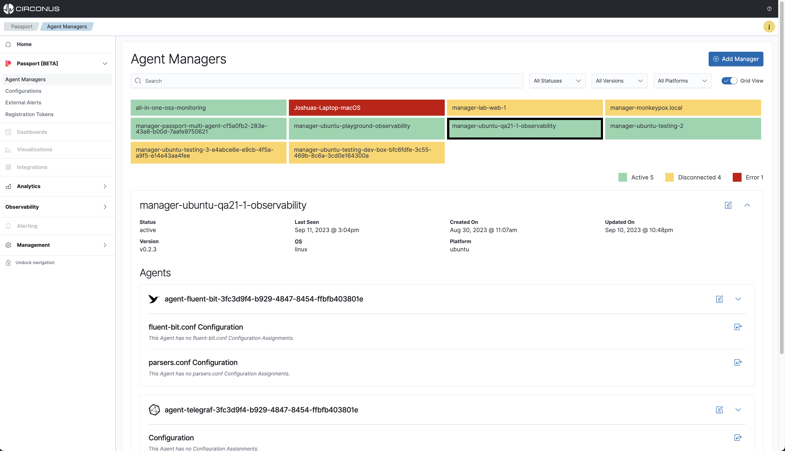

import Tabs from '@theme/Tabs';
import TabItem from '@theme/TabItem';

# Agent Manager

The Passport Agent Manager is the ultimate sidekick for your configuration files. It’s always on the lookout for new files and triggers the appropriate restart/reload functionality of the [supported agents](/passport/intro#supported-agents). With its simple installation and infrequent updates, you can rest assured that your configuration files are always up-to-date and running smoothly.

Once you install the agent manager on a host where your collection agents are located, you can easily manage everything through the intuitive Passport UI.



## Installation

The Circonus Agent Manager is supported on both Linux and macOS operating systems with Windows soon to come. The following installation instructions will guide you through installing Agent Manager on your host(s) and then being able to create/assign configurations to them from the Passport UI.

:::tip Pro Tip

Circonus recommends installing one or more [supported agents](/passport/intro#supported-agents) **before** installing the Agent Manager. If an agent is installed after the Agent Manager's installation then you will need to stop, re-inventory and restart the Agent Manager for it to detect the new agents.

:::

**Supported Platforms**

<Tabs groupId="operating-systems">
  <TabItem value="linuxPrivileged" label="Linux (Privileged)" default>

#### Step 1 - Download and install

- Download the latest version of Agent Manager from the [release page](https://github.com/circonus/agent-manager/releases) for the appropriate operating system and CPU architecture.
- Modify the following commands to fit your platform type and **specify the latest version available**.

```bash title="Example: Download and Install Agent Manager v0.2.5 for Debian"
curl -LO https://github.com/circonus/agent-manager/releases/download/v0.2.5/circonus-am_0.2.3_amd64.deb &&
sudo dpkg -i circonus-am_0.2.3_amd64.deb
```
<br/><br/>

#### Step 2 - Register, restart and view the status

1. Log into the Passport UI and navigate to `Passport > Agent Management > Registration` to retrieve a valid registration token. A secret will be displayed for the user to copy and keep for future Agent Manager registrations.

:::warning WARNING

This secret can not be retrieved again once the window is closed and a new one will need to be created.

:::

2.  Register Agent Manager with the following command flag `circonus-am --register="<validRegistrationToken>"`.
3.  In the following command, replace `<validRegistrationToken>` with your account registration token and then run the command.
4.  **Optional:**
    1.  Tags can be added only during registration times by using the `--tags` flag.  
    2.  Example of CLI tags: `--tags="foo:bar,baz:qux"` with `,` separating the `key:val` entries.
    3.  Example using environment variables: `CAM_TAGS="foo:bar baz:qux"` with spaces separating the `key:val` entries.

```bash title="Example: Register, restart and view the Agent Manager's status"
sudo /opt/circonus/am/sbin/circonus-am --register="<validRegistrationToken>" &&
sudo systemctl restart circonus-am &&
sudo systemctl restart circonus-am
```

:::info Success

If the registration is successful, then you should see the following output from the Agent Manager and also the status of its service as `Active: active (running)`.

```json
{"level": "info","pkg": "manager","time": 1692032136,"message": "registration complete"}
```

:::

<details><summary>Example - Successful installation</summary>
<p>

```bash title="Linux Ubuntu" showLineNumbers
# Install the Agent Manager
ubuntu-host:~$ sudo dpkg -i install ~/downloads/circonus-am_0.1.3_amd64.deb
Reading package lists... Done
Building dependency tree... Done
Reading state information... Done
Note, selecting 'circonus-am' instead of '/home/joshuajohnson/downloads/circonus-am_0.1.3_amd64.deb'
The following package was automatically installed and is no longer required:
  libnuma1
Use 'sudo apt autoremove' to remove it.
The following NEW packages will be installed:
  circonus-am
0 upgraded, 1 newly installed, 0 to remove and 73 not upgraded.
Need to get 0 B/4273 kB of archives.
After this operation, 10.7 MB of additional disk space will be used.
Get:1 /home/joshuajohnson/downloads/circonus-am_0.1.3_amd64.deb circonus-am amd64 0.1.3 [4273 kB]
Selecting previously unselected package circonus-am.
(Reading database ... 124495 files and directories currently installed.)
Preparing to unpack .../circonus-am_0.1.3_amd64.deb ...
Unpacking circonus-am (0.1.3) ...
Setting up circonus-am (0.1.3) ...
Created symlink /etc/systemd/system/multi-user.target.wants/circonus-am.service → /lib/systemd/system/circonus-am.service.
Scanning processes...
Scanning candidates...
Scanning linux images...

Restarting services...
Service restarts being deferred:
 /etc/needrestart/restart.d/dbus.service
 systemctl restart docker.service
 systemctl restart networkd-dispatcher.service
 systemctl restart unattended-upgrades.service
 systemctl restart user@1008.service

No containers need to be restarted.

No user sessions are running outdated binaries.

No VM guests are running outdated hypervisor (qemu) binaries on this host.

# Register the Agent Manager
ubuntu-host:/opt/circonus/am/etc$ sudo /opt/circonus/am/sbin/circonus-am --register=6850a610-51b6-4829-baf3-f2cc40897211
{"level":"info","name":"circonus-am","version":"0.1.3","time":1692125508,"message":"starting"}
{"level":"info","time":1692125508,"message":"starting registration"}
{"level":"info","agent":"telegraf","time":1692125508,"message":"found"}
{"level":"info","pkg":"manager","time":1692125508,"message":"registration complete"}

# Start the Agent Manager
ubuntu-host:/opt/circonus/am/etc$ sudo systemctl start circonus-am

# Optional: Check the status of Agent Manger
ubuntu-host:/opt/circonus/am/etc$ sudo systemctl status circonus-am
● circonus-am.service - Circonus Agent Manager
     Loaded: loaded (/lib/systemd/system/circonus-am.service; enabled; vendor preset: enabled)
     Active: active (running) since Tue 2023-08-15 19:01:14 UTC; 44s ago
       Docs: https://github.com/circonus/agent-manager
   Main PID: 4101958 (circonus-am)
      Tasks: 7 (limit: 9525)
     Memory: 2.6M
        CPU: 6ms
     CGroup: /system.slice/circonus-am.service
             └─4101958 /opt/circonus/am/sbin/circonus-am --config=/opt/circonus/am/etc/circonus-am.yaml

Aug 15 19:01:14 ubuntu-host systemd[1]: Started Circonus Agent Manager.
Aug 15 19:01:14 ubuntu-host circonus-am[4101958]: {"level":"info","name":"circonus-am","version":"0.1.3","time">
Aug 15 19:01:14 ubuntu-host circonus-am[4101958]: {"level":"info","interval":"1m0s","time":1692126074,"message">
lines 1-14/14 (END)
```

</p>
</details>
  </TabItem>
  <TabItem value="macOsHomebrew" label="macOS (Homebrew)">

#### Step 1 - Download and install

- Download and install the latest version of Agent Manager `tar.gz` file from the [release page](https://github.com/circonus/agent-manager/releases) for the appropriate operating system and CPU architecture, or install with homebrew package manager.

```bash title="Example: Tap the Agent Manager repo and install"
brew tap circonus/homebrew-circonus-agent-manager &&
brew install circonus/circonus-agent-manager/circonus-am
```

<br/><br/>

#### Step 2 - Register, start and view the status

1. Log into the Passport UI and navigate to `Passport > Agent Management > Registration` to retrieve a valid registration token. A secret will be displayed for the user to copy and keep for future Agent Manager registrations.

:::warning WARNING

This secret can not be retrieved again once the window is closed and a new one will need to be created.

:::

2.  Register Agent Manager with the following command flag `circonus-am --register="<validRegistrationToken>"`.
3.  In the following command, replace `<validRegistrationToken>` with your account registration token and then run the command.
4.  **Optional:**
    1.  Tags can be added only during registration times by using the `--tags` flag.  
    2.  Example of CLI tags: `--tags="foo:bar,baz:qux"` with `,` separating the `key:val` entries.
    3.  Example using environment variables: `CAM_TAGS="foo:bar baz:qux"` with spaces separating the `key:val` entries.

```bash title="Example: Register, start, and view the status"
/opt/homebrew/opt/circonus-am/sbin/circonus-am --register="<validRegistrationToken>" &&
brew services start circonus-am &&
brew services info circonus-am
```

:::info Success

If the registration is successful, then you should see the following output from the Agent Manager and also the status of its service as `Active: active (running)`.

```json
{"level": "info","pkg": "manager","time": 1692032136,"message": "registration complete"}
```

:::

  </TabItem>
</Tabs>


## Managing additional collection agents

If additional agents have been added to the host where Agent Manager is running, then you will need to run a few CMDs for them to become discovered.

<Tabs groupId="operating-systems">
  <TabItem value="linuxPrivileged" label="Linux (Privileged)" default>

#### Take an inventory of local collection agents

```bash title="Example: stop, reinventory, start and view the Agent Manager's status"
sudo systemctl stop circonus-am &&
sudo /opt/circonus/am/sbin/circonus-am --inventory &&
sudo systemctl start circonus-am &&
sudo systemctl status circonus-am
```

:::info Success

Example of what the output will look like when a **telegraf** agent has been found.

```json showLineNumbers
{"level":"info","agent":"telegraf","time":1692044346,"message":"found"}
{"level":"info","pkg":"manager","time":1692044346,"message":"invetory complete"}
```

:::

<details><summary>Example - Successful reinventory</summary>
<p>

```bash title="Linux Ubuntu" showLineNumbers
# Stop the Agent Manger
ubuntu-testing-dev-box:/opt/circonus/am/etc$ sudo systemctl stop circonus-am

# Check for collection agents on the host for Agent Manager to manage.
ubuntu-testing-dev-box:/opt/circonus/am/etc$ sudo /opt/circonus/am/sbin/circonus-am --inventory
{"level":"info","name":"circonus-am","version":"0.1.3","time":1692044346,"message":"starting"}
{"level":"info","agent":"telegraf","time":1692044346,"message":"found"}
{"level":"info","pkg":"manager","time":1692044346,"message":"invetory complete"}

# Start the Agent Manager
ubuntu-testing-dev-box:/opt/circonus/am/etc$ sudo systemctl start circonus-am

# Optional: Check the status of Agent Manger
ubuntu-testing-dev-box:/opt/circonus/am/etc$ sudo systemctl status circonus-am
● circonus-am.service - Circonus Agent Manager
     Loaded: loaded (/lib/systemd/system/circonus-am.service; enabled; vendor preset: enabled)
     Active: active (running) since Mon 2023-08-14 20:19:14 UTC; 8s ago
       Docs: https://github.com/circonus/agent-manager
   Main PID: 1361941 (circonus-am)
      Tasks: 8 (limit: 4680)
     Memory: 4.6M
        CPU: 3ms
     CGroup: /system.slice/circonus-am.service
             └─1361941 /opt/circonus/am/sbin/circonus-am --config=/opt/circonus/am/etc/circonus-am.yaml

Aug 14 20:19:14 ubuntu-testing-dev-box systemd[1]: Started Circonus Agent Manager.
Aug 14 20:19:14 ubuntu-testing-dev-box circonus-am[1361941]: {"level":"info","name":"circonus-am","version":"0.1.3","time":169204>
Aug 14 20:19:14 ubuntu-testing-dev-box circonus-am[1361941]: {"level":"info","interval":"1m0s","time":1692044354,"message":"start>
lines 1-14/14 (END)
```

</p>
</details>

  </TabItem>
  <TabItem value="macOsHomebrew" label="macOS (Homebrew)">

#### Take an inventory of local collection agents

```bash title="Example: stop, reinventory, start and view the Agent Manager's status"
brew services stop circonus-am &&
/opt/homebrew/opt/circonus-am/sbin/circonus-am --inventory &&
brew services start circonus-am &&
brew services info circonus-am
```

:::info Success

Example of what the output will look like when a **telegraf** agent has been found.

```json showLineNumbers
{"level":"info","agent":"telegraf","time":1692044346,"message":"found"}
{"level":"info","pkg":"manager","time":1692044346,"message":"invetory complete"}
```

:::
</TabItem>
</Tabs>

## Uninstalling

<Tabs groupId="operating-systems">
  <TabItem value="linuxPrivileged" label="Linux (Privileged)" default>

To uninstall Agent Manage, run the following CMD.

```bash
sudo apt-get remove circonus-am
```

  </TabItem>
  <TabItem value="macOsHomebrew" label="macOS (Homebrew)">

To uninstall Agent Manage, run the following CMD.

```bash
brew remove circonus/circonus-agent-manager/circonus-am
```

  </TabItem>
</Tabs>

## Troubleshooting

<Tabs groupId="operating-systems">
  <TabItem value="linuxPrivileged" label="Linux (Privileged)" default>

Agent Manager usage flags

```bash title="Linux Ubuntu" showLineNumbers
# Check all available usage flags for the Agent Manager
ubuntu-testing-dev-box:/opt/circonus/am/sbin$ sudo ./circonus-am -h
Manager for local agents (metrics, logs, etc.)

Usage:
  circonus-am [flags]

Flags:
      --apiurl string              [ENV: CAM_API_URL] Circonus API URL (default "https://web-api.svcs-np.circonus.net/collectors/v1")
      --aws-ec2-tags stringArray   [ENV: CAM_AWS_EC2_TAGS] AWS EC2 tags for registration meta data
  -c, --config string              config file (default: /opt/circonus/am/etc/circonus-am.yaml|.json|.toml)
  -d, --debug                      [ENV: CAM_DEBUG] Enable debug messages
  -h, --help                       help for circonus-am
      --inventory                  [ENV: CAM_INVENTORY] Inventory installed collectors
      --log-level string           [ENV: CAM_LOG_LEVEL] Log level [(panic|fatal|error|warn|info|debug|disabled)] (default "info")
      --log-pretty                 Output formatted/colored log lines [ignored on windows]
      --poll-interval string       [ENV: CAM_POLL_INTERVAL] Polling interval for actions (default "60s")
      --register string            [ENV: CAM_REGISTER] Registration token
  -V, --version                    Show version and exit
```

Check to see if the Agent Manager is running

```bash title="Linux Ubuntu" showLineNumbers
# Check the status of the Agent Manager
ubuntu-testing-dev-box:/opt/circonus/am/sbin$ sudo systemctl status circonus-am
● circonus-am.service - Circonus Agent Manager
     Loaded: loaded (/lib/systemd/system/circonus-am.service; enabled; vendor preset: enabled)
     Active: active (running) since Mon 2023-08-14 19:34:30 UTC; 2min 23s ago
       Docs: https://github.com/circonus/agent-manager
   Main PID: 1359376 (circonus-am)
      Tasks: 8 (limit: 4680)
     Memory: 8.0M
        CPU: 27ms
     CGroup: /system.slice/circonus-am.service
             └─1359376 /opt/circonus/am/sbin/circonus-am --config=/opt/circonus/am/etc/circonus-am.yaml

Aug 14 19:34:30 ubuntu-testing-dev-box systemd[1]: Started Circonus Agent Manager.
Aug 14 19:34:30 ubuntu-testing-dev-box circonus-am[1359376]: {"level":"info","name":"circonus-am","version":"0.1.3","time":1692041670,"message":"starting"}
Aug 14 19:34:30 ubuntu-testing-dev-box circonus-am[1359376]: {"level":"info","interval":"1m0s","time":1692041670,"message":"starting poller"}
```

View the logs of Agent Manager while it is running

```bash title="Linux Ubuntu" showLineNumbers
# View the logs of the running service
ubuntu-host:/opt/circonus/am/etc$ sudo journalctl -u circonus-am.service
Aug 15 18:07:28 ubuntu-qa21-1-observability systemd[1]: Started Circonus Agent Manager.
Aug 15 18:07:28 ubuntu-qa21-1-observability circonus-am[4079997]: {"level":"info","name":"circonus-am","version":"0.1.3","time":1692122848,"message":"starting"}
...
```

  </TabItem>
  <TabItem value="macOsHomebrew" label="macOS (Homebrew)">

Agent Manager usage flags

```bash title="macOS (Silicon) Homebrew" showLineNumbers
# Check all the usage flags for the Agent Manager
➜  ~ /opt/homebrew/opt/circonus-am/sbin/circonus-am -h
Manager for local agents (metrics, logs, etc.)

Usage:
  circonus-am [flags]

Flags:
      --apiurl string              [ENV: CAM_API_URL] Circonus API URL (default "https://web-api.svcs-np.circonus.net/configurations/v1")
      --aws-ec2-tags stringArray   [ENV: CAM_AWS_EC2_TAGS] AWS EC2 tags for registration meta data
  -c, --config string              config file (default: /opt/homebrew/Cellar/circonus-am/0.1.4/etc/circonus-am.yaml|.json|.toml)
  -d, --debug                      [ENV: CAM_DEBUG] Enable debug messages
  -h, --help                       help for circonus-am
      --inventory                  [ENV: CAM_INVENTORY] Inventory installed agents
      --log-level string           [ENV: CAM_LOG_LEVEL] Log level [(panic|fatal|error|warn|info|debug|disabled)] (default "info")
      --log-pretty                 Output formatted/colored log lines [ignored on windows]
      --poll-interval string       [ENV: CAM_POLL_INTERVAL] Polling interval for actions (default "60s")
      --register string            [ENV: CAM_REGISTER] Registration token
  -V, --version                    Show version and exit
```

Check to see if Agent Manager is running.

```bash title="macOS (Silicon) Homebrew" showLineNumbers
# Check the status of the Agent Manager
➜  ~ brew services info circonus-am
circonus-am (homebrew.mxcl.circonus-am)
Running: ✔
Loaded: ✔
Schedulable: ✔
```

View the logs of Agent Manager while it is running

```bash title="macOS (Silicon) Homebrew" showLineNumbers
# Manually start the Agent Manager and write the last 20 lines of logs to stdout
➜  ~ brew services start circonus-am && tail -f -n20 /opt/homebrew/var/log/circonus-agent-manager.log
==> Successfully started `circonus-am` (label: homebrew.mxcl.circonus-am)
{"level":"fatal","error":"open /opt/homebrew/etc/circonus-am.yaml: no such file or directory","config_file":"/opt/homebrew/etc/circonus-am.yaml","time":1692194609,"message":"unable to load config file"}
{"level":"fatal","error":"open /opt/homebrew/etc/circonus-am.yaml: no such file or directory","config_file":"/opt/homebrew/etc/circonus-am.yaml","time":1692194619,"message":"unable to load config file"}
{"level":"fatal","error":"open /opt/homebrew/etc/circonus-am.yaml: no such file or directory","config_file":"/opt/homebrew/etc/circonus-am.yaml","time":1692194629,"message":"unable to load config file"}
...
```

  </TabItem>
</Tabs>
