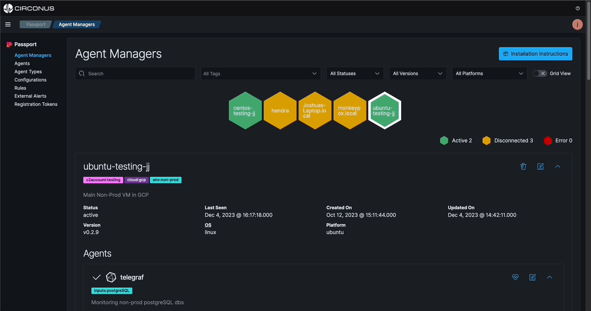

import Tabs from '@theme/Tabs';
import TabItem from '@theme/TabItem';
import styles from './styles.module.css';

# Agent Monitoring

Knowing when an agent stops running after a configuration file has been applied is important. Passport allows you to monitor your agents and their status during configuration assignments so you can take action when an agent stops running.

Each agent has a status that is recorded by the Agent Manager and is sent to the platform every 5 minutes.

