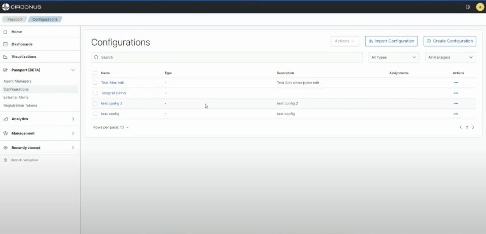
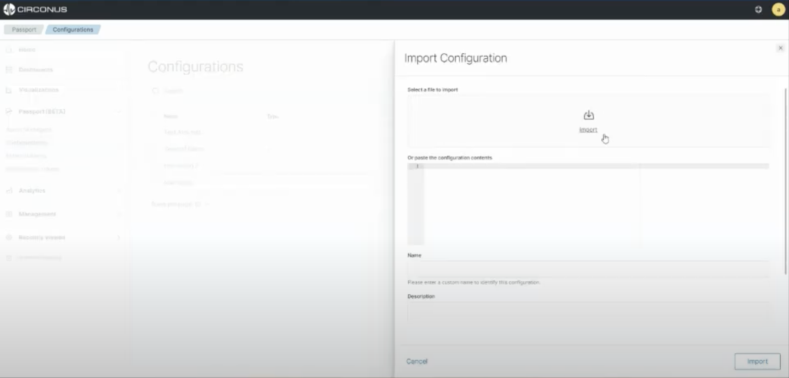

# Configuration files

Configuration files for agents can be either imported or created with a low-code flow build. Below outlines how to accomplish this.

**What are some best practices and how to do other things??**

## Import a Configuration files

From the configurations list page, select **Import Configuration**.

You have the option to upload a local file or simply paste the configuration in the code block. Fill in the rest of the form and select **Import**.

Once the configuration file is imported, it will be displayed on the **Passport > Configurations** list page.

## Build a Config with Flow Builder

The Passport Flow Builder is a low-code tool for building configurations for your agents. These configurations can be assigned to the corresponding agents managed by the Agent Manager.

### Creating a config

Go to **Passport > Configurations** and click the **Create Configuration** button at the top of the page.

Fill in the relevant information for your config and click "Add" at the bottom of the form.

### Using the flow builder

Once in the flow builder, what you see will be determined in part by which agent you are creating a config for. However, some elements are common to all.

In the left menu, you will see a list of supported plugins broken out by the plugin category supported by the target agent.

You can filter the results by using the search box. To use a plugin, simply drag it from the left menu and drop it over a compatible node on the canvas. The plugins that can connect is agent specific. 

:::info Example

When working with Telegraf, you can drag an output plugin over an input plugin, but not the other way around because the output plugin is the last plugin type in that agent's plugin pipeline model.

:::

Your configurations will appear on the right.

To save, click the **Save** button in the canvas button list:

Once the configuration file is imported, it will be displayed on the **Passport > Configurations** list page.