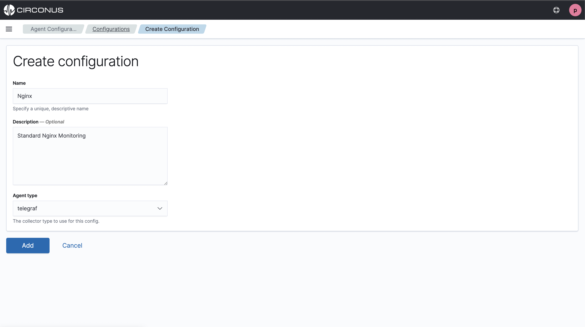
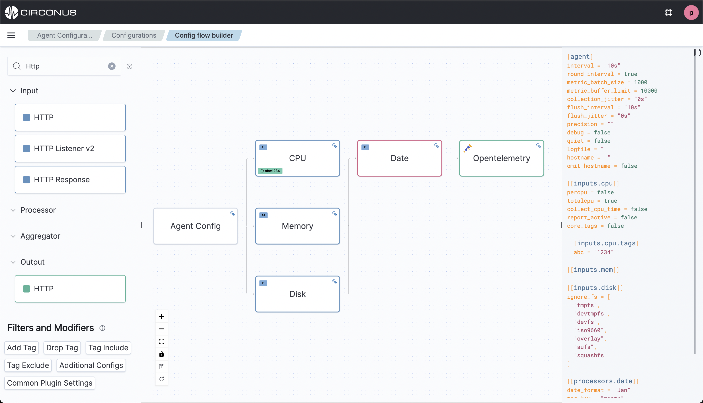
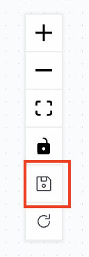

# Passport


## About

**Passport is currently in private beta.**

Passport is a solution for making the collection of observability data responsive to changes in your environment using your pre-existing observability agents. It allows you to collect more data when you need it, and less when you don't.

### Basic Concepts

Almost all observability agents can be managed through the use of configuration files that describe how to collect, enrich and send data. Management of these files and the agent itself is typically left as an exercise for the user and involves leveraging their preferred software distribution tools.

Passport aims to simplify this process through the use of an agent manager. The Passport Agent Manager functions as a sidecar utility that checks for new configuration files and triggers the appropriate restart/reload functionality of the supported agent. The agent manager is kept intentionally simple, with the goal that it only need to be installed once and updated very infrequently.

In order to change the collection strategy of a managed agent such as Telegraf, there needs to be a place to create and store the relevant configurations for the agent. This can be done through the Passport UI or the Passport API.

The Passport UI provides a place to view the current inventory of all agents under management as well as tools for managing and creating configuration files.

## Supported Agents

- [Telegraf](https://github.com/influxdata/telegraf)

## Installing the Passport Agent Manager

### Step 1

On the server where you wish to run the agent manager, ensure that at least one of the [supported agents](#supported-agents) is already installed. This is not a hard requirement for installation, just a recommended good practice.

### Step 2

Download the latest version of the agent manager from the [release page](https://github.com/circonus/agent-manager/releases) for the appropriate operating system and CPU architecture.

### Step 3

Log into the Passport UI and retrieve a registration token. Navigate to `Passport > Agent Management > Registration` or go directly there `<your_circonus_instance>/app/passport/registration`

### Step 4

Using the registration token from step 3, run the following:

```
circonus-am --register=<token>
```

If successful you should see a jwt token at `etc/.id/token`.

## Step 5

The service does not auto start when installed via .deb. To enable the service run:

```
systemctl start circonus-am
```

## Flow Builder

The Passport Flow Builder is a low code tool for building configurations for your agents. These configurations can be assigned to the corresponding agents managed by the Agent Manager.

### Creating a config

Go to `/app/passport/configuration` and click the "Create configuration" button at the top of the table.

Fill in the relevant information for your config and click "Add" at the bottom of the form.



### Using the flow builder

Once in the flow builder, what you see will be determined in part by which agent you are creating a config for. However, there are some elements that are common to all.



In the left menu you will see a list of supported plugins broken out by the plugin category supported by the target agent.

You can filter the results by using the search box. To use a plugin, simply drag it from the left menu and dropt it over a compatible node on the canvas. Which plugins can connect to each other is agent specific. For example, for Telegraf, you can drag an output plugin over an input plugin, but not the other way around because the output plugin is the last plugin type in that agent's plugin pipeline model.

Your configurations will appear on the right.

To save, click the save button in the canvas button list:


