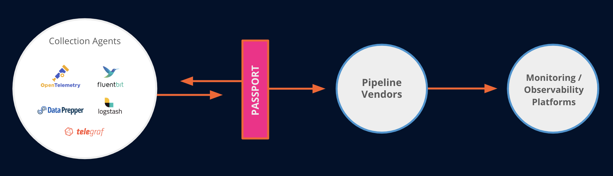

# Passport (Open Beta)

## Overview

**Passport is the ultimate solution for making the collection of observability data responsive to changes in your environment using your pre-existing observability agents.**

With Passport, you can collect more data when you need it and less when you don’t. And the best part? Almost all observability agents can be managed through the use of configuration files that describe how to collect, enrich and send data.

Passport aims to simplify this process through the use of an agent manager. The Passport Agent Manager functions as a sidecar utility that checks for new configuration files and triggers the appropriate restart/reload functionality of the supported agent. The Agent Manager is kept intentionally simple, with the goal that it only needs to be installed once and updated infrequently.

To change the collection strategy of a managed agent such as Telegraf, there needs to be a place to create and store the relevant configurations for the collection agent. This can be done through the intuitive Passport UI or API.

The Passport UI provides a place to view the current inventory of all agents under management as well as tools for managing and creating configuration files. Say goodbye to manual management and hello to Passport!

## Supported Agents

Agent Manager is extremely flexible and capable of managing applications that can be controlled from the command line and utilize configuration files. The Passport platform comes with many agent types already set up, the ability to add custom agent types, and assign configurations to them all from the intuitive Passport UI.

Some agent types such as the following come with the Passport enhanced low-code configuration building tool along with configuration uploads to help you build complex configuration files with ease.

- **[Telegraf](https://docs.influxdata.com/telegraf/v1/install/)**
- **[Fluent-bit](https://docs.fluentbit.io/manual/installation/getting-started-with-fluent-bit) - Coming soon!**

Other agent types such as the following are included out of the box and fully managed from the UI with configuration uploads.

- **[OpenTelemetry Collector](https://opentelemetry.io/docs/collector/getting-started/)**
- **[Circonus Unified Agent (CUA](https://docs.circonus.com/circonus/getting-started/circonus-unified-agent/)**
- **[Datadog-agent](https://docs.datadoghq.com/getting_started/agent/)**
- **[Vector](https://vector.dev/docs/setup/installation/)**
- **[New Relic Infrastructure agent](https://docs.newrelic.com/docs/infrastructure/install-infrastructure-agent/get-started/install-infrastructure-agent/)**
- **[Filebeat](https://www.elastic.co/guide/en/beats/filebeat/current/filebeat-installation-configuration.html)**
- **[Metricbeat](https://www.elastic.co/guide/en/beats/metricbeat/current/metricbeat-installation-configuration.html)**
- **[Pktvisor](https://github.com/orb-community/pktvisor)**
