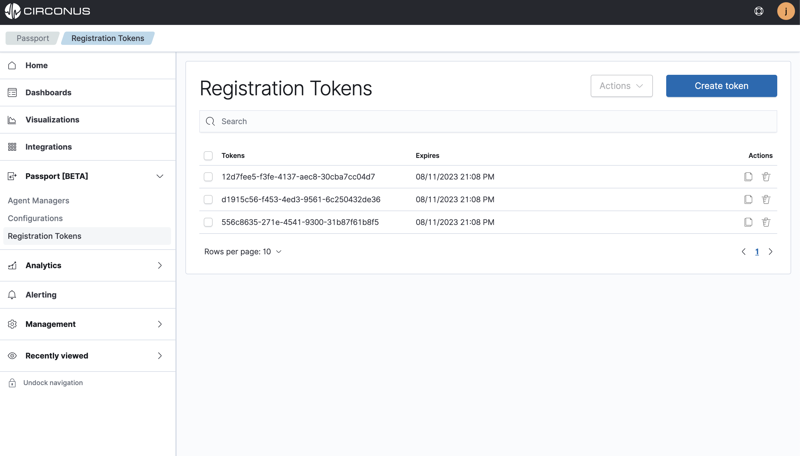

# Registration Tokens

## Overview

Circonus's Agent Manager requires a registration token to communicate with Circonus so your configuration files can be managed from the UI.

The very first step in getting started with the Passport platform is to create a Registration token so you can add it to the Agent Manager during installation.

## Create a registration token

Navigate to the **Passport > Registration Tokens** list view page and click on **Create token** to create and specify an expiration date and then click **Save**.

All successfully created registration tokens will populate the list view page seen below.

:::tip Pro tip

You will need the registration token for the Agent Manager setup, so click on the copy button located under the **Actions** column.

:::
