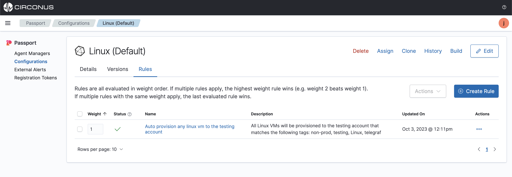

import Tabs from '@theme/Tabs';
import TabItem from '@theme/TabItem';
import styles from '../styles.module.css';

# Auto-provisioning

Auto provisioning is a feature that allows you to automatically apply a configuration file to a collection agent as soon as it comes online. This feature is useful when you want to apply a default configuration file to a collection agent as soon as it comes online.

Get started with auto-provisioning by simply creating a rule that will apply a configuration file to an agent that matches the rule.

:::info Example

The following example will apply a default Telegraf configuration file to any agent that has the tag **"env:non-prod,os:centos_7,agent:telegraf,os:linux"**.

:::

## Pre-requisites:

- A configuration file that will apply to more than 1 agent based on tags from those Agents and/or Managers.
  - If you don't already have a configuration file uploaded, [upload a configuration file](/passport/getting-started/passport#import-a-configuration-file) to your Passport account now.

## Create a rule

Select a configuration file from **Configurations list view page**, then click the **Rules** tab and select **Create Rule**.

Now, create a rule that will apply the configuration file to the agents that matches the rule and then click **create**.

For example, create a rule that will apply the configuration file to all agents that have the tags **"env:non-prod,os:centos_7,agent:telegraf,os:linux"** as seen below.

Now, this configuration will automatically be applied to any agent that has the tag **"env:non-prod,os:centos_7,agent:telegraf,os:linux"** that is currently being managed and any new agent that comes online with the tag **"env:non-prod,os:centos_7,agent:telegraf,os:linux"**.

## Rule weights

:::info Working with more than 1 rule for auto provisioning agents

A configuration can have 1 or more rules applied to it. When auto provisioning agents, set the rule **weight** to 1 so it will be the default configuration.

Doing this will allow you to have multiple rules applied to a configuration file and or agent with either lower or higher weights for other conditions such as auto-provisioning default configs, in coming alerts, Etc. When the rules with higher value weights expire, then the rules engine will apply the rule with lower **weights** to the agents.

:::

We will set the weight of this rule to be something low such as **1** so we can default to this configuration file from other higher weighted configurations once they expire.

