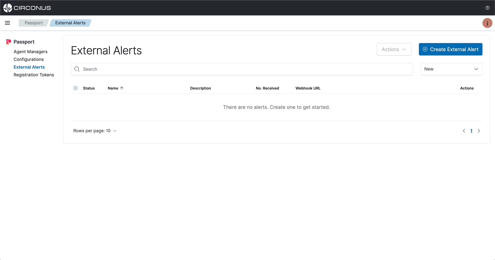
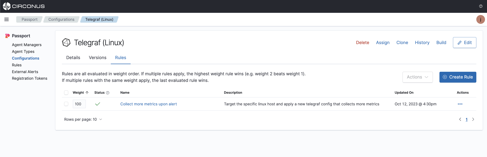

import Tabs from '@theme/Tabs';
import TabItem from '@theme/TabItem';
import styles from '../styles.module.css';

# External Alerting

External alerting is a feature that allows for automatically updating configurations based on alerts from an external alerting system. The setup is simple and can be done in a couple steps listed below.

1. Create an external alert for the appropriate alerting system. Supported alerting systems are **Datadog**, **Grafana**, and **Circonus**.
2. Create a rule that will apply a configuration file to an agent that matches the external alert.

:::info Example

We will be using **Circonus** as our external alerting system. The following example will apply a Telegraf configuration file to to the linux host that matches **"os:linux,os:{host}"** when an alert is triggered in Circonus.

:::

## Pre-requisites:

- An observability solution that can send alerts to Passport via a webhook.
  - If you don't already have an observability solution, [create a free account](https://www.circonus.com/free-trial/) with **Circonus** now.
- A configuration file uploaded to Passport.
  - If you don't already have a configuration file uploaded, [upload a configuration file](/passport/getting-started/passport#import-a-configuration-file) to your Passport account now.

## Create an external alert

Click the **External Alerts** menu item and select **Create External Alert**.

Choose the desired **key field** for the appropriate alerting system. For example, if you are using Circonus, then choose **"alert_id"** as the key field.

:::info Note

_Note: When creating an external alert, you will need to add the generated Passport Webhook URL to your current alerting output to send alerts to Passport. This URL will be provided to you when you create the external alert in the "Webhook URL field on the External Alert list view page"._

:::

## Create a rule

Select a configuration file from **Configurations list view page**, then click the **Rules** tab and select **Create Rule**.

After creating the rule, ensure the rule weight is set to a higher value than all other existing rules that target the same host. This will ensure that the rule is applied to the agent when the alert is triggered.

