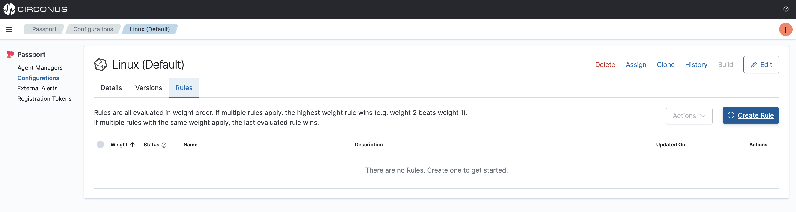
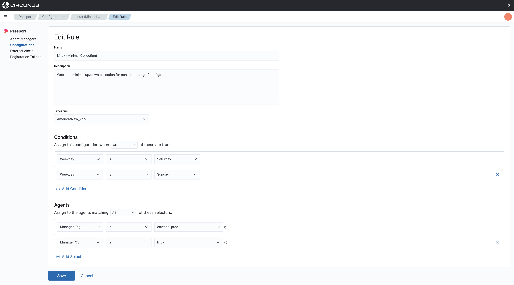
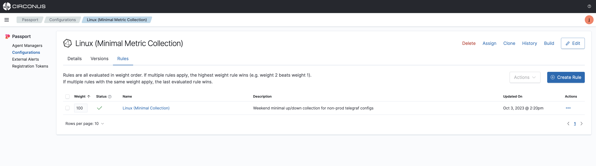

import Tabs from '@theme/Tabs';
import TabItem from '@theme/TabItem';
import styles from '../styles.module.css';

# Time Bounded

Time bounded rules allow you to apply a configuration file to an agent for a specific period of time. This feature is useful when you want to collect more or less data for a specific period of time.

Get started with a time bounded configuration by simply creating a rule that will apply a configuration file to an agent that matches the rule.

:::info Example

The following example will apply a Telegraf configuration file to any agent that has the tag **"env:non-prod,os:linux"** during both Saturdays and Sundays.

:::

## Pre-requisites:

- An existing configuration file.
  - If you don't already have a configuration file uploaded, [upload a configuration file](/passport/getting-started/passport#import-a-configuration-file) to your Passport account now.

## Create a rule

Select a configuration file from **Configurations list view page**, then click the **Rules** tab and select **Create Rule**.

Now, create a rule that will apply the configuration file to the agents that matches the rule and then click **create**.

For example, create a rule that will apply the configuration file to all agents that have the tags **"env:non-prod,os:linux"** during both Saturdays and Sundays as seen below.

Now, this configuration will automatically be applied to any agent that has the tag **"env:non-prod,os:linux"** during both Saturdays and Sundays that is currently being managed and any new agent that comes online with the tag **"env:non-prod,os:linux"** during both Saturdays and Sundays. Once the rule expires, the configuration file will be removed from the agent.

## Rule weights

:::info Working with more than 1 rule

A configuration can have 1 or more rules applied to it. When creating a time bounded config, set the rule **weight** to be a higher number so it will override other rules such as a default configuration which could have a **weight** of 1.

Doing this will allow you to have multiple rules applied to a configuration file and or agent with either lower or higher weights for other conditions such as auto-provisioning default configs, in coming alerts, Etc. When the rules with higher value weights expire, then the rules engine will apply the rule with lower **weights** to the agents.

:::

We will set the weight of this rule to be something high such as **100** so we can override other rules such as a default configuration file. Once the rule expires, the default configuration file or a lower weighted configuration will be applied to the agent.

## Video example

<iframe width="560" height="315" src="https://www.youtube.com/embed/JXQc_pcd-sE?si=vk8CPu_-4lxUWOCG" title="YouTube video player" frameborder="0" allow="accelerometer; autoplay; clipboard-write; encrypted-media; gyroscope; picture-in-picture; web-share" allowfullscreen></iframe>

