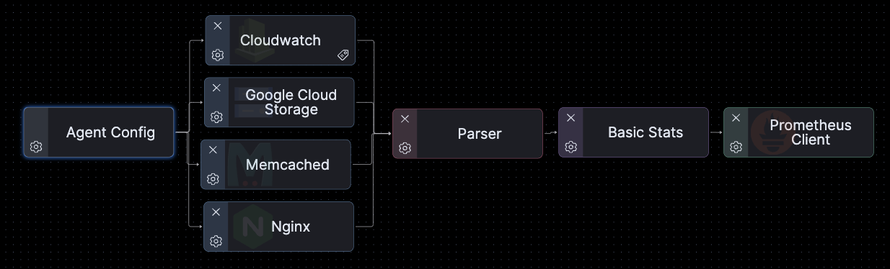
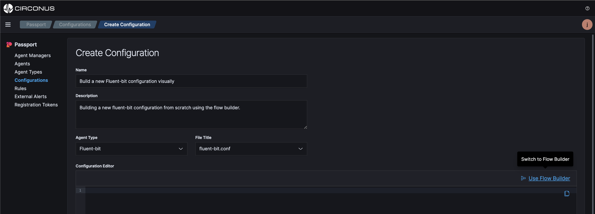
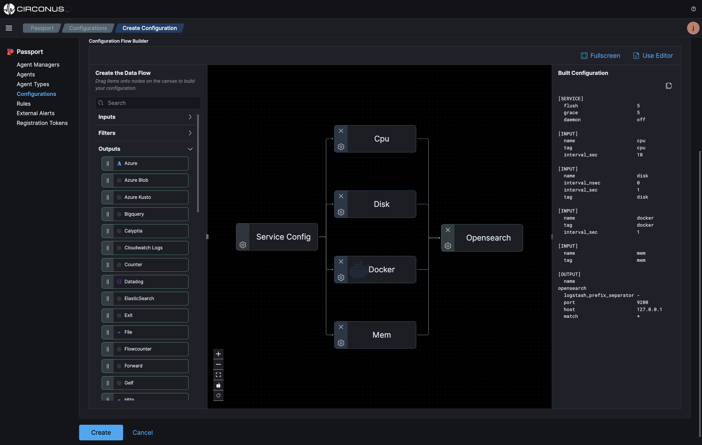
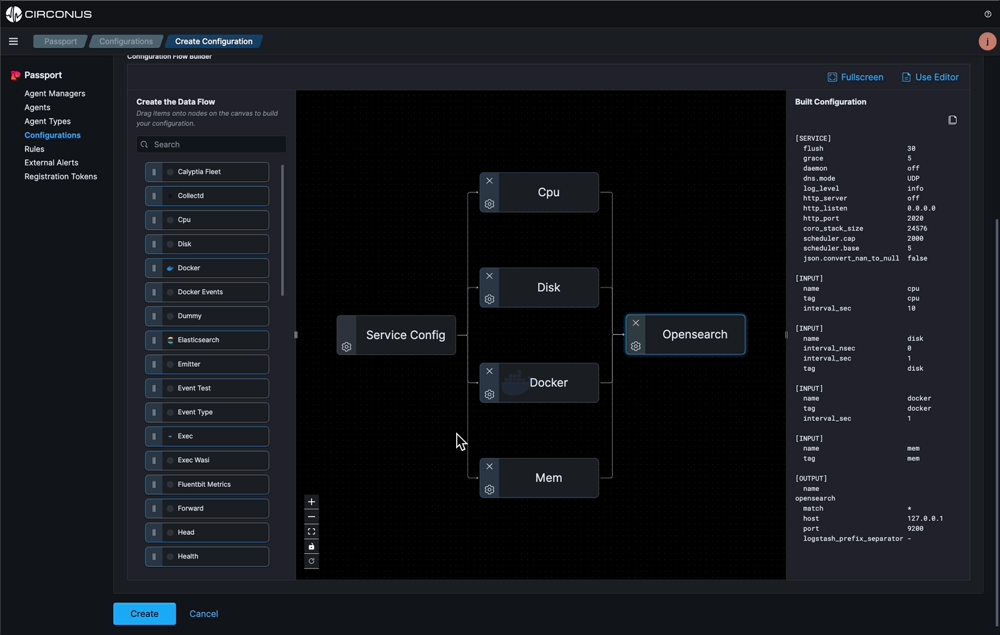

import Tabs from '@theme/Tabs';
import TabItem from '@theme/TabItem';
import styles from '../styles.module.css';

# Visual Pipelines

Passport allows you to visualize a data pipeline from the agent to the destination, all from the UI. Whether you’re working with an existing text configuration file or building a new configuration file from scratch, Passport presents the data pipeline in a visual format for deeper understanding.

One of the key features of Passport is _*isomorphism*_. It allows you to import an existing configuration file and presents the data pipeline in a visual format with the ability to start building within the flow builder. Once the configuration file is saved, it can easily be assigned to your agents.

The visual pipeline is a great way to understand the data pipeline from the agent to the destination while eliminating syntax errors within text-based configuration files. Visual pipeline support is now available for the following agents:

- Telegraf
- Fluent Bit
- OpenTelemetry Collector (Coming Soon)

:::info Example

We will be importing an existing text configuration file and also building a new visual configuration file from scratch for a fluent bit agent.

:::

## Pre-requisites:

- Passport
  - If you don't already have a Passport account, [create a free account](https://circonus.com/passport) now.
- An observability solution.
  - If you don't already have an observability solution, [create a free account](https://www.circonus.com/free-trial/) with **Circonus** now.
- An existing configuration file.
  - If you don't already have a configuration file uploaded, [upload a configuration file](/passport/getting-started/passport#import-a-configuration-file) to your Passport account now.

## Visualize an existing configuration file

From the **Configurations** page, click on **Import**. Then, select that configuration file and click on **Build**.

The existing text based configuration file is now visualized in the flow builder canvas. The config can be edited and saved from the visual builder and also assigned to agents.

From here, you can edit the configuration file and save it from the flow builder. When done, create a rule or manually assign the configuration file to an agent.

## Visualize a new configuration file

From the **Configurations** page, click on **Create Configuration**. Then, select the support agent type and click on **Use Flow Builder**.

Once the flow builder is open, you can start modifying the configuration file by dragging and dropping inputs, filters, processors, outputs, Etc. onto the canvas.

Each _node_ (inputs, filters, processors, outputs, Etc.) has a set of _properties_ that can be configured. To configure the _properties_, click on the gear on the left bottom of the node and the _properties_ will appear in a modal to be modified.

Each agent type is different so the data flow options and properties will vary. For example, the properties and nodes for a fluent bit agent will be different than a telegraf or OTel collector agent.

