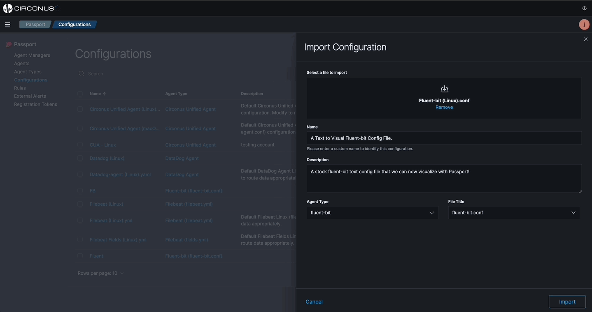

import Tabs from '@theme/Tabs';
import TabItem from '@theme/TabItem';
import styles from '../styles.module.css';

# Visual Pipelines

Passport allows you to visualize your data pipeline from the agent to the destination all from the UI. Whether it be an existing text configuration file or building a new configuration file from scratch, Passport will present the data pipeline for deeper understanding.

_**Isomorphism**_ is a key feature of configurations within Passport. Import an existing configuration file and Passport will present the data pipeline in a visual format and you can also start building within the visual builder. Once the configuration file is saved, it can easily be assigned to your agents.

_Add something about the visual builder also keeping a text version available_

The visual pipeline is a great way to understand the data pipeline from the agent to the destination while eliminating syntax errors within text based configuration files.

## Pre-requisites:

- An observability solution.
  - If you don't already have an observability solution, [create a free account](https://www.circonus.com/free-trial/) with **Circonus** now.
- An existing configuration file.
  - If you don't already have a configuration file uploaded, [upload a configuration file](/passport/getting-started/passport#import-a-configuration-file) to your Passport account now.

## Visualize an existing configuration file

From the Configurations page, click on *Import* to import an existing configuration file. Then, select that configuration file and click on *Build*.

The visual builder will present the data pipeline in a visual format. The config can be edited and saved from the visual builder and also assigned to agents.

_Make a new video_

